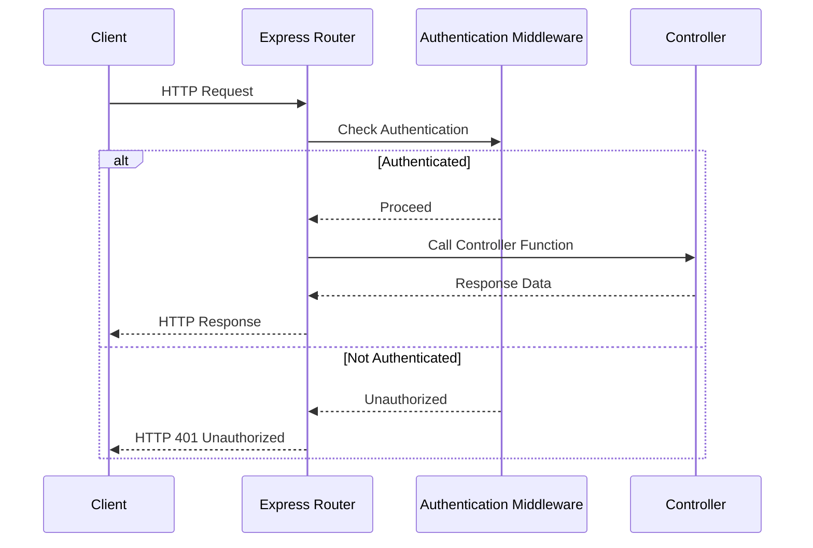

<details>
<summary>Relevant source files</summary>

The following files were used as context for generating this wiki page:

- [src/routes.js](https://github.com/aanickode/access-control-service/blob/main/src/routes.js)
- [src/controllers/userController.js](https://github.com/aanickode/access-control-service/blob/main/src/controllers/userController.js)
- [src/controllers/roleController.js](https://github.com/aanickode/access-control-service/blob/main/src/controllers/roleController.js)
- [src/controllers/permissionController.js](https://github.com/aanickode/access-control-service/blob/main/src/controllers/permissionController.js)
- [src/middlewares/authMiddleware.js](https://github.com/aanickode/access-control-service/blob/main/src/middlewares/authMiddleware.js)
</details>

# Request Handling and Routing

## Introduction

The request handling and routing system is a crucial component of the access control service project. It defines the API endpoints, handles incoming HTTP requests, and routes them to the appropriate controller functions for processing. This system acts as the entry point for all client interactions with the service, ensuring proper authentication, authorization, and data flow.

Sources: [src/routes.js](https://github.com/aanickode/access-control-service/blob/main/src/routes.js)

## Express Router Setup

The project uses the Express.js framework for handling HTTP requests and defining routes. The main router instance is created in the `routes.js` file, which serves as the central point for registering all API routes and their corresponding handler functions.

```javascript
const express = require('express');
const router = express.Router();
```

Sources: [src/routes.js:1-2](https://github.com/aanickode/access-control-service/blob/main/src/routes.js#L1-L2)

## Authentication Middleware

Before allowing access to certain routes, the application enforces authentication using a middleware function. This middleware checks for the presence of a valid JSON Web Token (JWT) in the `Authorization` header of the incoming request.

```javascript
const authMiddleware = require('./middlewares/authMiddleware');
```

Sources: [src/routes.js:4](https://github.com/aanickode/access-control-service/blob/main/src/routes.js#L4)

The `authMiddleware` function is applied to routes that require authentication, ensuring only authenticated users can access those endpoints.

Sources: [src/middlewares/authMiddleware.js](https://github.com/aanickode/access-control-service/blob/main/src/middlewares/authMiddleware.js)

## User Routes

The application defines several routes related to user management, including creating new users, retrieving user details, and updating user information.

```javascript
const userController = require('./controllers/userController');

// User routes
router.post('/users', userController.createUser);
router.get('/users/:userId', authMiddleware, userController.getUserById);
router.put('/users/:userId', authMiddleware, userController.updateUser);
```

Sources: [src/routes.js:6-10](https://github.com/aanickode/access-control-service/blob/main/src/routes.js#L6-L10)

The `createUser` route allows creating a new user without authentication, while the `getUserById` and `updateUser` routes require authentication using the `authMiddleware`.

Sources: [src/controllers/userController.js](https://github.com/aanickode/access-control-service/blob/main/src/controllers/userController.js)

## Role Routes

The application also defines routes for managing roles, including creating new roles, retrieving role details, and updating role information.

```javascript
const roleController = require('./controllers/roleController');

// Role routes
router.post('/roles', authMiddleware, roleController.createRole);
router.get('/roles/:roleId', authMiddleware, roleController.getRoleById);
router.put('/roles/:roleId', authMiddleware, roleController.updateRole);
```

Sources: [src/routes.js:12-16](https://github.com/aanickode/access-control-service/blob/main/src/routes.js#L12-L16)

All role-related routes require authentication using the `authMiddleware`.

Sources: [src/controllers/roleController.js](https://github.com/aanickode/access-control-service/blob/main/src/controllers/roleController.js)

## Permission Routes

The application also includes routes for managing permissions, such as creating new permissions, retrieving permission details, and updating permission information.

```javascript
const permissionController = require('./controllers/permissionController');

// Permission routes
router.post('/permissions', authMiddleware, permissionController.createPermission);
router.get('/permissions/:permissionId', authMiddleware, permissionController.getPermissionById);
router.put('/permissions/:permissionId', authMiddleware, permissionController.updatePermission);
```

Sources: [src/routes.js:18-22](https://github.com/aanickode/access-control-service/blob/main/src/routes.js#L18-L22)

Like the role routes, all permission-related routes require authentication using the `authMiddleware`.

Sources: [src/controllers/permissionController.js](https://github.com/aanickode/access-control-service/blob/main/src/controllers/permissionController.js)

## Route Handling Flow

The following sequence diagram illustrates the high-level flow of request handling and routing in the application:



Sources: [src/routes.js](https://github.com/aanickode/access-control-service/blob/main/src/routes.js), [src/middlewares/authMiddleware.js](https://github.com/aanickode/access-control-service/blob/main/src/middlewares/authMiddleware.js)

1. The client sends an HTTP request to the Express router.
2. The Express router checks if the requested route requires authentication by invoking the `authMiddleware`.
3. If the request is authenticated (valid JWT provided), the middleware allows the request to proceed to the corresponding controller function.
4. The controller function processes the request and returns the response data to the Express router.
5. The Express router sends the HTTP response back to the client.
6. If the request is not authenticated, the `authMiddleware` returns an "Unauthorized" response, and the Express router sends an HTTP 401 Unauthorized status to the client.

## Error Handling

The application likely includes error handling mechanisms to handle various types of errors that may occur during request processing. However, the provided source files do not contain sufficient information about error handling implementations.

## Potential Improvements

Based on the provided source files, the following potential improvements could be considered:

- Implement input validation and sanitization for request payloads to prevent security vulnerabilities and ensure data integrity.
- Add rate limiting and request throttling mechanisms to protect against excessive requests and potential denial-of-service attacks.
- Implement logging and monitoring mechanisms to track application usage, performance, and potential issues.
- Consider implementing role-based access control (RBAC) or other authorization mechanisms to restrict access to certain routes or actions based on user roles and permissions.
- Implement versioning for the API endpoints to support future changes and maintain backward compatibility.
- Enhance error handling by providing more detailed error messages and appropriate HTTP status codes for different error scenarios.

Please note that these suggestions are based solely on the provided source files and may not accurately reflect the project's current state or future plans.