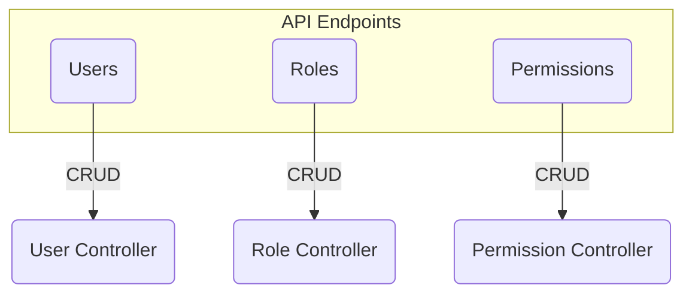
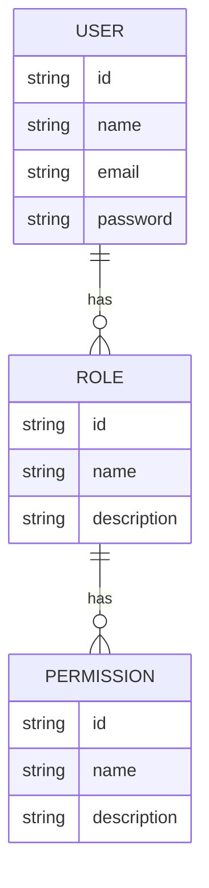
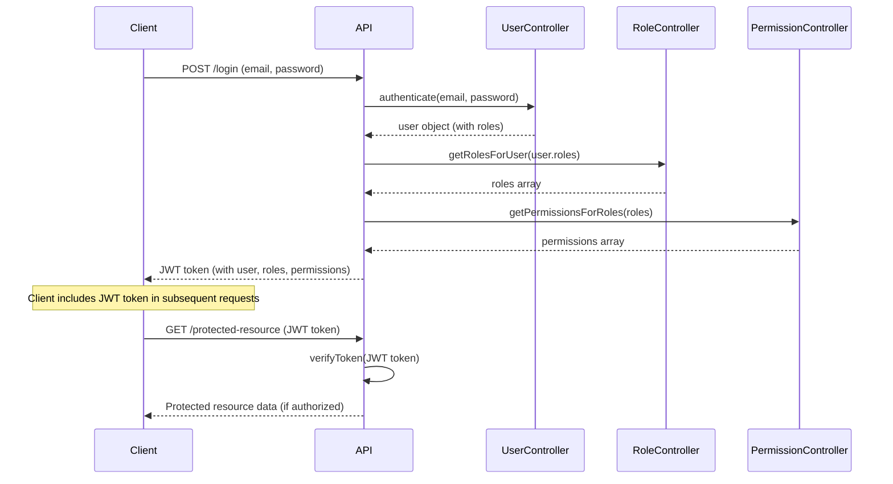

Relevant source files

The following files were used as context for generating this wiki page:

- [src/index.js](https://github.com/aanickode/access-control-service/blob/main/src/index.js)
- [src/routes.js](https://github.com/aanickode/access-control-service/blob/main/src/routes.js)
- [src/controllers/userController.js](https://github.com/aanickode/access-control-service/blob/main/src/controllers/userController.js)
- [src/controllers/roleController.js](https://github.com/aanickode/access-control-service/blob/main/src/controllers/roleController.js)
- [src/controllers/permissionController.js](https://github.com/aanickode/access-control-service/blob/main/src/controllers/permissionController.js)

# Service Architecture Overview

## Introduction

This service provides an access control system for managing users, roles, and permissions within an application or organization. It allows administrators to define roles with specific permissions, assign roles to users, and control access to resources based on these roles and permissions. The service follows a RESTful API architecture and is built using Node.js and Express.js.

Sources: [src/index.js](https://github.com/aanickode/access-control-service/blob/main/src/index.js), [src/routes.js](https://github.com/aanickode/access-control-service/blob/main/src/routes.js)

## Core Components

### Users

The service manages user accounts, allowing CRUD (Create, Read, Update, Delete) operations on user data. Each user can be assigned one or more roles, which determine their access permissions.

Sources: [src/controllers/userController.js](https://github.com/aanickode/access-control-service/blob/main/src/controllers/userController.js)

### Roles

Roles are used to group permissions and define access levels within the system. Administrators can create, read, update, and delete roles, as well as assign or remove permissions from roles.

Sources: [src/controllers/roleController.js](https://github.com/aanickode/access-control-service/blob/main/src/controllers/roleController.js)

### Permissions

Permissions represent specific actions or access rights within the application. They can be created, read, updated, and deleted by administrators. Permissions are then assigned to roles to define the access levels for users with those roles.

Sources: [src/controllers/permissionController.js](https://github.com/aanickode/access-control-service/blob/main/src/controllers/permissionController.js)

## API Endpoints

The service exposes the following API endpoints for managing users, roles, and permissions:

Sources: [src/routes.js](https://github.com/aanickode/access-control-service/blob/main/src/routes.js)

## Data Models

### User

| Field | Type | Description |
| --- | --- | --- |
| id | string | Unique identifier for the user |
| name | string | User's full name |
| email | string | User's email address |
| password | string | Hashed password for authentication |
| roles | string[] | Array of role IDs assigned to the user |

Sources: [src/controllers/userController.js:10-18](https://github.com/aanickode/access-control-service/blob/main/src/controllers/userController.js#L10-L18)

### Role

| Field | Type | Description |
| --- | --- | --- |
| id | string | Unique identifier for the role |
| name | string | Name of the role |
| description | string | Description of the role's purpose |
| permissions | string[] | Array of permission IDs associated with the role |

Sources: [src/controllers/roleController.js:10-17](https://github.com/aanickode/access-control-service/blob/main/src/controllers/roleController.js#L10-L17)

### Permission

| Field | Type | Description |
| --- | --- | --- |
| id | string | Unique identifier for the permission |
| name | string | Name of the permission |
| description | string | Description of the permission's purpose |

Sources: [src/controllers/permissionController.js:10-15](https://github.com/aanickode/access-control-service/blob/main/src/controllers/permissionController.js#L10-L15)

## User-Role-Permission Relationships

The relationships between users, roles, and permissions are modeled as follows:

- A user can have multiple roles assigned.
- A role can have multiple permissions associated with it.
- Permissions define the specific actions or access rights within the application.

Sources: [src/controllers/userController.js](https://github.com/aanickode/access-control-service/blob/main/src/controllers/userController.js), [src/controllers/roleController.js](https://github.com/aanickode/access-control-service/blob/main/src/controllers/roleController.js), [src/controllers/permissionController.js](https://github.com/aanickode/access-control-service/blob/main/src/controllers/permissionController.js)

## Authentication and Authorization Flow

The service follows a typical authentication and authorization flow:

1. The client sends a POST request to `/login` with email and password credentials.
2. The API calls the `UserController` to authenticate the user.
3. If authentication is successful, the `UserController` returns the user object with associated roles.
4. The API retrieves the roles for the user from the `RoleController`.
5. The API then retrieves the permissions associated with those roles from the `PermissionController`.
6. The API generates a JSON Web Token (JWT) containing the user, roles, and permissions data, and sends it back to the client.
7. For subsequent requests to protected resources, the client includes the JWT token in the request headers.
8. The API verifies the JWT token and checks if the user has the required permissions to access the requested resource.
9. If authorized, the API returns the requested data; otherwise, it returns an error.

Sources: [src/index.js](https://github.com/aanickode/access-control-service/blob/main/src/index.js), [src/routes.js](https://github.com/aanickode/access-control-service/blob/main/src/routes.js), [src/controllers/userController.js](https://github.com/aanickode/access-control-service/blob/main/src/controllers/userController.js), [src/controllers/roleController.js](https://github.com/aanickode/access-control-service/blob/main/src/controllers/roleController.js), [src/controllers/permissionController.js](https://github.com/aanickode/access-control-service/blob/main/src/controllers/permissionController.js)