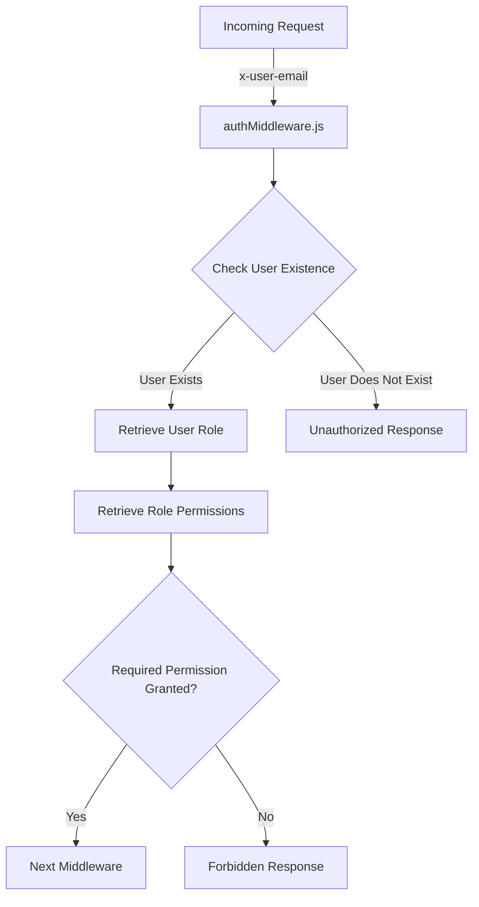
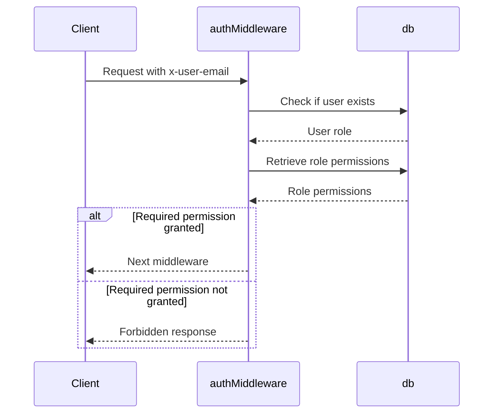
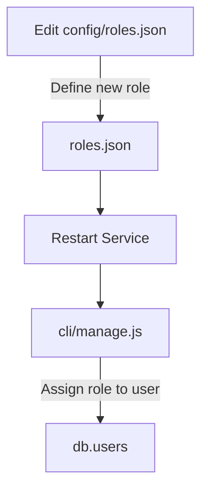

Relevant source files

The following files were used as context for generating this wiki page:

- [src/authMiddleware.js](https://github.com/aanickode/access-control-service/blob/main/src/authMiddleware.js)
- [docs/permissions.md](https://github.com/aanickode/access-control-service/blob/main/docs/permissions.md)

# Access Control

## Introduction

The Access Control system is a critical component of the project, responsible for enforcing role-based access control (RBAC) and ensuring that users have the necessary permissions to access specific routes or resources. It acts as a middleware layer, intercepting incoming requests and verifying the user's role and associated permissions before allowing the request to proceed.

Sources: [docs/permissions.md](https://github.com/aanickode/access-control-service/blob/main/docs/permissions.md)

## Architecture

The Access Control system follows a simple architecture, leveraging an in-memory database (`db.js`) to store user-role mappings and role-permission mappings. The `authMiddleware.js` file contains the core logic for permission enforcement.

Sources: [src/authMiddleware.js](https://github.com/aanickode/access-control-service/blob/main/src/authMiddleware.js), [docs/permissions.md](https://github.com/aanickode/access-control-service/blob/main/docs/permissions.md)

## Permission Enforcement

The `checkPermission` function in `authMiddleware.js` is the core of the permission enforcement mechanism. It takes a `requiredPermission` as an argument and returns a middleware function that can be applied to specific routes.

Sources: [src/authMiddleware.js:2-20](https://github.com/aanickode/access-control-service/blob/main/src/authMiddleware.js#L2-L20)

The middleware function performs the following steps:

1. Extracts the `x-user-email` header from the request.
2. Checks if the user exists in the `db.users` mapping.
3. Retrieves the user's role from the `db.users` mapping.
4. Retrieves the permissions associated with the user's role from the `db.roles` mapping.
5. Verifies if the required permission is included in the user's role permissions.
6. If the permission is granted, the request proceeds to the next middleware; otherwise, a `403 Forbidden` response is sent.

Sources: [src/authMiddleware.js:4-18](https://github.com/aanickode/access-control-service/blob/main/src/authMiddleware.js#L4-L18), [docs/permissions.md](https://github.com/aanickode/access-control-service/blob/main/docs/permissions.md)

## Roles and Permissions

The Access Control system follows a role-based access control (RBAC) model, where users are assigned roles, and roles are associated with specific permissions.

### Default Roles

The system comes with three predefined roles:

| Role     | Permissions                                   |
|----------|------------------------------------------------|
| admin    | view_users, create_role, view_permissions     |
| engineer | view_users, view_permissions                  |
| analyst  | view_users                                     |

Sources: [docs/permissions.md:10-18](https://github.com/aanickode/access-control-service/blob/main/docs/permissions.md#L10-L18)

### Adding a New Role

To add a new role, follow these steps:

1. Edit the `config/roles.json` file to define the new role and its associated permissions.
2. Assign the new role to a user using the `cli/manage.js` script.
3. Ensure that consuming services request the appropriate permissions for the new role.

Sources: [docs/permissions.md:22-31](https://github.com/aanickode/access-control-service/blob/main/docs/permissions.md#L22-L31)

## Limitations and Future Enhancements

The current implementation of the Access Control system has the following limitations:

- All permission checks are flat; no support for wildcarding or nested permissions.
- All user-role mappings are stored in-memory, which may not be suitable for large-scale deployments.
- Changes to the `roles.json` file require a service restart.

To address these limitations and enhance the system, the following improvements are planned:

- Implement scoped permissions (e.g., `project:view:marketing`) for more granular access control.
- Integrate with a single sign-on (SSO) system to retrieve user roles and permissions from group claims.
- Add audit logging for role changes and access attempts.

Sources: [docs/permissions.md:35-39](https://github.com/aanickode/access-control-service/blob/main/docs/permissions.md#L35-L39)

## Conclusion

The Access Control system plays a crucial role in ensuring secure access to resources within the project. By enforcing role-based access control and verifying user permissions, it helps maintain data integrity and prevent unauthorized access. While the current implementation is functional, the planned enhancements will further improve its scalability, flexibility, and integration capabilities.