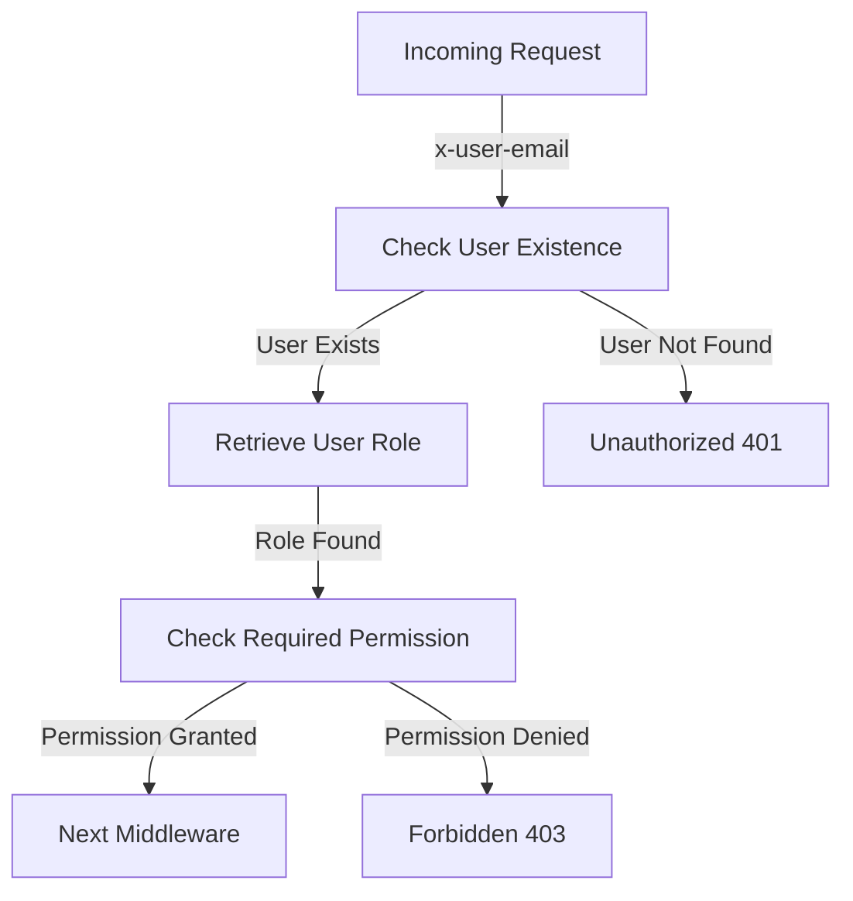

<details>
<summary>Relevant source files</summary>

The following files were used as context for generating this wiki page:

- [src/authMiddleware.js](https://github.com/aanickode/access-control-service/blob/main/src/authMiddleware.js)
- [docs/permissions.md](https://github.com/aanickode/access-control-service/blob/main/docs/permissions.md)
</details>

# Access Control

## Introduction

The Access Control system is a critical component of the project, responsible for enforcing role-based access control (RBAC) and ensuring that only authorized users can access specific routes or resources based on their assigned permissions. It acts as a middleware layer, intercepting incoming requests and verifying the user's credentials and permissions before allowing the request to proceed.

Sources: [docs/permissions.md](https://github.com/aanickode/access-control-service/blob/main/docs/permissions.md)

## Architecture

The Access Control system follows a simple architecture, as illustrated by the following flow diagram:



The key steps in the access control flow are:

1. Extract the `x-user-email` header from the incoming request.
2. Check if the user exists in the in-memory `db.users` map.
3. Retrieve the user's assigned role from the `db.users` map.
4. Check if the user's role includes the required permission for the requested route.
5. If the permission is granted, proceed to the next middleware; otherwise, return a `403 Forbidden` error.

If the `x-user-email` header is missing or the user is not found in the `db.users` map, a `401 Unauthorized` error is returned.

Sources: [src/authMiddleware.js](https://github.com/aanickode/access-control-service/blob/main/src/authMiddleware.js)

## Permission Enforcement

The Access Control system enforces permissions on a per-route basis. Each route defines the required permission to access it, and this permission is checked at runtime against the user's assigned role.

For a request to be considered valid, it must:

1. Include the `x-user-email` header.
2. Match a known user in the in-memory `db.users` map.
3. Have a role that includes the required permission for the requested route.

Sources: [docs/permissions.md](https://github.com/aanickode/access-control-service/blob/main/docs/permissions.md)

## Default Roles and Permissions

The Access Control system comes with a set of predefined roles and their associated permissions, as defined in the `config/roles.json` file (not provided in the source files).

The default roles and their permissions are as follows:

| Role     | Permissions                                 |
|----------|----------------------------------------------|
| admin    | `view_users`, `create_role`, `view_permissions` |
| engineer | `view_users`, `view_permissions`               |
| analyst  | `view_users`                                   |

### admin

- Full system access
- Used by platform and DevOps teams

### engineer

- Read-only access to users and permissions
- Used for observability and debugging

### analyst

- Basic read-only access
- Intended for data/reporting use cases

Sources: [docs/permissions.md](https://github.com/aanickode/access-control-service/blob/main/docs/permissions.md)

## Adding a New Role

To add a new role to the Access Control system, follow these steps:

1. Edit the `config/roles.json` file to define a new role and its associated permissions:

   ```json
   {
     "support": ["view_users"]
   }
   ```

2. Assign the new role to a user using the provided CLI tool:

   ```bash
   node cli/manage.js assign-role support@company.com support
   ```

3. Ensure that consuming services request the appropriate permissions when accessing routes or resources.

Sources: [docs/permissions.md](https://github.com/aanickode/access-control-service/blob/main/docs/permissions.md)

## Implementation Details

The Access Control system is implemented as a middleware function `checkPermission` in the `src/authMiddleware.js` file. This function takes a `requiredPermission` as an argument and returns a middleware function that can be used to protect routes.

```javascript
export function checkPermission(requiredPermission) {
  return function (req, res, next) {
    const userEmail = req.headers['x-user-email'];
    if (!userEmail || !db.users[userEmail]) {
      return res.status(401).json({ error: 'Unauthorized: no user context' });
    }

    const role = db.users[userEmail];
    const permissions = db.roles[role] || [];

    if (!permissions.includes(requiredPermission)) {
      return res.status(403).json({ error: 'Forbidden: insufficient permissions' });
    }

    next();
  };
}
```

The `checkPermission` middleware function performs the following steps:

1. Extracts the `x-user-email` header from the incoming request.
2. Checks if the user exists in the `db.users` map.
3. Retrieves the user's assigned role from the `db.users` map.
4. Retrieves the permissions associated with the user's role from the `db.roles` map.
5. Checks if the required permission is included in the user's permissions.
6. If the permission is granted, calls the `next` middleware function; otherwise, returns a `403 Forbidden` error.
7. If the `x-user-email` header is missing or the user is not found in the `db.users` map, returns a `401 Unauthorized` error.

Sources: [src/authMiddleware.js](https://github.com/aanickode/access-control-service/blob/main/src/authMiddleware.js)

## Notes and Future Enhancements

- All permission checks are flat; no wildcarding or nesting is supported.
- All user-role mappings are stored in-memory, which may not be suitable for large-scale deployments.
- Changes to the `roles.json` file require a service restart to take effect.

Potential future enhancements for the Access Control system include:

- Scoped permissions (e.g., `project:view:marketing`) for more granular access control.
- Integration with Single Sign-On (SSO) group claims for more flexible user-role mapping.
- Audit logging for role changes and access attempts for improved security and auditing.

Sources: [docs/permissions.md](https://github.com/aanickode/access-control-service/blob/main/docs/permissions.md)

## Conclusion

The Access Control system is a crucial component of the project, responsible for enforcing role-based access control and ensuring that only authorized users can access specific routes or resources based on their assigned permissions. It follows a simple architecture and provides a set of predefined roles and permissions, while also allowing for the addition of new roles as needed. However, it is important to note that the current implementation has some limitations, such as flat permission checks and in-memory user-role mappings, which may need to be addressed for large-scale deployments or more complex access control requirements.