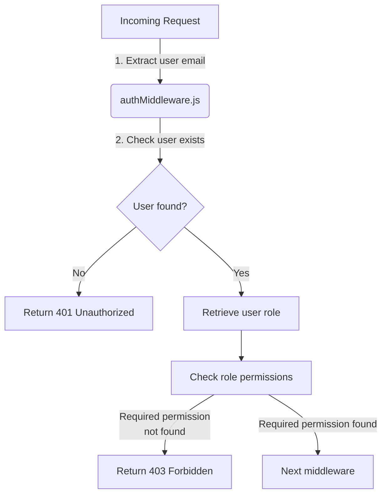
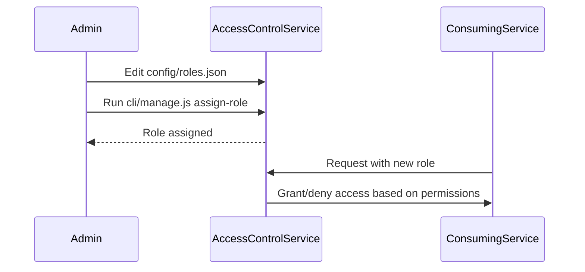

Relevant source files

The following files were used as context for generating this wiki page:

- [src/authMiddleware.js](https://github.com/aanickode/access-control-service/blob/main/src/authMiddleware.js)
- [docs/permissions.md](https://github.com/aanickode/access-control-service/blob/main/docs/permissions.md)

# Access Control

## Introduction

The Access Control system is a crucial component of the project, responsible for enforcing role-based access control (RBAC) and ensuring that only authorized users can access specific routes or resources within the application. It acts as a middleware layer, intercepting incoming requests and verifying the user's permissions before allowing the request to proceed.

Sources: [docs/permissions.md](https://github.com/aanickode/access-control-service/blob/main/docs/permissions.md)

## Role-Based Access Control (RBAC)

The RBAC model is the foundation of the Access Control system. It defines a set of roles, each associated with a specific set of permissions. Users are assigned one or more roles, and their access to resources is determined by the permissions granted to their assigned roles.

### Roles and Permissions

The project defines the following default roles and their associated permissions:

| Role     | Permissions                                   |
|----------|------------------------------------------------|
| admin    | view_users, create_role, view_permissions     |
| engineer | view_users, view_permissions                  |
| analyst  | view_users                                    |

Sources: [docs/permissions.md:13-17](https://github.com/aanickode/access-control-service/blob/main/docs/permissions.md#L13-L17)

### Permission Enforcement

The Access Control system enforces permissions on a per-route basis. Each route defines the required permission(s) to access it. The `checkPermission` middleware function in `authMiddleware.js` is responsible for verifying the user's permissions against the required permission(s) for the requested route.

Sources: [src/authMiddleware.js](https://github.com/aanickode/access-control-service/blob/main/src/authMiddleware.js)

## Managing Roles and Permissions

### Adding a New Role

To add a new role, follow these steps:

1. Edit the `config/roles.json` file to define the new role and its associated permissions.
2. Assign the new role to a user using the `cli/manage.js` script.
3. Ensure that consuming services request the appropriate permissions for the new role.

Sources: [docs/permissions.md:23-33](https://github.com/aanickode/access-control-service/blob/main/docs/permissions.md#L23-L33)

## Implementation Details

### User-Role Mapping

The Access Control system maintains an in-memory mapping of users to their assigned roles. This mapping is stored in the `db.users` object, where the keys are user email addresses, and the values are the corresponding role names.

Sources: [src/authMiddleware.js:6-7](https://github.com/aanickode/access-control-service/blob/main/src/authMiddleware.js#L6-L7)

### Role-Permission Mapping

The mapping of roles to their associated permissions is stored in the `db.roles` object. This object is likely loaded from a configuration file (e.g., `config/roles.json`) during the application's initialization.

Sources: [src/authMiddleware.js:9](https://github.com/aanickode/access-control-service/blob/main/src/authMiddleware.js#L9), [docs/permissions.md:13-17](https://github.com/aanickode/access-control-service/blob/main/docs/permissions.md#L13-L17)

## Future Enhancements

The documentation outlines several potential enhancements for the Access Control system:

- **Scoped Permissions**: Introduce a more granular permission model that allows for scoping permissions to specific resources or projects (e.g., `project:view:marketing`).
- **SSO Integration**: Integrate with a Single Sign-On (SSO) provider to retrieve user roles and permissions from group claims.
- **Audit Logging**: Implement audit logging to track role changes and access attempts for auditing and security purposes.

Sources: [docs/permissions.md:37-40](https://github.com/aanickode/access-control-service/blob/main/docs/permissions.md#L37-L40)

## Conclusion

The Access Control system plays a crucial role in ensuring secure access to resources within the application. By enforcing role-based access control and verifying user permissions, it helps maintain data integrity and prevent unauthorized access. The system is designed to be extensible, allowing for the addition of new roles and permissions as needed. However, future enhancements, such as scoped permissions, SSO integration, and audit logging, could further improve its functionality and security.