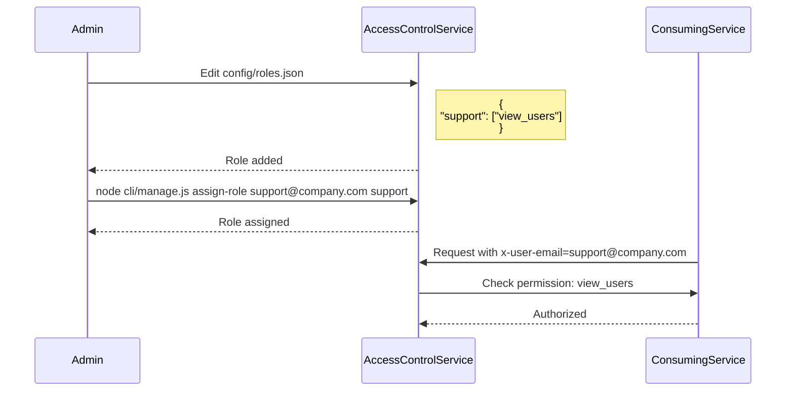

<details>
<summary>Relevant source files</summary>

The following files were used as context for generating this wiki page:

- [src/authMiddleware.js](https://github.com/aanickode/access-control-service/blob/main/src/authMiddleware.js)
- [docs/permissions.md](https://github.com/aanickode/access-control-service/blob/main/docs/permissions.md)
</details>

# Access Control

## Introduction

The Access Control system is a critical component of the project, responsible for enforcing role-based access control (RBAC) and ensuring that users have the appropriate permissions to access specific routes or resources. It acts as a middleware layer, intercepting incoming requests and validating the user's permissions before allowing the request to proceed.

Sources: [docs/permissions.md](https://github.com/aanickode/access-control-service/blob/main/docs/permissions.md)

## Permission Enforcement

The permission enforcement mechanism is implemented in the `checkPermission` function within the `authMiddleware.js` file. This function takes a `requiredPermission` parameter and returns a middleware function that can be applied to specific routes.

```javascript
export function checkPermission(requiredPermission) {
  return function (req, res, next) {
    // ...
  };
}
```

Sources: [src/authMiddleware.js:1-2](https://github.com/aanickode/access-control-service/blob/main/src/authMiddleware.js#L1-L2)

The middleware function performs the following steps:

1. Extracts the user's email from the `x-user-email` header in the request.
2. Checks if the user exists in the `db.users` in-memory map.
3. If the user exists, retrieves the user's role from the `db.users` map.
4. Looks up the permissions associated with the user's role in the `db.roles` map.
5. Verifies if the user's role includes the `requiredPermission`.
6. If the user has the required permission, the request is allowed to proceed by calling `next()`.
7. If the user is not found or lacks the required permission, an appropriate error response is sent with a 401 (Unauthorized) or 403 (Forbidden) status code.

```mermaid
graph TD
    A[Incoming Request] -->|x-user-email| B[Extract User Email]
    B --> C{User Exists?}
    C -->|No| D[Return 401 Unauthorized]
    C -->|Yes| E[Retrieve User Role]
    E --> F[Lookup Role Permissions]
    F --> G{Has Required Permission?}
    G -->|No| H[Return 403 Forbidden]
    G -->|Yes| I[Call next() Middleware]
```

Sources: [src/authMiddleware.js:3-18](https://github.com/aanickode/access-control-service/blob/main/src/authMiddleware.js#L3-L18)

## Role and Permission Management

The Access Control system uses a flat, non-hierarchical permission model, where each role is associated with a list of permitted actions or resources.

### Default Roles

The system comes pre-configured with the following default roles and their associated permissions:

| Role     | Permissions                                 |
|----------|----------------------------------------------|
| admin    | view_users, create_role, view_permissions   |
| engineer | view_users, view_permissions                |
| analyst  | view_users                                  |

Sources: [docs/permissions.md:9-17](https://github.com/aanickode/access-control-service/blob/main/docs/permissions.md#L9-L17)

### Adding a New Role

To add a new role, follow these steps:

1. Edit the `config/roles.json` file to define the new role and its associated permissions.
2. Assign the new role to a user using the `cli/manage.js` script.
3. Ensure that consuming services request the appropriate permissions when accessing protected routes or resources.



Sources: [docs/permissions.md:20-31](https://github.com/aanickode/access-control-service/blob/main/docs/permissions.md#L20-L31)

## Implementation Details

### User-Role Mapping

The mapping between users and their assigned roles is stored in an in-memory `db.users` map. This map is likely initialized from a persistent data store or external service during the application's startup.

```javascript
import db from './db.js';

// ...

const userEmail = req.headers['x-user-email'];
if (!userEmail || !db.users[userEmail]) {
  return res.status(401).json({ error: 'Unauthorized: no user context' });
}

const role = db.users[userEmail];
```

Sources: [src/authMiddleware.js:4,10-12](https://github.com/aanickode/access-control-service/blob/main/src/authMiddleware.js#L4,L10-L12)

### Role-Permission Mapping

The permissions associated with each role are stored in an in-memory `db.roles` map, which is likely initialized from a configuration file or external source during application startup.

```javascript
import db from './db.js';

// ...

const permissions = db.roles[role] || [];
```

Sources: [src/authMiddleware.js:4,14](https://github.com/aanickode/access-control-service/blob/main/src/authMiddleware.js#L4,L14)

## Limitations and Future Enhancements

The current implementation of the Access Control system has the following limitations:

- All permission checks are flat, with no support for wildcarding or nested permissions.
- User-role mappings and role-permission mappings are stored in-memory, which may not be suitable for large-scale or distributed systems.
- Changes to the `roles.json` configuration file require a service restart to take effect.

The documentation outlines the following potential future enhancements:

- Support for scoped permissions (e.g., `project:view:marketing`).
- Integration with single sign-on (SSO) group claims for user-role mapping.
- Audit logging for role changes and access attempts.

Sources: [docs/permissions.md:35-39](https://github.com/aanickode/access-control-service/blob/main/docs/permissions.md#L35-L39)

## Conclusion

The Access Control system plays a crucial role in enforcing role-based access control and ensuring that users have the appropriate permissions to access protected resources or routes. It provides a flexible and extensible mechanism for defining roles, permissions, and their mappings, while also allowing for future enhancements to support more advanced features like scoped permissions and integration with external authentication and authorization systems.