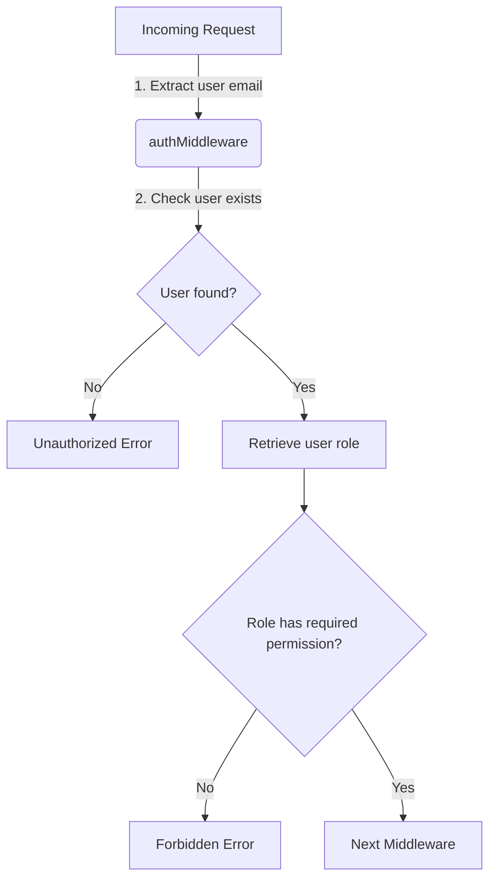
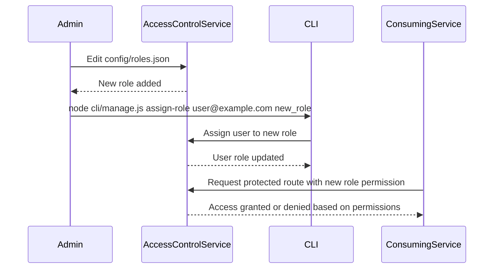

Relevant source files

The following files were used as context for generating this wiki page:

- [src/authMiddleware.js](https://github.com/aanickode/access-control-service/blob/main/src/authMiddleware.js)
- [docs/permissions.md](https://github.com/aanickode/access-control-service/blob/main/docs/permissions.md)

# Access Control

## Introduction

The Access Control module is a critical component of the project, responsible for enforcing role-based access control (RBAC) and ensuring that only authorized users can access specific routes or resources within the application. It acts as a middleware layer, intercepting incoming requests and validating the user's permissions before allowing the request to proceed further.

Sources: [docs/permissions.md]()

## Role-Based Access Control (RBAC) Model

The RBAC model employed by the Access Control module is based on a simple yet effective approach. It defines a set of predefined roles, each associated with a specific set of permissions. Users are assigned one of these roles, and their access to various routes or resources is determined by the permissions granted to their assigned role.

Sources: [docs/permissions.md]()

### Default Roles and Permissions

The project comes with a set of predefined roles and their associated permissions:

| Role     | Permissions                                |
|----------|---------------------------------------------|
| admin    | view_users, create_role, view_permissions |
| engineer | view_users, view_permissions              |
| analyst  | view_users                                 |

Sources: [docs/permissions.md:19-25]()

## Permission Enforcement

The Access Control module enforces permissions on a per-route basis. Each route defines the required permission(s) to access it, and the module checks if the user's assigned role has the necessary permission(s) before allowing the request to proceed.

The permission enforcement process follows these steps:

1. Extract the user's email from the `x-user-email` header in the incoming request.
2. Check if the user exists in the in-memory `db.users` map.
3. If the user exists, retrieve their assigned role.
4. Check if the user's role includes the required permission for the requested route.
5. If the user has the required permission, proceed to the next middleware; otherwise, return a "Forbidden" error.

Sources: [src/authMiddleware.js](), [docs/permissions.md:5-10]()

## Adding a New Role

To add a new role to the system, follow these steps:

1. Edit the `config/roles.json` file to define the new role and its associated permissions.
2. Assign the new role to a user using the provided CLI tool (`node cli/manage.js assign-role <email> <role>`).
3. Ensure that consuming services request the appropriate permissions for the new role when accessing protected routes.

Sources: [docs/permissions.md:28-37]()

## Future Enhancements

The Access Control module has several potential enhancements planned for future releases:

- Scoped permissions (e.g., `project:view:marketing`) for more granular access control.
- Integration with Single Sign-On (SSO) group claims for easier user-role mapping.
- Audit logging for role changes and access attempts to improve security and auditing capabilities.

Sources: [docs/permissions.md:40-43]()

## Conclusion

The Access Control module plays a crucial role in ensuring secure and controlled access to the application's resources. By implementing a role-based access control model, it provides a flexible and scalable way to manage user permissions and enforce access restrictions. The module's design allows for easy extensibility, enabling the addition of new roles and permissions as the application's requirements evolve.