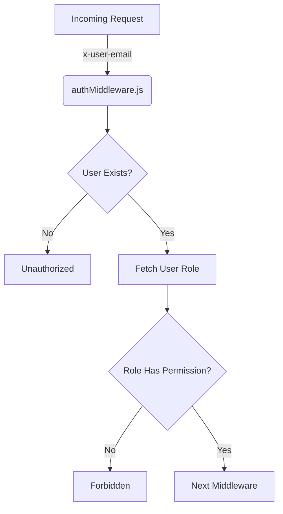
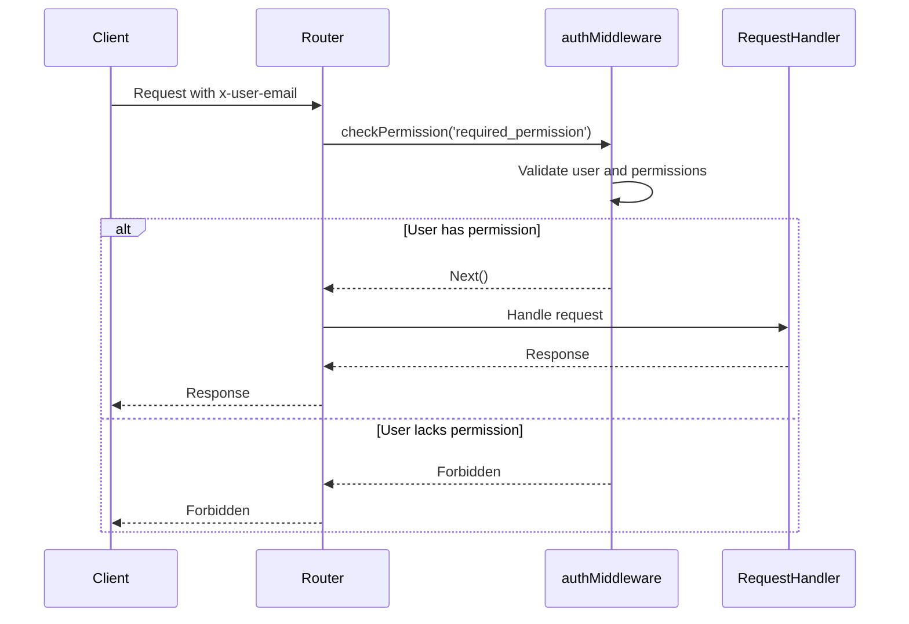
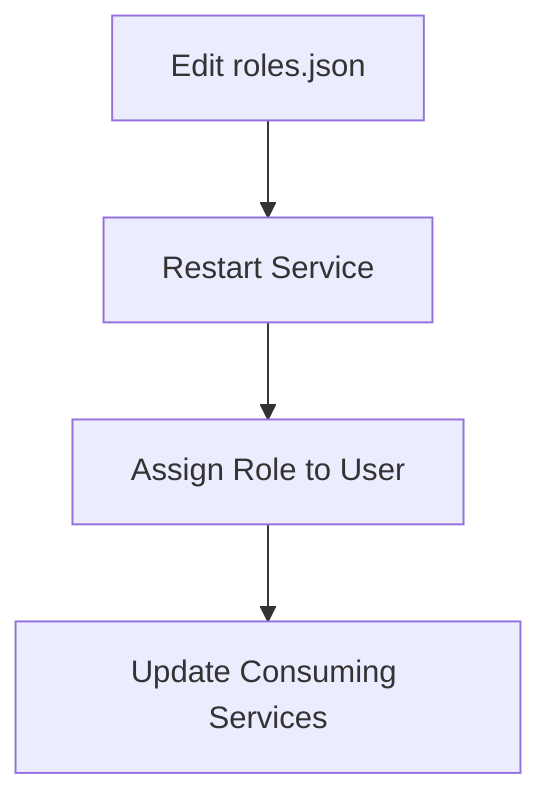

<details>
<summary>Relevant source files</summary>

The following files were used as context for generating this wiki page:

- [src/authMiddleware.js](https://github.com/aanickode/access-control-service/blob/main/src/authMiddleware.js)
- [docs/permissions.md](https://github.com/aanickode/access-control-service/blob/main/docs/permissions.md)

</details>

# Access Control

## Introduction

The Access Control system is a critical component of the project, responsible for enforcing role-based access control (RBAC) and ensuring that users have the necessary permissions to access specific routes or resources. It acts as a middleware layer, intercepting incoming requests and verifying the user's role and associated permissions before allowing the request to proceed.

Sources: [docs/permissions.md](https://github.com/aanickode/access-control-service/blob/main/docs/permissions.md)

## Architecture

The Access Control system follows a straightforward architecture, leveraging an in-memory database (`db.js`) to store user-role mappings and role-permission mappings. The core functionality is implemented in the `authMiddleware.js` file, which exports a `checkPermission` function.



The `checkPermission` function is a higher-order function that takes a `requiredPermission` as an argument and returns a middleware function. This middleware function is responsible for checking if the user has the required permission based on their role.

Sources: [src/authMiddleware.js](https://github.com/aanickode/access-control-service/blob/main/src/authMiddleware.js), [docs/permissions.md](https://github.com/aanickode/access-control-service/blob/main/docs/permissions.md)

## Permission Enforcement

The Access Control system enforces permissions on a per-route basis. Each route defines the required permission, and the `checkPermission` middleware is used to validate the user's access before allowing the request to proceed.



For a request to be considered valid, it must:

1. Include the `x-user-email` header
2. Match a known user in the `db.users` map
3. Have a role that includes the required permission

Sources: [src/authMiddleware.js:5-18](https://github.com/aanickode/access-control-service/blob/main/src/authMiddleware.js#L5-L18), [docs/permissions.md](https://github.com/aanickode/access-control-service/blob/main/docs/permissions.md)

## Roles and Permissions

The Access Control system uses a role-based access control (RBAC) model, where users are assigned roles, and roles are associated with specific permissions.

### Default Roles

The system comes with a set of predefined roles and their associated permissions:

| Role     | Permissions                                  |
|----------|-----------------------------------------------|
| admin    | view_users, create_role, view_permissions    |
| engineer | view_users, view_permissions                 |
| analyst  | view_users                                   |

Sources: [docs/permissions.md:8-17](https://github.com/aanickode/access-control-service/blob/main/docs/permissions.md#L8-L17)

#### admin

- Full system access
- Used by platform and DevOps teams

#### engineer

- Read-only access to users and permissions
- Used for observability and debugging

#### analyst

- Basic read-only access
- Intended for data/reporting use cases

Sources: [docs/permissions.md:19-27](https://github.com/aanickode/access-control-service/blob/main/docs/permissions.md#L19-L27)

### Adding a New Role

To add a new role, follow these steps:

1. Edit `config/roles.json` to define a new role and its associated permissions.
2. Assign the new role to a user using the `cli/manage.js` script.
3. Ensure consuming services request the appropriate permissions for the new role.



Sources: [docs/permissions.md:30-38](https://github.com/aanickode/access-control-service/blob/main/docs/permissions.md#L30-L38)

## Implementation Details

### User-Role Mapping

The user-role mapping is stored in an in-memory `db.users` object, where the keys are user email addresses, and the values are the corresponding roles.

```javascript
const db = {
  users: {
    'admin@company.com': 'admin',
    'engineer@company.com': 'engineer',
    'analyst@company.com': 'analyst'
  },
  // ...
}
```

Sources: [src/authMiddleware.js:3](https://github.com/aanickode/access-control-service/blob/main/src/authMiddleware.js#L3)

### Role-Permission Mapping

The role-permission mapping is stored in an in-memory `db.roles` object, where the keys are role names, and the values are arrays of associated permissions.

```javascript
const db = {
  roles: {
    'admin': ['view_users', 'create_role', 'view_permissions'],
    'engineer': ['view_users', 'view_permissions'],
    'analyst': ['view_users']
  },
  // ...
}
```

Sources: [src/authMiddleware.js:4](https://github.com/aanickode/access-control-service/blob/main/src/authMiddleware.js#L4), [docs/permissions.md:8-17](https://github.com/aanickode/access-control-service/blob/main/docs/permissions.md#L8-L17)

## Limitations and Future Enhancements

While the current implementation of the Access Control system is functional, there are several limitations and potential areas for improvement:

- All permission checks are flat; no support for wildcarding or nested permissions.
- All user-role mappings are stored in-memory, which may not be suitable for large-scale deployments.
- Changes to the `roles.json` configuration file require a service restart.

Potential future enhancements include:

- Scoped permissions (e.g., `project:view:marketing`)
- Integration with single sign-on (SSO) group claims
- Audit logging for role changes and access attempts

Sources: [docs/permissions.md:41-45](https://github.com/aanickode/access-control-service/blob/main/docs/permissions.md#L41-L45)

## Conclusion

The Access Control system is a crucial component of the project, responsible for enforcing role-based access control and ensuring that users have the necessary permissions to access specific routes or resources. It follows a straightforward architecture, leveraging an in-memory database to store user-role mappings and role-permission mappings. While the current implementation is functional, there are opportunities for future enhancements, such as scoped permissions, SSO integration, and audit logging.