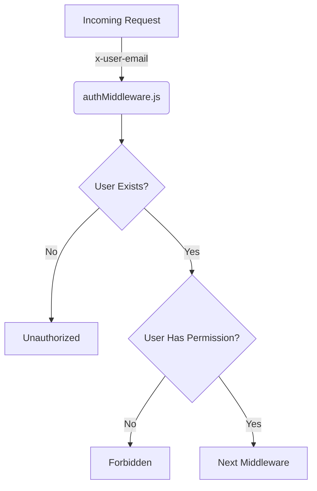

<details>
<summary>Relevant source files</summary>

The following files were used as context for generating this wiki page:

- [src/authMiddleware.js](https://github.com/aanickode/access-control-service/blob/main/src/authMiddleware.js)
- [docs/permissions.md](https://github.com/aanickode/access-control-service/blob/main/docs/permissions.md)
</details>

# Access Control

## Introduction

The Access Control system is a critical component of the project, responsible for enforcing role-based access control (RBAC) and ensuring that users have the appropriate permissions to access specific routes or resources. It acts as a middleware layer, intercepting incoming requests and verifying the user's role and associated permissions before allowing the request to proceed.

Sources: [docs/permissions.md](https://github.com/aanickode/access-control-service/blob/main/docs/permissions.md)

## Role-Based Access Control (RBAC)

The RBAC model is the foundation of the Access Control system. It defines a set of roles, each associated with a specific set of permissions. Users are assigned one or more roles, and their access to resources is determined by the permissions granted to their assigned roles.

### Roles and Permissions

The project defines the following default roles and their associated permissions:

| Role     | Permissions                                |
|----------|---------------------------------------------|
| admin    | view_users, create_role, view_permissions  |
| engineer | view_users, view_permissions               |
| analyst  | view_users                                 |

Sources: [docs/permissions.md:11-16](https://github.com/aanickode/access-control-service/blob/main/docs/permissions.md#L11-L16)

## Permission Enforcement

The `checkPermission` function in the `authMiddleware.js` file is responsible for enforcing permissions on incoming requests. It is a higher-order function that takes a `requiredPermission` as an argument and returns a middleware function.



The middleware function performs the following steps:

1. Extracts the `x-user-email` header from the request.
2. Checks if the user exists in the `db.users` in-memory map.
3. Retrieves the user's role from the `db.users` map.
4. Checks if the user's role includes the `requiredPermission`.
5. If the user has the required permission, the request is passed to the next middleware; otherwise, a `403 Forbidden` response is sent.

Sources: [src/authMiddleware.js](https://github.com/aanickode/access-control-service/blob/main/src/authMiddleware.js)

## Adding a New Role

To add a new role to the system, follow these steps:

1. Edit the `config/roles.json` file to define the new role and its associated permissions.
2. Use the `cli/manage.js` script to assign the new role to a user:

```bash
node cli/manage.js assign-role user@example.com new-role
```

3. Ensure that consuming services request the appropriate permissions for the new role.

Sources: [docs/permissions.md:25-35](https://github.com/aanickode/access-control-service/blob/main/docs/permissions.md#L25-L35)

## Limitations and Future Enhancements

The current implementation of the Access Control system has the following limitations:

- All permission checks are flat; no support for wildcarding or nested permissions.
- All user-role mappings are stored in-memory, which may not be suitable for large-scale deployments.
- Changes to the `roles.json` file require a service restart to take effect.

Potential future enhancements include:

- Scoped permissions (e.g., `project:view:marketing`) for finer-grained access control.
- Integration with a single sign-on (SSO) system to leverage group claims for role assignments.
- Audit logging for role changes and access attempts.

Sources: [docs/permissions.md:38-45](https://github.com/aanickode/access-control-service/blob/main/docs/permissions.md#L38-L45)

## Conclusion

The Access Control system plays a crucial role in ensuring secure access to resources within the project. By implementing a role-based access control model and enforcing permissions at the middleware level, it provides a flexible and scalable approach to managing user access. While the current implementation has some limitations, the system is designed to be extensible, with potential future enhancements to improve its functionality and integration with other systems.