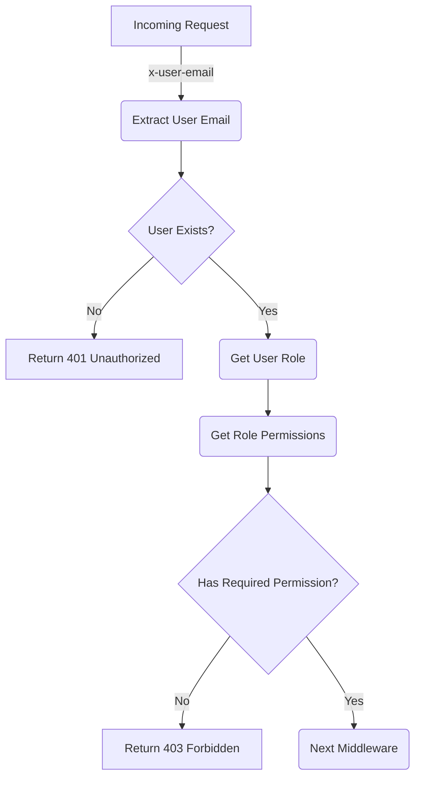
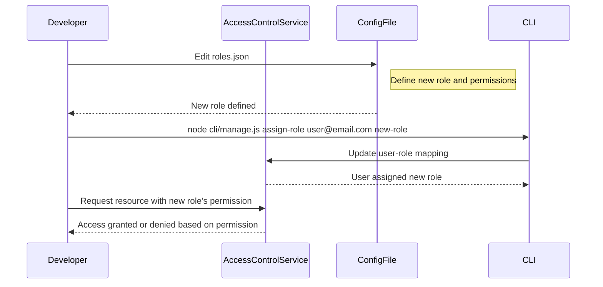

<details>
<summary>Relevant source files</summary>

The following files were used as context for generating this wiki page:

- [src/authMiddleware.js](https://github.com/aanickode/access-control-service/blob/main/src/authMiddleware.js)
- [docs/permissions.md](https://github.com/aanickode/access-control-service/blob/main/docs/permissions.md)

</details>

# Access Control

## Introduction

The Access Control system is a critical component of the project, responsible for enforcing role-based access control (RBAC) and ensuring that users have the appropriate permissions to access specific routes or resources. It acts as a middleware layer, intercepting incoming requests and verifying the user's role and associated permissions before allowing the request to proceed.

Sources: [docs/permissions.md](https://github.com/aanickode/access-control-service/blob/main/docs/permissions.md)

## Role-Based Access Control (RBAC)

The RBAC model is the foundation of the Access Control system. It defines a set of roles, each with a specific set of permissions. Users are assigned one or more roles, and their access to resources is determined by the permissions associated with their assigned roles.

### Roles and Permissions

The project defines the following default roles and their associated permissions:

| Role     | Permissions                                |
|----------|---------------------------------------------|
| admin    | view_users, create_role, view_permissions  |
| engineer | view_users, view_permissions               |
| analyst  | view_users                                 |

Sources: [docs/permissions.md:11-18](https://github.com/aanickode/access-control-service/blob/main/docs/permissions.md#L11-L18)

### Role Assignment

Users are assigned roles through an in-memory mapping stored in the `db.users` object. This mapping associates a user's email address with their assigned role.

```javascript
const userEmail = req.headers['x-user-email'];
if (!userEmail || !db.users[userEmail]) {
  return res.status(401).json({ error: 'Unauthorized: no user context' });
}

const role = db.users[userEmail];
```

Sources: [src/authMiddleware.js:5-9](https://github.com/aanickode/access-control-service/blob/main/src/authMiddleware.js#L5-L9)

## Permission Enforcement

The `checkPermission` middleware function is responsible for enforcing permissions on incoming requests. It checks if the user has the required permission based on their assigned role.

```javascript
export function checkPermission(requiredPermission) {
  return function (req, res, next) {
    const userEmail = req.headers['x-user-email'];
    if (!userEmail || !db.users[userEmail]) {
      return res.status(401).json({ error: 'Unauthorized: no user context' });
    }

    const role = db.users[userEmail];
    const permissions = db.roles[role] || [];

    if (!permissions.includes(requiredPermission)) {
      return res.status(403).json({ error: 'Forbidden: insufficient permissions' });
    }

    next();
  };
}
```

Sources: [src/authMiddleware.js:1-19](https://github.com/aanickode/access-control-service/blob/main/src/authMiddleware.js#L1-L19)

The middleware function follows these steps:

1. Extract the user's email from the `x-user-email` request header.
2. Check if the user exists in the `db.users` mapping.
3. Retrieve the user's assigned role from the `db.users` mapping.
4. Retrieve the permissions associated with the user's role from the `db.roles` mapping.
5. Check if the required permission is included in the user's permissions.
6. If the user has the required permission, the request is allowed to proceed; otherwise, a 403 Forbidden response is returned.



Sources: [src/authMiddleware.js](https://github.com/aanickode/access-control-service/blob/main/src/authMiddleware.js)

## Adding a New Role

To add a new role to the system, follow these steps:

1. Edit the `config/roles.json` file to define the new role and its associated permissions.
2. Assign the new role to a user using the `cli/manage.js` script.
3. Ensure that consuming services request the appropriate permissions for the new role.



Sources: [docs/permissions.md:24-37](https://github.com/aanickode/access-control-service/blob/main/docs/permissions.md#L24-L37)

## Future Enhancements

The documentation outlines several potential future enhancements for the Access Control system:

- Scoped permissions (e.g., `project:view:marketing`)
- Integration with Single Sign-On (SSO) group claims
- Audit logging for role changes and access attempts

Sources: [docs/permissions.md:40-43](https://github.com/aanickode/access-control-service/blob/main/docs/permissions.md#L40-L43)

## Conclusion

The Access Control system plays a crucial role in ensuring that users have the appropriate permissions to access resources within the project. It enforces a role-based access control (RBAC) model, where users are assigned roles with specific permissions. The `checkPermission` middleware function is responsible for verifying the user's role and associated permissions before allowing access to a requested resource. The system also provides a mechanism for adding new roles and assigning them to users. While currently limited to flat permissions and in-memory user-role mappings, the documentation outlines potential future enhancements to improve the system's functionality and security.