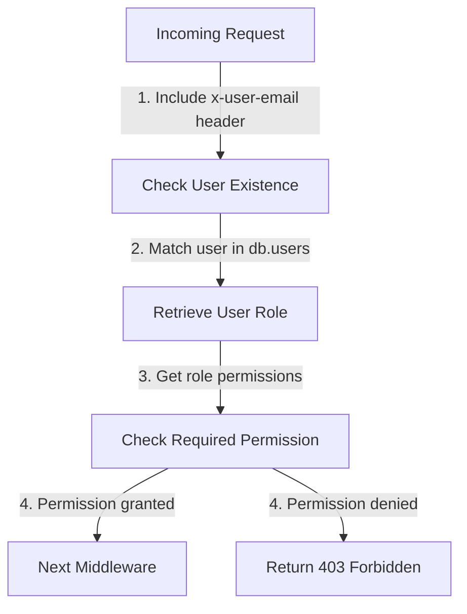

<details>
<summary>Relevant source files</summary>

The following files were used as context for generating this wiki page:

- [src/authMiddleware.js](https://github.com/aanickode/access-control-service/blob/main/src/authMiddleware.js)
- [docs/permissions.md](https://github.com/aanickode/access-control-service/blob/main/docs/permissions.md)
</details>

# Access Control

## Introduction

The Access Control system is a crucial component of the project, responsible for enforcing role-based access control (RBAC) and managing permissions for various routes and resources. It ensures that only authorized users with the appropriate roles and permissions can access specific functionalities or data within the application.

Sources: [docs/permissions.md]()

## Role-Based Access Control (RBAC) Model

The RBAC model is the foundation of the Access Control system. It defines a set of predefined roles, each associated with a specific set of permissions. Users are assigned one or more roles, and their access to resources is determined by the permissions granted to their assigned roles.

Sources: [docs/permissions.md]()

### Default Roles and Permissions

The project includes the following default roles and their associated permissions:

| Role     | Permissions                                  |
|----------|-----------------------------------------------|
| admin    | view_users, create_role, view_permissions    |
| engineer | view_users, view_permissions                 |
| analyst  | view_users                                   |

Sources: [docs/permissions.md:17-22]()

#### admin

The `admin` role is intended for platform and DevOps teams, granting full system access. This role has permissions to view users, create new roles, and view available permissions.

Sources: [docs/permissions.md:24-25]()

#### engineer

The `engineer` role is designed for observability and debugging purposes. It has read-only access to user information and available permissions.

Sources: [docs/permissions.md:27-28]()

#### analyst

The `analyst` role is intended for data and reporting use cases. It has basic read-only access to user information.

Sources: [docs/permissions.md:30-31]()

## Permission Enforcement

The Access Control system enforces permissions on a per-route basis. Each route defines the required permission(s) to access it, and these permissions are checked at runtime against the user's assigned role(s).



For a request to be considered valid, it must:

1. Include the `x-user-email` header
2. Match a known user in the in-memory `db.users` map
3. Have a role that includes the required permission for the requested route

If any of these conditions are not met, the request is rejected with a `401 Unauthorized` or `403 Forbidden` error.

Sources: [src/authMiddleware.js](), [docs/permissions.md:5-9]()

## Adding a New Role

To add a new role to the system, follow these steps:

1. Edit the `config/roles.json` file to define the new role and its associated permissions:

```json
{
  "support": ["view_users"]
}
```

2. Assign the new role to a user using the provided CLI tool:

```bash
node cli/manage.js assign-role support@company.com support
```

3. Ensure that consuming services request the appropriate permissions when accessing routes or resources protected by the Access Control system.

Sources: [docs/permissions.md:14-20]()

## Implementation Details

### Authentication Middleware

The `authMiddleware.js` file contains the `checkPermission` function, which is a middleware function used to enforce permissions on routes. It takes a `requiredPermission` parameter and returns a middleware function that can be applied to specific routes.

```javascript
export function checkPermission(requiredPermission) {
  return function (req, res, next) {
    const userEmail = req.headers['x-user-email'];
    if (!userEmail || !db.users[userEmail]) {
      return res.status(401).json({ error: 'Unauthorized: no user context' });
    }

    const role = db.users[userEmail];
    const permissions = db.roles[role] || [];

    if (!permissions.includes(requiredPermission)) {
      return res.status(403).json({ error: 'Forbidden: insufficient permissions' });
    }

    next();
  };
}
```

The middleware function performs the following steps:

1. Checks if the `x-user-email` header is present in the request and if the user exists in the `db.users` map.
2. Retrieves the user's role from the `db.users` map.
3. Looks up the permissions associated with the user's role in the `db.roles` map.
4. Checks if the required permission is included in the user's role permissions.
5. If the permission is granted, the request is passed to the next middleware function using `next()`.
6. If the permission is denied, the middleware returns a `403 Forbidden` response.

Sources: [src/authMiddleware.js]()

## Future Enhancements

The `docs/permissions.md` file outlines several potential future enhancements for the Access Control system:

- **Scoped Permissions**: Introduce a more granular permission system that allows for scoped permissions, such as `project:view:marketing`.
- **SSO Group Claims Integration**: Integrate with a Single Sign-On (SSO) system to map user roles and permissions based on group claims.
- **Audit Logging**: Implement audit logging for role changes and access attempts to improve security and auditing capabilities.

Sources: [docs/permissions.md:25-29]()

## Conclusion

The Access Control system plays a crucial role in ensuring secure access to resources and functionalities within the project. By implementing a role-based access control model and enforcing permissions on a per-route basis, it provides a robust and flexible mechanism for managing user access. The system includes predefined roles with associated permissions, as well as the ability to add new roles and assign them to users. While the current implementation is based on an in-memory data store, future enhancements such as scoped permissions, SSO integration, and audit logging are planned to further improve the system's capabilities and security.