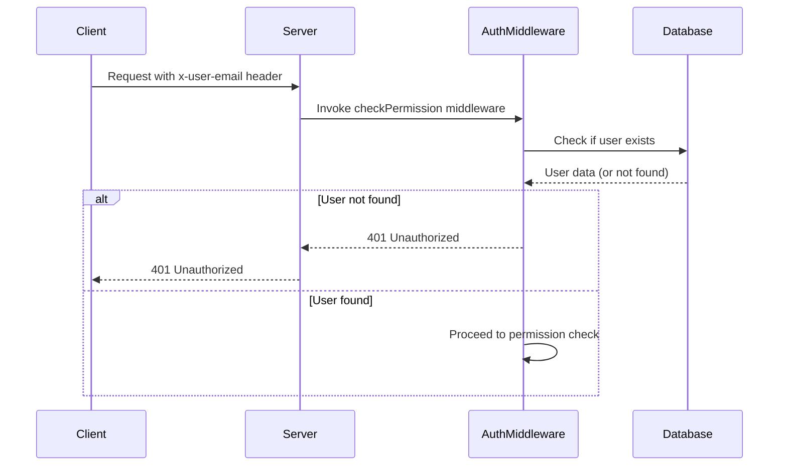
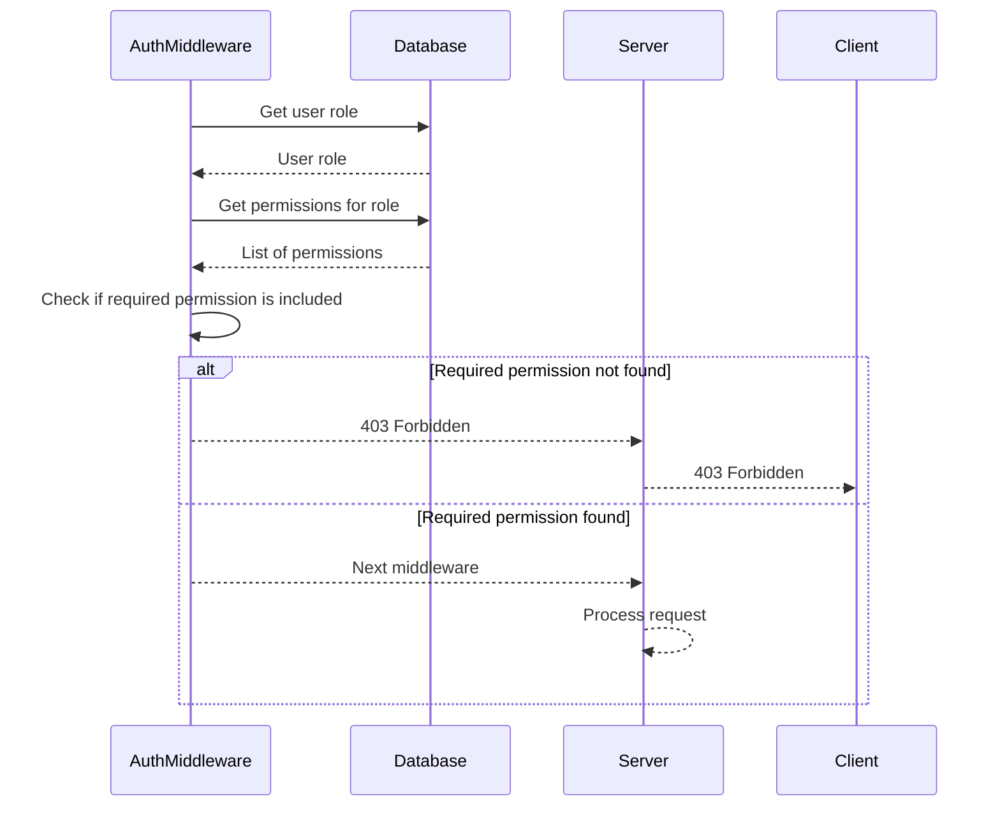

<details>
<summary>Relevant source files</summary>

The following file was used as context for generating this wiki page:

- [src/authMiddleware.js](https://github.com/aanickode/access-control-service/blob/main/src/authMiddleware.js)

</details>

# Access Control

## Introduction

The Access Control feature is a crucial component of the project, responsible for enforcing authorization and permission checks for incoming requests. It ensures that only authenticated users with the appropriate permissions can access and perform specific actions within the application.

The primary functionality of Access Control is implemented in the `src/authMiddleware.js` file, which exports a `checkPermission` function. This function acts as a middleware for Express.js routes, verifying the user's permissions based on their assigned role and the required permission level for the requested operation.

## Authorization Flow

### User Authentication

Before the Access Control mechanism is invoked, the user must be authenticated and their email address must be present in the request headers (`x-user-email`). If the user email is not provided or is not found in the `db.users` object, the middleware returns a 401 Unauthorized response.



Sources: [src/authMiddleware.js:3-9]()

### Permission Check

If the user is authenticated, the middleware retrieves the user's role from the `db.users` object. It then looks up the permissions associated with that role in the `db.roles` object. If the required permission is not included in the user's permissions, the middleware returns a 403 Forbidden response.



Sources: [src/authMiddleware.js:11-19]()

## Key Components

| Component | Description |
| --- | --- |
| `checkPermission` | A higher-order function that takes a `requiredPermission` string as input and returns a middleware function for Express.js routes. This middleware function performs the actual permission check based on the user's role and required permission. |
| `db.users` | An object that maps user email addresses to their respective roles. |
| `db.roles` | An object that maps roles to their associated permissions (an array of strings). |

Sources: [src/authMiddleware.js:1,3,11-12,15]()

## Usage

The `checkPermission` function is designed to be used as a middleware for specific routes that require authorization. It can be imported and applied to routes like this:

```javascript
import { checkPermission } from './authMiddleware.js';

app.get('/protected-resource', checkPermission('read:resource'), (req, res) => {
  // Handle protected resource request
});
```

In this example, the `checkPermission('read:resource')` middleware is applied to the `/protected-resource` route. Only users with the `'read:resource'` permission will be allowed to access this route.

Sources: [src/authMiddleware.js:3]()

## Conclusion

The Access Control feature implemented in `src/authMiddleware.js` provides a robust and flexible mechanism for enforcing authorization and permission checks within the application. By leveraging user roles and associated permissions, it ensures that only authenticated users with the appropriate privileges can access and perform specific actions. This feature is essential for maintaining data integrity, security, and proper access control throughout the application.