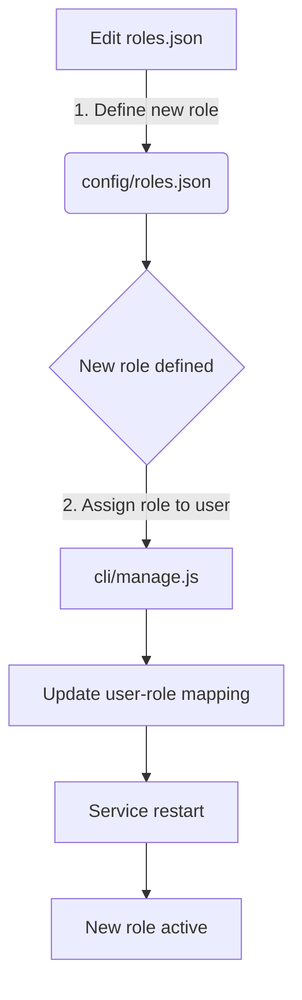
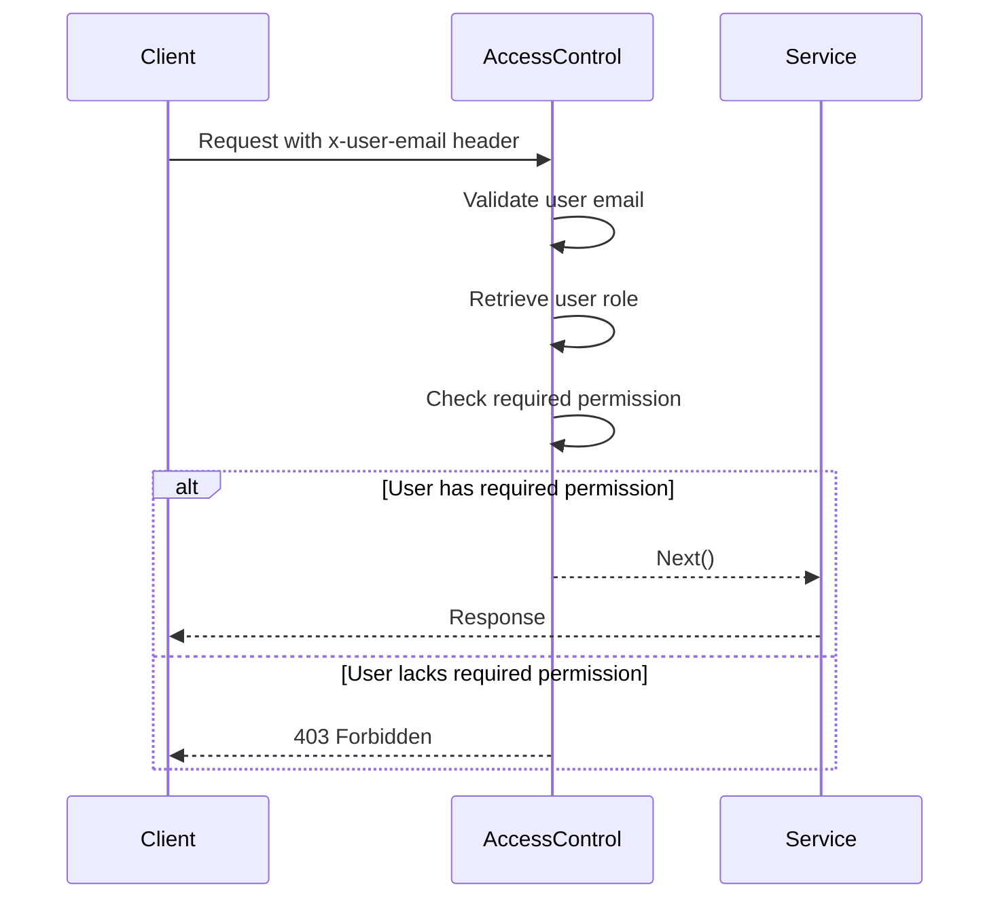

<details>
<summary>Relevant source files</summary>

The following files were used as context for generating this wiki page:

- [src/authMiddleware.js](https://github.com/aanickode/access-control-service/blob/main/src/authMiddleware.js)
- [docs/permissions.md](https://github.com/aanickode/access-control-service/blob/main/docs/permissions.md)

</details>

# Access Control

## Introduction

The Access Control system is a crucial component of the project, responsible for enforcing role-based access control (RBAC) and ensuring that only authorized users can access specific routes or resources within the application. It acts as a middleware layer, verifying user permissions before allowing requests to proceed.

Sources: [docs/permissions.md](https://github.com/aanickode/access-control-service/blob/main/docs/permissions.md)

## Role-Based Access Control (RBAC)

The RBAC model is the foundation of the Access Control system. It defines a set of roles, each associated with a specific set of permissions. Users are assigned one or more roles, and their access to resources is determined by the permissions granted to their assigned roles.

### Roles and Permissions

The project defines the following default roles and their associated permissions:

| Role     | Permissions                                  |
|----------|-----------------------------------------------|
| admin    | view_users, create_role, view_permissions    |
| engineer | view_users, view_permissions                 |
| analyst  | view_users                                   |

Sources: [docs/permissions.md:11-17](https://github.com/aanickode/access-control-service/blob/main/docs/permissions.md#L11-L17)

#### Admin Role

The `admin` role has full system access and is intended for platform and DevOps teams.

#### Engineer Role

The `engineer` role has read-only access to users and permissions, typically used for observability and debugging purposes.

#### Analyst Role

The `analyst` role has basic read-only access to users, intended for data and reporting use cases.

Sources: [docs/permissions.md:19-27](https://github.com/aanickode/access-control-service/blob/main/docs/permissions.md#L19-L27)

### Adding a New Role

To add a new role, follow these steps:

1. Edit the `config/roles.json` file to define the new role and its associated permissions.
2. Assign the new role to a user using the `cli/manage.js` script.
3. Ensure that consuming services request the appropriate permissions for the new role.



Sources: [docs/permissions.md:30-40](https://github.com/aanickode/access-control-service/blob/main/docs/permissions.md#L30-L40)

## Permission Enforcement

The Access Control system enforces permissions on a per-route basis. Each route defines the required permission(s) to access it, and these permissions are checked at runtime against the user's assigned role(s).



For a request to be valid, it must:

1. Include the `x-user-email` header.
2. Match a known user in the in-memory `db.users` map.
3. Have a role that includes the required permission for the requested route.

Sources: [src/authMiddleware.js](https://github.com/aanickode/access-control-service/blob/main/src/authMiddleware.js), [docs/permissions.md:3-8](https://github.com/aanickode/access-control-service/blob/main/docs/permissions.md#L3-L8)

## Implementation Details

The `checkPermission` function in `src/authMiddleware.js` is a middleware function that enforces the permission checks described above.

```javascript
export function checkPermission(requiredPermission) {
  return function (req, res, next) {
    const userEmail = req.headers['x-user-email'];
    if (!userEmail || !db.users[userEmail]) {
      return res.status(401).json({ error: 'Unauthorized: no user context' });
    }

    const role = db.users[userEmail];
    const permissions = db.roles[role] || [];

    if (!permissions.includes(requiredPermission)) {
      return res.status(403).json({ error: 'Forbidden: insufficient permissions' });
    }

    next();
  };
}
```

1. It retrieves the `x-user-email` header from the request.
2. If the header is missing or the user is not found in the `db.users` map, it returns a 401 Unauthorized error.
3. It retrieves the user's role from the `db.users` map.
4. It retrieves the permissions associated with the user's role from the `db.roles` map.
5. If the required permission is not included in the user's permissions, it returns a 403 Forbidden error.
6. If the user has the required permission, it calls the `next()` middleware function to proceed with the request.

Sources: [src/authMiddleware.js](https://github.com/aanickode/access-control-service/blob/main/src/authMiddleware.js)

## Notes and Future Enhancements

- All permission checks are flat; no wildcarding or nesting is supported.
- All user-role mappings are stored in-memory.
- Changes to the `roles.json` file require a service restart to take effect.
- Potential future enhancements include:
  - Scoped permissions (e.g., `project:view:marketing`).
  - Integration with Single Sign-On (SSO) group claims.
  - Audit logging for role changes and access attempts.

Sources: [docs/permissions.md:45-52](https://github.com/aanickode/access-control-service/blob/main/docs/permissions.md#L45-L52)

## Conclusion

The Access Control system is a critical component of the project, ensuring that only authorized users can access specific routes or resources based on their assigned roles and permissions. It follows the Role-Based Access Control (RBAC) model, defining a set of roles with associated permissions, and enforcing these permissions at runtime through middleware checks. The system is designed to be extensible, allowing for the addition of new roles and permissions as needed, while also providing room for future enhancements such as scoped permissions and integration with external authentication systems.