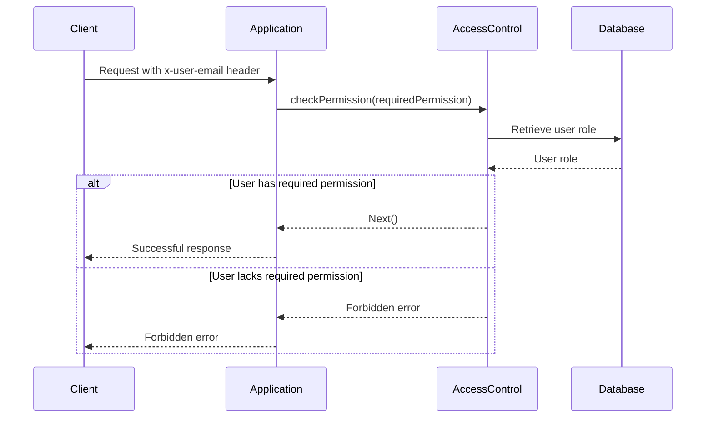
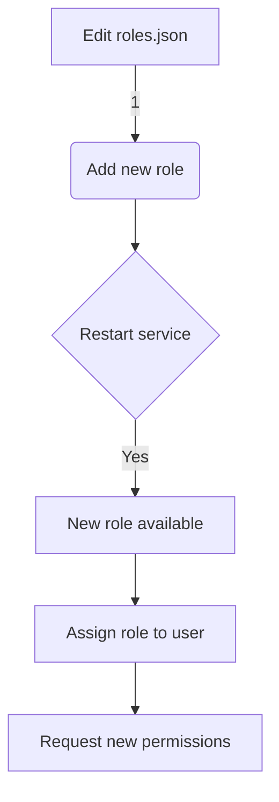

Relevant source files

The following files were used as context for generating this wiki page:

- [src/authMiddleware.js](https://github.com/aanickode/access-control-service/blob/main/src/authMiddleware.js)
- [docs/permissions.md](https://github.com/aanickode/access-control-service/blob/main/docs/permissions.md)

# Access Control

## Introduction

The Access Control system is a critical component of the project, responsible for enforcing role-based access control (RBAC) and ensuring that only authorized users can access specific routes or resources within the application. It acts as a middleware layer, verifying user permissions before allowing requests to proceed.

Sources: [docs/permissions.md](https://github.com/aanickode/access-control-service/blob/main/docs/permissions.md)

## Architecture Overview

The Access Control system follows a simple architecture, as illustrated by the following sequence diagram:

The `checkPermission` middleware function is the core of the Access Control system. It performs the following steps:

1. Extracts the `x-user-email` header from the incoming request.
2. Looks up the user's role in the in-memory `db.users` mapping.
3. Retrieves the permissions associated with the user's role from the `db.roles` mapping.
4. Checks if the user's role includes the required permission for the requested route.
5. If the user has the required permission, the request is allowed to proceed; otherwise, a `403 Forbidden` error is returned.

Sources: [src/authMiddleware.js](https://github.com/aanickode/access-control-service/blob/main/src/authMiddleware.js), [docs/permissions.md](https://github.com/aanickode/access-control-service/blob/main/docs/permissions.md)

## Role and Permission Management

The Access Control system relies on predefined roles and their associated permissions, which are managed through configuration files and a CLI tool.

### Default Roles and Permissions

The following table lists the default roles and their corresponding permissions:

| Role     | Permissions                                |
|----------|---------------------------------------------|
| admin    | view_users, create_role, view_permissions   |
| engineer | view_users, view_permissions                |
| analyst  | view_users                                  |

Sources: [docs/permissions.md:18-26](https://github.com/aanickode/access-control-service/blob/main/docs/permissions.md#L18-L26)

### Adding a New Role

To add a new role, follow these steps:

1. Edit the `config/roles.json` file to define the new role and its associated permissions.
2. Use the `cli/manage.js` tool to assign the new role to a user.
3. Ensure that consuming services request the appropriate permissions for the new role.

Sources: [docs/permissions.md:31-40](https://github.com/aanickode/access-control-service/blob/main/docs/permissions.md#L31-L40)

## Limitations and Future Enhancements

The current implementation of the Access Control system has the following limitations:

- All permission checks are flat, with no support for wildcarding or nested permissions.
- User-role mappings are stored in-memory, which may not be suitable for large-scale deployments.
- Changes to the `roles.json` configuration file require a service restart to take effect.

Potential future enhancements include:

- Scoped permissions (e.g., `project:view:marketing`) for finer-grained access control.
- Integration with single sign-on (SSO) group claims for role assignment.
- Audit logging for role changes and access attempts.

Sources: [docs/permissions.md:44-49](https://github.com/aanickode/access-control-service/blob/main/docs/permissions.md#L44-L49)

## Conclusion

The Access Control system plays a crucial role in ensuring that only authorized users can access specific routes or resources within the application. By enforcing role-based access control (RBAC), it helps maintain the security and integrity of the system. While the current implementation is relatively simple, it provides a solid foundation for future enhancements and integration with more advanced authentication and authorization mechanisms.