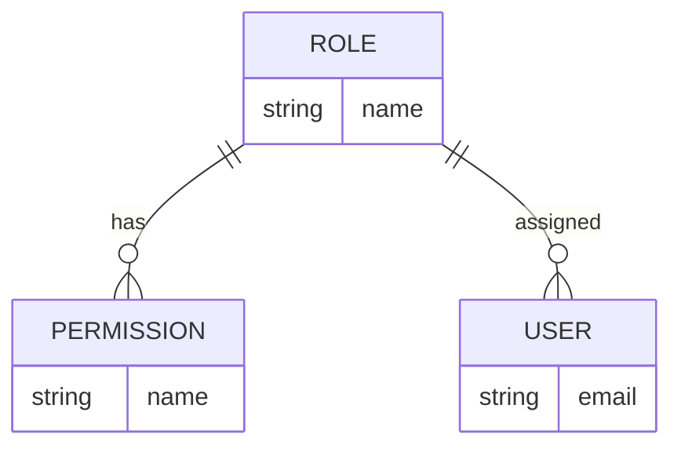
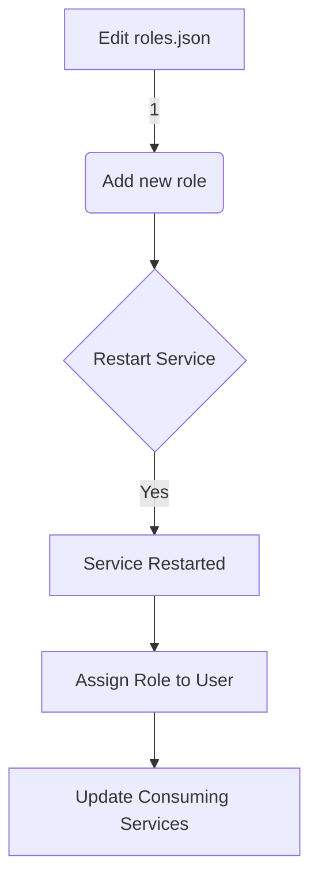
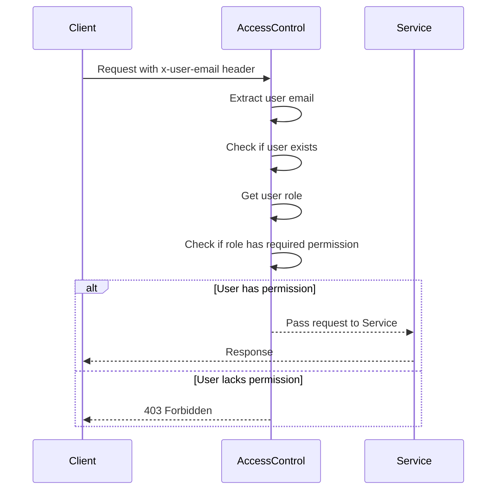

<details>
<summary>Relevant source files</summary>

The following files were used as context for generating this wiki page:

- [src/authMiddleware.js](https://github.com/aanickode/access-control-service/blob/main/src/authMiddleware.js)
- [docs/permissions.md](https://github.com/aanickode/access-control-service/blob/main/docs/permissions.md)

</details>

# Access Control

## Introduction

The Access Control system is a crucial component of the project, responsible for enforcing role-based access control (RBAC) and ensuring that users have the appropriate permissions to access various routes and resources within the application. It acts as a middleware layer, intercepting incoming requests and verifying the user's role and associated permissions before allowing the request to proceed.

Sources: [docs/permissions.md](https://github.com/aanickode/access-control-service/blob/main/docs/permissions.md)

## Permission Enforcement

The permission enforcement mechanism is implemented in the `checkPermission` function within the `authMiddleware.js` file. This function takes a `requiredPermission` parameter and returns a middleware function that can be applied to specific routes.

```javascript
export function checkPermission(requiredPermission) {
  return function (req, res, next) {
    // ...
  };
}
```

The middleware function performs the following steps:

1. Extracts the user's email from the `x-user-email` header in the request.
2. Checks if the user exists in the `db.users` in-memory map.
3. Retrieves the user's role from the `db.users` map.
4. Looks up the permissions associated with the user's role in the `db.roles` map.
5. Verifies if the required permission is included in the user's permissions.
6. If the user has the required permission, the request is allowed to proceed by calling `next()`.
7. If the user is not authenticated or lacks the required permission, an appropriate error response is sent with a 401 (Unauthorized) or 403 (Forbidden) status code.

Sources: [src/authMiddleware.js:3-18](https://github.com/aanickode/access-control-service/blob/main/src/authMiddleware.js#L3-L18)

## Role-Based Access Control (RBAC) Model

The Access Control system follows a Role-Based Access Control (RBAC) model, where permissions are assigned to roles, and users are assigned one or more roles. This approach simplifies permission management and allows for flexible access control configurations.

### Default Roles and Permissions

The project defines three default roles with predefined permissions:



| Role     | Permissions                                 |
|----------|----------------------------------------------|
| admin    | view_users, create_role, view_permissions   |
| engineer | view_users, view_permissions                |
| analyst  | view_users                                  |

Sources: [docs/permissions.md:9-19](https://github.com/aanickode/access-control-service/blob/main/docs/permissions.md#L9-L19)

### Adding a New Role

To add a new role, follow these steps:

1. Edit the `config/roles.json` file to define the new role and its associated permissions.
2. Use the `cli/manage.js` script to assign the new role to a user.
3. Ensure that consuming services request the appropriate permissions for the new role.



Sources: [docs/permissions.md:22-31](https://github.com/aanickode/access-control-service/blob/main/docs/permissions.md#L22-L31)

## Request Flow

The following sequence diagram illustrates the flow of a request through the Access Control system:



Sources: [src/authMiddleware.js](https://github.com/aanickode/access-control-service/blob/main/src/authMiddleware.js)

## Implementation Details

### User and Role Storage

The user-role mappings and role-permission mappings are stored in-memory using the following data structures:

```javascript
const db = {
  users: {
    'user1@example.com': 'admin',
    'user2@example.com': 'engineer',
    'user3@example.com': 'analyst'
  },
  roles: {
    'admin': ['view_users', 'create_role', 'view_permissions'],
    'engineer': ['view_users', 'view_permissions'],
    'analyst': ['view_users']
  }
};
```

Sources: [src/authMiddleware.js:1](https://github.com/aanickode/access-control-service/blob/main/src/authMiddleware.js#L1), [docs/permissions.md:9-19](https://github.com/aanickode/access-control-service/blob/main/docs/permissions.md#L9-L19)

### Limitations and Future Enhancements

- The current implementation uses a flat permission model without support for wildcarding or nested permissions.
- User-role mappings are stored in-memory, which may not be suitable for larger-scale deployments.
- Changes to the `roles.json` file require a service restart to take effect.

Potential future enhancements include:

- Scoped permissions (e.g., `project:view:marketing`)
- Integration with Single Sign-On (SSO) group claims
- Audit logging for role changes and access attempts

Sources: [docs/permissions.md:34-39](https://github.com/aanickode/access-control-service/blob/main/docs/permissions.md#L34-L39)

## Conclusion

The Access Control system plays a crucial role in enforcing role-based access control and ensuring that users have the appropriate permissions to access various resources within the application. It follows a well-defined RBAC model with predefined roles and permissions, and provides a flexible mechanism for adding new roles and assigning them to users. While the current implementation has some limitations, such as in-memory storage and a flat permission model, the system is designed with potential future enhancements in mind to address these limitations and provide more advanced access control capabilities.