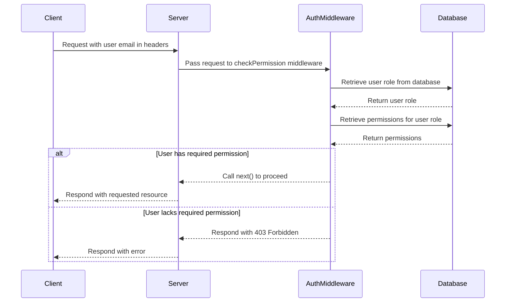

<details>
<summary>Relevant source files</summary>

The following file was used as context for generating this wiki page:

- [src/authMiddleware.js](https://github.com/aanickode/access-control-service/blob/main/src/authMiddleware.js)
</details>

# Authentication and Authorization

## Introduction

The "Authentication and Authorization" module is responsible for verifying user identities and ensuring they have the necessary permissions to access protected resources within the application. It acts as a middleware layer, intercepting incoming requests and validating the user's credentials and permissions before allowing the request to proceed.

Sources: [src/authMiddleware.js]()

## Authentication Flow

The authentication process is handled by the `checkPermission` function, which is a higher-order function that returns a middleware function. This middleware function is designed to be used in Express.js routes to protect specific endpoints.

```javascript
export function checkPermission(requiredPermission) {
  return function (req, res, next) {
    // Authentication and authorization logic...
  };
}
```

Sources: [src/authMiddleware.js:1-2](), [src/authMiddleware.js:3-10]()

The authentication flow can be represented by the following sequence diagram:



Sources: [src/authMiddleware.js:4-5](), [src/authMiddleware.js:6-8](), [src/authMiddleware.js:9-13](), [src/authMiddleware.js:14-18]()

## Authorization Logic

The authorization logic is implemented within the `checkPermission` middleware function. Here's a breakdown of the steps:

1. **Extract User Email**: The middleware expects the user's email to be present in the `x-user-email` header of the incoming request. If the header is missing or the user is not found in the database, a 401 Unauthorized response is returned.

   ```javascript
   const userEmail = req.headers['x-user-email'];
   if (!userEmail || !db.users[userEmail]) {
     return res.status(401).json({ error: 'Unauthorized: no user context' });
   }
   ```

   Sources: [src/authMiddleware.js:5](), [src/authMiddleware.js:6-8]()

2. **Retrieve User Role**: The user's role is retrieved from the `db.users` object using the email as the key.

   ```javascript
   const role = db.users[userEmail];
   ```

   Sources: [src/authMiddleware.js:10]()

3. **Retrieve Permissions for Role**: The permissions associated with the user's role are retrieved from the `db.roles` object. If the role is not found, an empty array is assigned.

   ```javascript
   const permissions = db.roles[role] || [];
   ```

   Sources: [src/authMiddleware.js:11]()

4. **Check Required Permission**: The middleware checks if the required permission (passed as an argument to `checkPermission`) is included in the user's permissions array. If the permission is not found, a 403 Forbidden response is returned.

   ```javascript
   if (!permissions.includes(requiredPermission)) {
     return res.status(403).json({ error: 'Forbidden: insufficient permissions' });
   }
   ```

   Sources: [src/authMiddleware.js:13-16]()

5. **Proceed to Next Middleware**: If the user has the required permission, the `next()` function is called to pass control to the next middleware or route handler.

   ```javascript
   next();
   ```

   Sources: [src/authMiddleware.js:18]()

## Data Structures

The `authMiddleware` module relies on two data structures stored in the `db` module:

| Data Structure | Description |
| --- | --- |
| `db.users` | An object that maps user emails to their respective roles. |
| `db.roles` | An object that maps roles to an array of permissions. |

Sources: [src/authMiddleware.js:6](), [src/authMiddleware.js:11]()

## Conclusion

The "Authentication and Authorization" module provides a robust mechanism for verifying user identities and ensuring they have the necessary permissions to access protected resources within the application. It leverages a role-based access control (RBAC) model, where users are assigned roles, and roles are associated with specific permissions. The module is designed to be used as a middleware layer in Express.js routes, allowing for granular control over access to different endpoints based on the user's permissions.