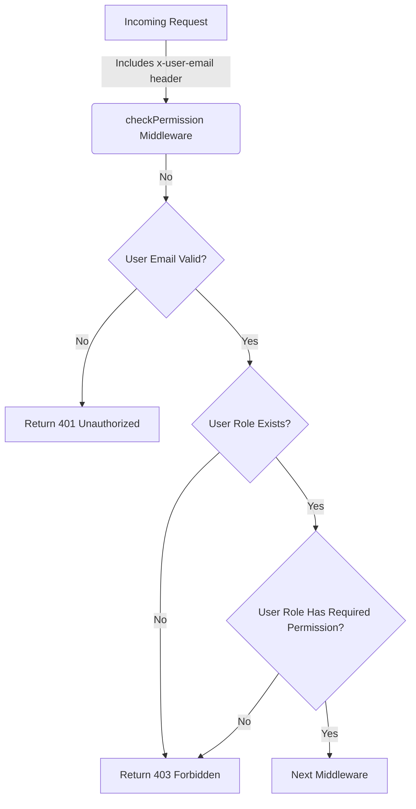

<details>
<summary>Relevant source files</summary>

The following files were used as context for generating this wiki page:

- [config/roles.json](https://github.com/aanickode/access-control-service/blob/main/config/roles.json)
- [src/authMiddleware.js](https://github.com/aanickode/access-control-service/blob/main/src/authMiddleware.js)
- [docs/permissions.md](https://github.com/aanickode/access-control-service/blob/main/docs/permissions.md)

</details>

# Permission Management

## Introduction

The Permission Management system is a crucial component of the access-control-service project, responsible for enforcing role-based access control (RBAC) across the application. It ensures that users can only access resources and perform actions they are authorized for based on their assigned roles and associated permissions.

The system follows a flat permission model, where each role is granted a set of permissions, and users are assigned one or more roles. The permissions are then checked at runtime for each incoming request to determine if the user has the required access level.

Sources: [docs/permissions.md](https://github.com/aanickode/access-control-service/blob/main/docs/permissions.md)

## Role and Permission Configuration

The roles and their associated permissions are defined in a JSON configuration file located at `config/roles.json`. This file maps each role to an array of permission strings.

```json
{
  "admin": ["view_users", "create_role", "view_permissions"],
  "engineer": ["view_users", "view_permissions"],
  "analyst": ["view_users"]
}
```

Sources: [config/roles.json](https://github.com/aanickode/access-control-service/blob/main/config/roles.json), [docs/permissions.md](https://github.com/aanickode/access-control-service/blob/main/docs/permissions.md:12-17)

## Default Roles

The system comes with three pre-defined roles:

### admin

- Full system access
- Used by platform and DevOps teams
- Permissions: `view_users`, `create_role`, `view_permissions`

### engineer

- Read-only access to users and permissions
- Used for observability and debugging
- Permissions: `view_users`, `view_permissions`

### analyst

- Basic read-only access
- Intended for data/reporting use cases
- Permissions: `view_users`

Sources: [docs/permissions.md](https://github.com/aanickode/access-control-service/blob/main/docs/permissions.md:19-31)

## Permission Enforcement Flow

The permission enforcement logic is implemented in the `checkPermission` middleware function, which is expected to be used on routes that require access control.



1. The middleware checks if the incoming request includes the `x-user-email` header.
2. It looks up the user's role in the in-memory `db.users` map.
3. If the user's role is not found, a 401 Unauthorized response is returned.
4. The user's role is used to retrieve the associated permissions from the `db.roles` map.
5. If the required permission is not included in the user's role permissions, a 403 Forbidden response is returned.
6. If the user has the required permission, the request is passed to the next middleware.

Sources: [src/authMiddleware.js](https://github.com/aanickode/access-control-service/blob/main/src/authMiddleware.js)

## Adding a New Role

To add a new role to the system, follow these steps:

1. Edit the `config/roles.json` file and define the new role with its associated permissions.
   ```json
   {
     "support": ["view_users"]
   }
   ```
2. Assign the new role to a user using the provided CLI tool:
   ```bash
   node cli/manage.js assign-role support@company.com support
   ```
3. Ensure that consuming services request the appropriate permissions when accessing protected routes.

Sources: [docs/permissions.md](https://github.com/aanickode/access-control-service/blob/main/docs/permissions.md:34-43)

## Limitations and Future Enhancements

The current implementation has the following limitations:

- All permission checks are flat; no wildcarding or nesting is supported.
- All user-role mappings are stored in-memory, which may not be suitable for large-scale deployments.
- Changes to the `roles.json` configuration file require a service restart to take effect.

Potential future enhancements include:

- Scoped permissions (e.g., `project:view:marketing`) for finer-grained access control.
- Integration with a single sign-on (SSO) provider to retrieve group claims and map them to roles.
- Audit logging for role changes and access attempts.

Sources: [docs/permissions.md](https://github.com/aanickode/access-control-service/blob/main/docs/permissions.md:46-52)

## Conclusion

The Permission Management system in the access-control-service project provides a robust and flexible role-based access control mechanism. It allows for easy configuration of roles and permissions, and enforces access control at runtime based on the user's assigned role and the required permissions for each route. While the current implementation has some limitations, the system is designed to be extensible and can be enhanced with additional features as needed.