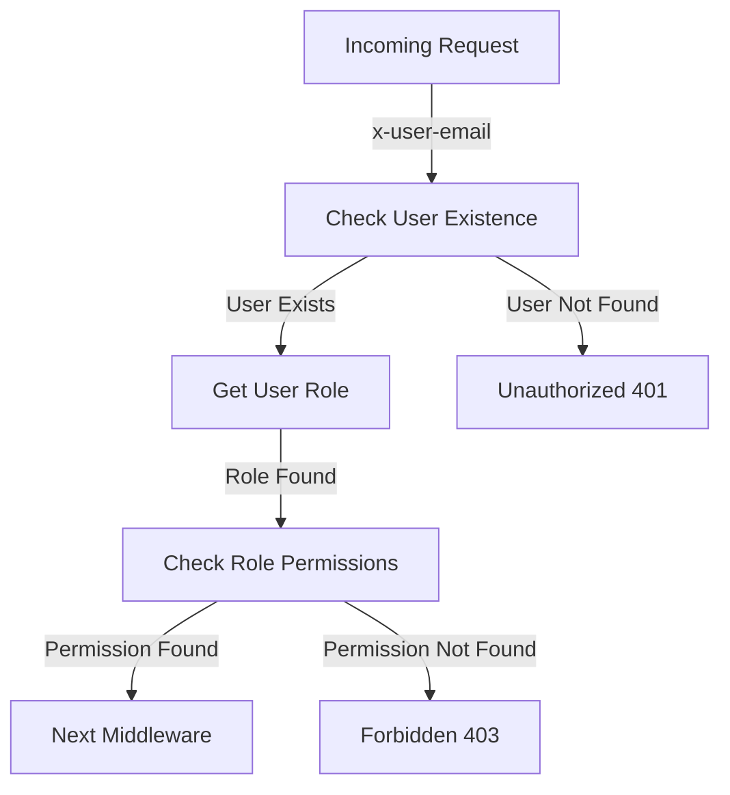
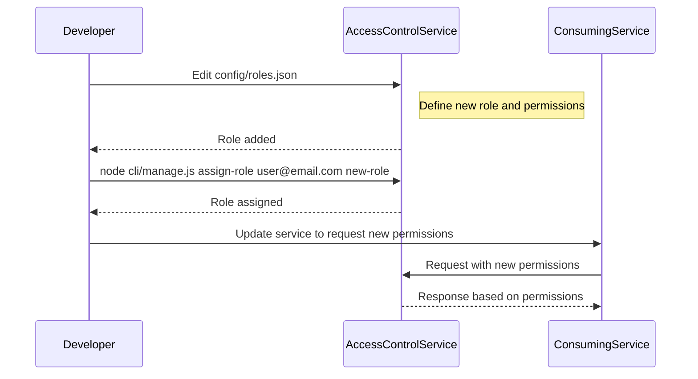

<details>
<summary>Relevant source files</summary>

The following files were used as context for generating this wiki page:

- [config/roles.json](https://github.com/aanickode/access-control-service/blob/main/config/roles.json)
- [src/authMiddleware.js](https://github.com/aanickode/access-control-service/blob/main/src/authMiddleware.js)
- [docs/permissions.md](https://github.com/aanickode/access-control-service/blob/main/docs/permissions.md)

</details>

# Permission Management

## Introduction

The Permission Management system is a crucial component of the access-control-service project, responsible for enforcing role-based access control (RBAC) across various routes and services. It ensures that only authorized users with the appropriate permissions can access specific resources or perform certain actions within the system.

The system relies on a predefined set of roles, each associated with a list of permissions. Users are assigned to these roles, and their access privileges are determined by the permissions granted to their respective roles.

## Role-Based Access Control (RBAC)

The RBAC model employed in this project is based on a simple mapping of roles to permissions. Each role is assigned a set of permissions, and users are assigned to one or more roles. When a user attempts to access a resource or perform an action, the system checks if the user's role(s) have the required permission(s).

### Roles and Permissions

The roles and their associated permissions are defined in the `config/roles.json` file. Here's an example of the default roles and their permissions:

```json
{
  "admin": ["view_users", "create_role", "view_permissions"],
  "engineer": ["view_users", "view_permissions"],
  "analyst": ["view_users"]
}
```

Sources: [config/roles.json](https://github.com/aanickode/access-control-service/blob/main/config/roles.json)

## Permission Enforcement

The `authMiddleware.js` module contains the `checkPermission` function, which is a middleware function responsible for enforcing permissions on routes. This function checks if the user has the required permission based on their assigned role.



Sources: [src/authMiddleware.js](https://github.com/aanickode/access-control-service/blob/main/src/authMiddleware.js)

The `checkPermission` function follows these steps:

1. Checks if the `x-user-email` header is present in the request and if the user exists in the `db.users` map.
2. Retrieves the user's role from the `db.users` map.
3. Checks if the user's role has the required permission by looking up the permissions associated with the role in the `db.roles` map.
4. If the permission is found, the request is allowed to proceed to the next middleware.
5. If the permission is not found, a `403 Forbidden` response is sent.
6. If the user is not found, a `401 Unauthorized` response is sent.

Sources: [src/authMiddleware.js:5-18](https://github.com/aanickode/access-control-service/blob/main/src/authMiddleware.js#L5-L18)

## Adding a New Role

To add a new role, follow these steps:

1. Edit the `config/roles.json` file to define a new role and its associated permissions.
2. Assign the new role to a user using the `cli/manage.js` script.
3. Ensure that consuming services request the appropriate permissions for the new role.



Sources: [docs/permissions.md:22-28](https://github.com/aanickode/access-control-service/blob/main/docs/permissions.md#L22-L28)

## Limitations and Future Enhancements

The current implementation of the Permission Management system has the following limitations:

- All permission checks are flat, with no support for wildcarding or nested permissions.
- All user-role mappings are stored in-memory, which may not be suitable for large-scale deployments.
- Changes to the `roles.json` file require a service restart to take effect.

To address these limitations and enhance the system, the following improvements are planned:

- Implement scoped permissions (e.g., `project:view:marketing`) for more granular access control.
- Integrate with a Single Sign-On (SSO) provider to leverage group claims for role assignments.
- Introduce audit logging for role changes and access attempts.

Sources: [docs/permissions.md:32-36](https://github.com/aanickode/access-control-service/blob/main/docs/permissions.md#L32-L36)

## Conclusion

The Permission Management system in the access-control-service project provides a robust and flexible way to manage user access and enforce role-based access control. By defining roles and associated permissions, and assigning users to these roles, the system ensures that only authorized users can access specific resources or perform certain actions. While the current implementation has some limitations, the planned enhancements will further improve the system's scalability, granularity, and integration capabilities.