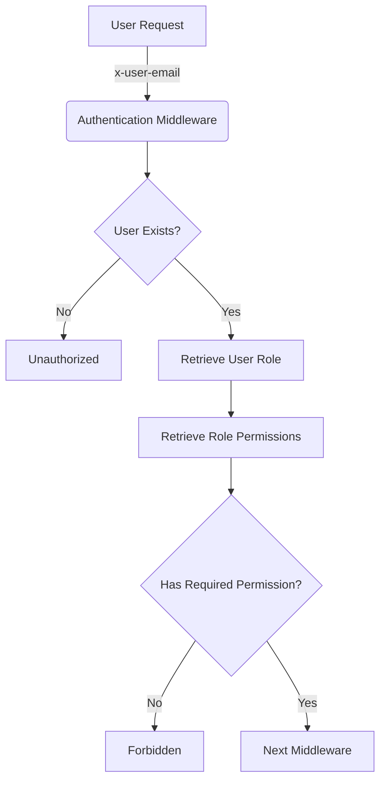
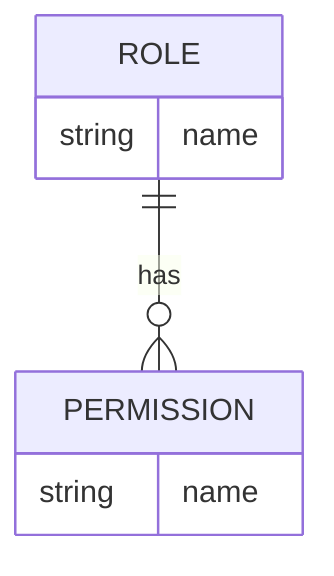
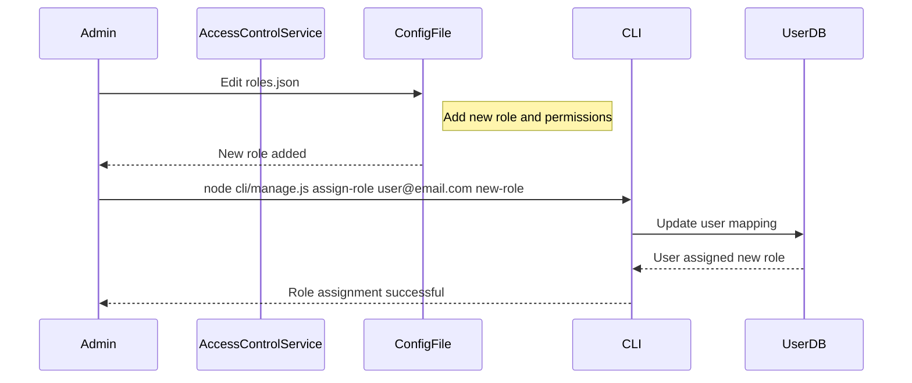
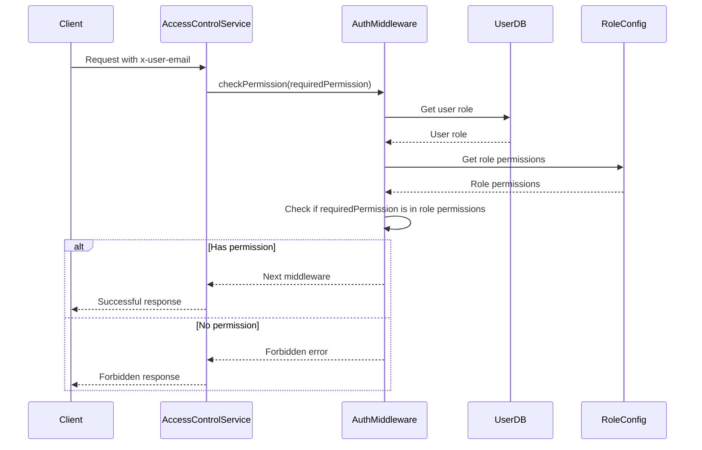

Relevant source files

The following files were used as context for generating this wiki page:

- [config/roles.json](https://github.com/aanickode/access-control-service/blob/main/config/roles.json)
- [src/authMiddleware.js](https://github.com/aanickode/access-control-service/blob/main/src/authMiddleware.js)
- [docs/permissions.md](https://github.com/aanickode/access-control-service/blob/main/docs/permissions.md)

# Permission Management

## Introduction

The Permission Management system is a crucial component of the access-control-service project, responsible for enforcing role-based access control (RBAC) across various routes and services within the application. It ensures that only authorized users with the appropriate permissions can access specific resources or perform certain actions.

The system is built around a simple yet flexible model that maps users to predefined roles, and roles to a set of permissions. By associating users with roles and defining the permissions required for each route, the access-control-service can effectively manage and control access to sensitive resources or functionalities.

Sources: [docs/permissions.md](https://github.com/aanickode/access-control-service/blob/main/docs/permissions.md)

## Architecture Overview

The Permission Management system follows a straightforward architecture, consisting of the following key components:

1. **User-Role Mapping**: An in-memory data structure (`db.users`) that maps user email addresses to their assigned roles.
2. **Role-Permission Mapping**: A configuration file (`config/roles.json`) that defines the permissions associated with each role.
3. **Authentication Middleware**: A middleware function (`checkPermission`) that validates the user's permissions based on their role and the required permission for a specific route.

The authentication middleware (`checkPermission`) is responsible for enforcing the permission checks. It extracts the user's email from the request headers, retrieves the user's role from the in-memory mapping, and checks if the role has the required permission defined in the `config/roles.json` file. If the user has the necessary permission, the request is allowed to proceed; otherwise, an appropriate error response is sent.

Sources: [src/authMiddleware.js](https://github.com/aanickode/access-control-service/blob/main/src/authMiddleware.js), [docs/permissions.md](https://github.com/aanickode/access-control-service/blob/main/docs/permissions.md)

## Role and Permission Management

The access-control-service defines three default roles: `admin`, `engineer`, and `analyst`. Each role has a predefined set of permissions, as defined in the `config/roles.json` file.

| Role     | Permissions                                |
|----------|---------------------------------------------|
| admin    | view_users, create_role, view_permissions  |
| engineer | view_users, view_permissions               |
| analyst  | view_users                                 |

Sources: [config/roles.json](https://github.com/aanickode/access-control-service/blob/main/config/roles.json), [docs/permissions.md](https://github.com/aanickode/access-control-service/blob/main/docs/permissions.md)

### Adding a New Role

To add a new role, follow these steps:

1. Edit the `config/roles.json` file to define the new role and its associated permissions.
2. Assign the new role to a user using the provided CLI tool (`cli/manage.js`).
3. Ensure that consuming services request the appropriate permissions for the new role.

Sources: [docs/permissions.md](https://github.com/aanickode/access-control-service/blob/main/docs/permissions.md)

## Permission Enforcement

The access-control-service enforces permissions on a per-route basis. Each route defines the required permission for access, and the authentication middleware (`checkPermission`) validates the user's permissions against this requirement.

For a request to be authorized, it must:

1. Include the `x-user-email` header with a valid user email.
2. Match a known user in the in-memory `db.users` mapping.
3. Have a role that includes the required permission for the requested route.

Sources: [src/authMiddleware.js](https://github.com/aanickode/access-control-service/blob/main/src/authMiddleware.js), [docs/permissions.md](https://github.com/aanickode/access-control-service/blob/main/docs/permissions.md)

## Limitations and Future Enhancements

The current implementation of the Permission Management system has the following limitations:

- All permission checks are flat, with no support for wildcarding or nested permissions.
- All user-role mappings are stored in-memory, which may not be suitable for large-scale deployments.
- Changes to the `config/roles.json` file require a service restart to take effect.

To address these limitations and improve the system's functionality, the following enhancements have been proposed:

- **Scoped Permissions**: Introduce a more granular permission model that supports scoped permissions (e.g., `project:view:marketing`).
- **SSO Integration**: Integrate with a single sign-on (SSO) provider to retrieve user roles and permissions based on group claims or assertions.
- **Audit Logging**: Implement audit logging for role changes and access attempts to improve security and compliance.

Sources: [docs/permissions.md](https://github.com/aanickode/access-control-service/blob/main/docs/permissions.md)

## Conclusion

The Permission Management system in the access-control-service project provides a simple yet effective way to enforce role-based access control across various routes and services. By defining roles, associating permissions with those roles, and validating user permissions against the required permissions for each route, the system ensures that only authorized users can access sensitive resources or perform specific actions.

While the current implementation has some limitations, the proposed future enhancements aim to address these limitations and further improve the system's functionality, scalability, and security.