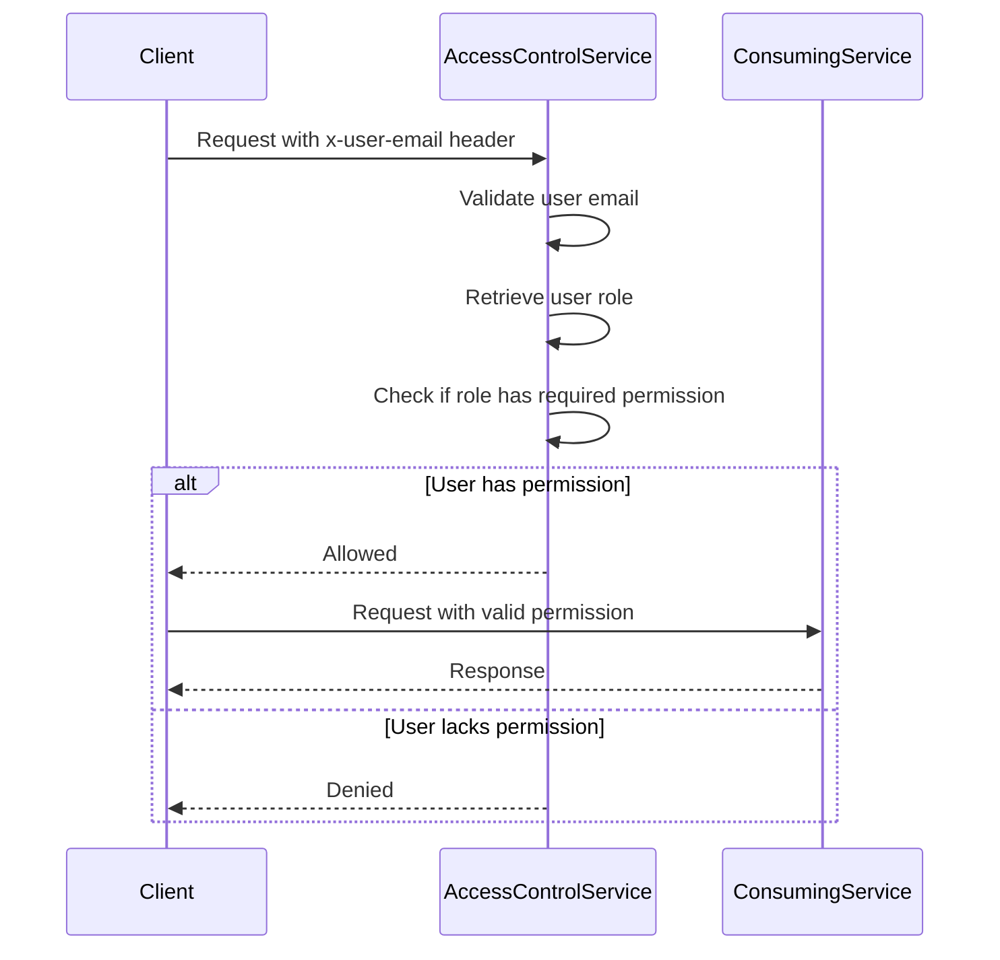
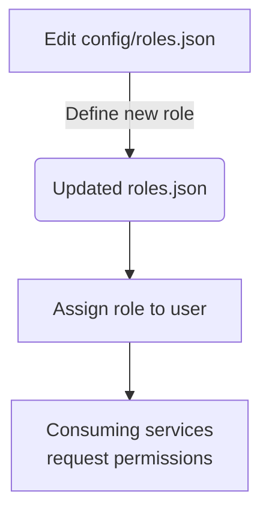

<details>
<summary>Relevant source files</summary>

The following files were used as context for generating this wiki page:

- [config/roles.json](https://github.com/aanickode/access-control-service/blob/main/config/roles.json)
- [src/models.js](https://github.com/aanickode/access-control-service/blob/main/src/models.js)
- [docs/permissions.md](https://github.com/aanickode/access-control-service/blob/main/docs/permissions.md)

</details>

# Permission Management

The Permission Management system is a crucial component of the access-control-service project, responsible for enforcing role-based access control (RBAC) across various routes and services within the application. It defines a set of predefined roles, each associated with specific permissions, and ensures that users can only access resources and functionalities based on their assigned roles.

## Introduction

The Permission Management system is designed to provide a secure and flexible way to manage access control within the application. It follows the RBAC model, where permissions are granted to roles, and users are assigned one or more roles. This approach simplifies the management of permissions, as roles can be easily assigned or revoked from users without modifying individual permissions.

The system consists of several key components, including user and role models, a configuration file for defining roles and their associated permissions, and a set of utilities for managing and enforcing permissions at runtime.

## Role Configuration

The roles and their associated permissions are defined in the `config/roles.json` file. This file serves as a central configuration point for managing the available roles and their corresponding permissions.

```json
{
  "admin": ["view_users", "create_role", "view_permissions"],
  "engineer": ["view_users", "view_permissions"],
  "analyst": ["view_users"]
}
```

Sources: [config/roles.json](https://github.com/aanickode/access-control-service/blob/main/config/roles.json)

### Default Roles

The system comes with three predefined roles:

1. **admin**: This role has full system access, including the ability to view users, create new roles, and view permissions. It is intended for platform and DevOps teams.
2. **engineer**: This role has read-only access to users and permissions, which is useful for observability and debugging purposes.
3. **analyst**: This role has basic read-only access to users, intended for data and reporting use cases.

Sources: [docs/permissions.md](https://github.com/aanickode/access-control-service/blob/main/docs/permissions.md)

## Data Models

The Permission Management system relies on two main data models: `User` and `Role`.

```javascript
export const User = {
  email: 'string',
  role: 'string'
};

export const Role = {
  name: 'string',
  permissions: ['string']
};
```

Sources: [src/models.js](https://github.com/aanickode/access-control-service/blob/main/src/models.js)

The `User` model represents a user in the system, with properties for their email address and the name of their assigned role. The `Role` model defines a role with a name and an array of permissions associated with that role.

## Permission Enforcement

Permissions are enforced on a per-route basis within the application. Each route defines the permission required to access it, and these permissions are checked at runtime against the user's assigned role.



Sources: [docs/permissions.md](https://github.com/aanickode/access-control-service/blob/main/docs/permissions.md)

For a request to be considered valid, it must:

1. Include the `x-user-email` header.
2. Match a known user in the in-memory `db.users` map.
3. Have a role that includes the required permission for the requested route.

Sources: [docs/permissions.md](https://github.com/aanickode/access-control-service/blob/main/docs/permissions.md)

## Adding a New Role

To add a new role to the system, follow these steps:

1. Edit the `config/roles.json` file to define the new role and its associated permissions.
2. Assign the new role to a user using the provided CLI utility.
3. Ensure that consuming services request the appropriate permissions for the new role.



For example, to add a new "support" role with the "view_users" permission:

1. Edit `config/roles.json`:

```json
{
  "support": ["view_users"]
}
```

2. Assign the role to a user:

```bash
node cli/manage.js assign-role support@company.com support
```

3. Ensure consuming services request the "view_users" permission for the "support" role.

Sources: [docs/permissions.md](https://github.com/aanickode/access-control-service/blob/main/docs/permissions.md)

## Limitations and Future Enhancements

The current implementation of the Permission Management system has some limitations and potential areas for improvement:

- All permission checks are flat, with no support for wildcarding or nested permissions.
- All user-role mappings are stored in-memory, which may not be suitable for larger-scale deployments.
- Changes to the `roles.json` configuration file require a service restart to take effect.

Some potential future enhancements include:

- Implementing scoped permissions (e.g., `project:view:marketing`) for more granular access control.
- Integrating with a single sign-on (SSO) system to leverage group claims for role assignments.
- Adding audit logging capabilities for tracking role changes and access attempts.

Sources: [docs/permissions.md](https://github.com/aanickode/access-control-service/blob/main/docs/permissions.md)

## Conclusion

The Permission Management system is a critical component of the access-control-service project, providing a secure and flexible way to manage access control based on roles and permissions. By defining roles and their associated permissions in a central configuration file, and enforcing permissions at runtime, the system ensures that users can only access resources and functionalities they are authorized to access. While the current implementation has some limitations, the system is designed to be extensible and can be enhanced with additional features, such as scoped permissions and integration with SSO systems, to meet the evolving needs of the application.