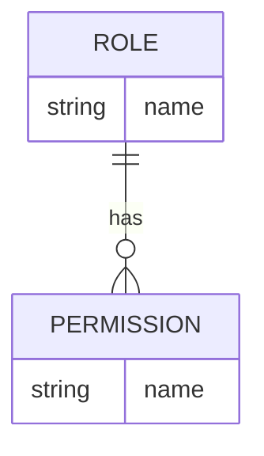
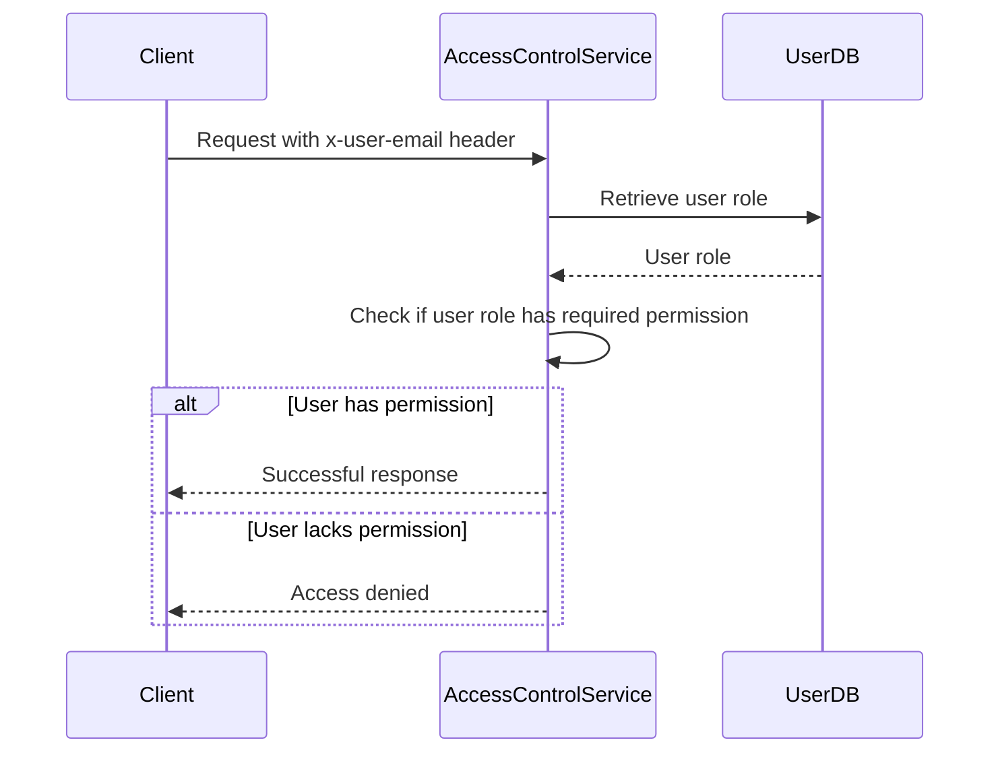

<details>
<summary>Relevant source files</summary>

The following files were used as context for generating this wiki page:

- [config/roles.json](https://github.com/aanickode/access-control-service/blob/main/config/roles.json)
- [docs/permissions.md](https://github.com/aanickode/access-control-service/blob/main/docs/permissions.md)

</details>

# Permission Management

Permission management is a crucial aspect of the access-control-service, responsible for defining and enforcing access control rules based on user roles and permissions. It ensures that only authorized users can perform specific actions within the system, enhancing security and maintaining data integrity.

## Introduction

The access-control-service implements a Role-Based Access Control (RBAC) model, where permissions are granted to users based on their assigned roles. Each role is associated with a set of permissions, and users are assigned one or more roles. This approach simplifies permission management by grouping related permissions together and assigning them collectively to roles, rather than managing permissions individually for each user.

The RBAC model is defined in the `config/roles.json` file, which maps roles to their respective permissions. The `docs/permissions.md` file provides detailed documentation on the permission system, including the default roles, how to add new roles, and future enhancements.

## Role Configuration

The `config/roles.json` file defines the roles and their associated permissions within the system. It follows a JSON format, where each key represents a role, and the corresponding value is an array of permissions granted to that role.



Sources: [config/roles.json](https://github.com/aanickode/access-control-service/blob/main/config/roles.json), [docs/permissions.md](https://github.com/aanickode/access-control-service/blob/main/docs/permissions.md)

### Default Roles

The system comes with three predefined roles: `admin`, `engineer`, and `analyst`. Each role has a specific set of permissions, as shown in the following table:

| Role     | Permissions                                   | Description                                                  |
|----------|------------------------------------------------|--------------------------------------------------------------|
| admin    | `view_users`, `create_role`, `view_permissions` | Full system access for platform and DevOps teams            |
| engineer | `view_users`, `view_permissions`                | Read-only access to users and permissions for observability |
| analyst  | `view_users`                                    | Basic read-only access for data/reporting use cases         |

Sources: [config/roles.json](https://github.com/aanickode/access-control-service/blob/main/config/roles.json), [docs/permissions.md](https://github.com/aanickode/access-control-service/blob/main/docs/permissions.md)

## Permission Enforcement

Permissions are enforced on a per-route basis within the access-control-service. Each route defines the permission required to access it, and these permissions are checked at runtime against the user's assigned role.



For a request to be considered valid, it must:

1. Include the `x-user-email` header
2. Match a known user in the in-memory `db.users` map
3. Have a role that includes the required permission for the requested route

Sources: [docs/permissions.md](https://github.com/aanickode/access-control-service/blob/main/docs/permissions.md)

## Adding a New Role

To add a new role to the system, follow these steps:

1. Edit the `config/roles.json` file to define the new role and its associated permissions.
   ```json
   {
     "support": ["view_users"]
   }
   ```

2. Assign the new role to a user using the `cli/manage.js` script.
   ```bash
   node cli/manage.js assign-role support@company.com support
   ```

3. Ensure that consuming services request the appropriate permissions when making requests to the access-control-service.

Sources: [docs/permissions.md](https://github.com/aanickode/access-control-service/blob/main/docs/permissions.md)

## Notes and Future Enhancements

- All permission checks are flat, meaning there is no support for wildcarding or nesting of permissions.
- All user-role mappings are stored in-memory, and changes to the `roles.json` file require a service restart.
- Future enhancements may include scoped permissions (e.g., `project:view:marketing`), integration with Single Sign-On (SSO) group claims, and audit logging for role changes and access attempts.

Sources: [docs/permissions.md](https://github.com/aanickode/access-control-service/blob/main/docs/permissions.md)

In summary, the access-control-service implements a Role-Based Access Control (RBAC) model for permission management, ensuring that only authorized users can perform specific actions within the system. The RBAC model is defined in the `config/roles.json` file, and permissions are enforced on a per-route basis at runtime. The system provides a straightforward way to add new roles and assign them to users, while also outlining potential future enhancements to improve the permission management capabilities.