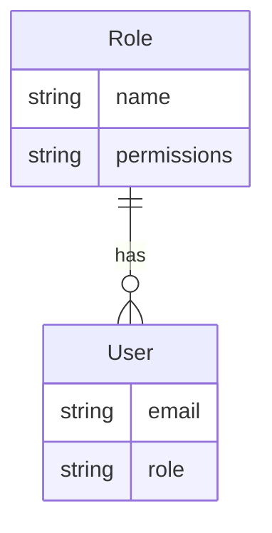
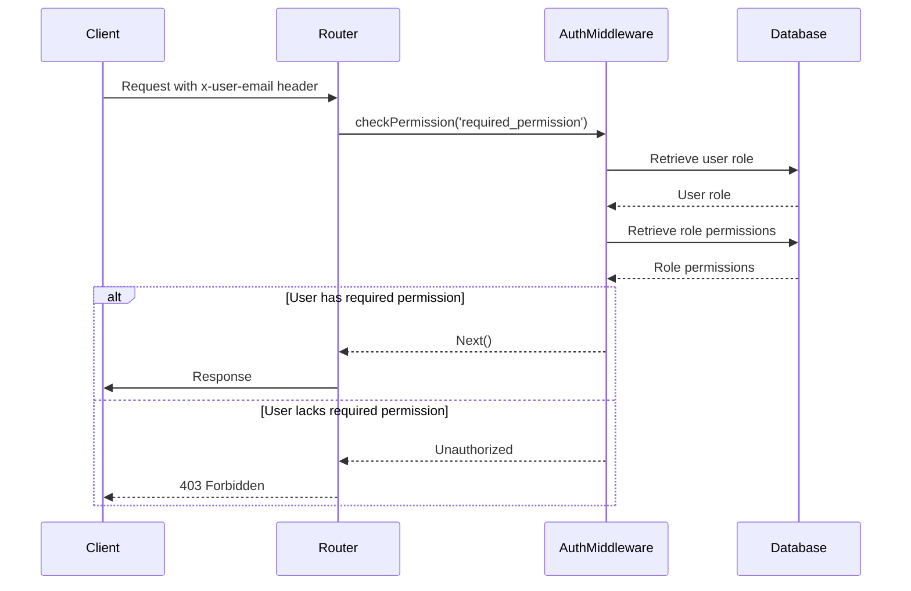
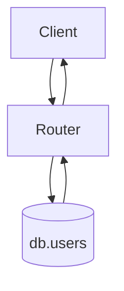
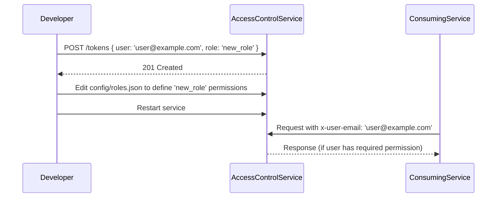

<details>
<summary>Relevant source files</summary>

The following files were used as context for generating this wiki page:

- [config/roles.json](https://github.com/aanickode/access-control-service/blob/main/config/roles.json)
- [src/models.js](https://github.com/aanickode/access-control-service/blob/main/src/models.js)
- [src/routes.js](https://github.com/aanickode/access-control-service/blob/main/src/routes.js)
- [docs/permissions.md](https://github.com/aanickode/access-control-service/blob/main/docs/permissions.md)
- [src/authMiddleware.js](https://github.com/aanickode/access-control-service/blob/main/src/authMiddleware.js)

</details>

# Permission Management

## Introduction

The Permission Management system is a crucial component of the access-control-service project, responsible for enforcing role-based access control (RBAC) across various routes and resources. It defines a set of roles with associated permissions, maps users to these roles, and verifies the required permissions before granting access to specific routes or functionalities.

The system follows a flat permission model, where permissions are checked individually without any hierarchical or nested structure. User-role mappings are stored in an in-memory database, and changes to the role configurations require a service restart.

## Role and Permission Model

The project defines a set of default roles with predefined permissions in the `config/roles.json` file. These roles and their associated permissions are as follows:



Sources: [src/models.js](https://github.com/aanickode/access-control-service/blob/main/src/models.js), [config/roles.json](https://github.com/aanickode/access-control-service/blob/main/config/roles.json)

| Role     | Permissions                                 | Description                                    |
|----------|----------------------------------------------|------------------------------------------------|
| admin    | view_users, create_role, view_permissions   | Full system access for platform and DevOps teams |
| engineer | view_users, view_permissions                 | Read-only access for observability and debugging |
| analyst  | view_users                                   | Basic read-only access for data/reporting use cases |

Sources: [docs/permissions.md](https://github.com/aanickode/access-control-service/blob/main/docs/permissions.md)

## Permission Enforcement

The permission enforcement mechanism is implemented in the `authMiddleware.js` file, which exports a `checkPermission` middleware function. This function is used to protect specific routes by verifying the user's role and associated permissions.



Sources: [src/routes.js](https://github.com/aanickode/access-control-service/blob/main/src/routes.js), [src/authMiddleware.js](https://github.com/aanickode/access-control-service/blob/main/src/authMiddleware.js)

The `checkPermission` middleware follows these steps:

1. Extracts the user email from the `x-user-email` request header.
2. Retrieves the user's role from the in-memory `db.users` map.
3. Retrieves the permissions associated with the user's role from the `db.roles` map.
4. Checks if the required permission is included in the user's role permissions.
5. If the permission is present, the request is allowed to proceed; otherwise, a 403 Forbidden response is returned.

Sources: [src/authMiddleware.js](https://github.com/aanickode/access-control-service/blob/main/src/authMiddleware.js)

## Route Handlers

The project defines the following routes and their associated permissions:

### GET /users

- **Permission Required:** `view_users`
- **Description:** Retrieves a list of all users and their assigned roles.

```mermaid
graph TD
    Client-->Router
    Router-->AuthMiddleware[checkPermission('view_users')]
    AuthMiddleware-->Database[(db.users)]
    Database-->AuthMiddleware
    AuthMiddleware-->Router
    Router-->Client
```

Sources: [src/routes.js:5-8](https://github.com/aanickode/access-control-service/blob/main/src/routes.js#L5-L8)

### POST /roles

- **Permission Required:** `create_role`
- **Description:** Creates a new role with the specified name and permissions.

```mermaid
graph TD
    Client-->Router
    Router-->AuthMiddleware[checkPermission('create_role')]
    AuthMiddleware-->Database[(db.roles)]
    Database-->AuthMiddleware
    AuthMiddleware-->Router
    Router-->Client
```

Sources: [src/routes.js:10-17](https://github.com/aanickode/access-control-service/blob/main/src/routes.js#L10-L17)

### GET /permissions

- **Permission Required:** `view_permissions`
- **Description:** Retrieves a list of all defined roles and their associated permissions.

```mermaid
graph TD
    Client-->Router
    Router-->AuthMiddleware[checkPermission('view_permissions')]
    AuthMiddleware-->Database[(db.roles)]
    Database-->AuthMiddleware
    AuthMiddleware-->Router
    Router-->Client
```

Sources: [src/routes.js:19-21](https://github.com/aanickode/access-control-service/blob/main/src/routes.js#L19-L21)

### POST /tokens

- **Permission Required:** None
- **Description:** Assigns a role to a user by adding the user-role mapping to the in-memory `db.users` map.



Sources: [src/routes.js:23-29](https://github.com/aanickode/access-control-service/blob/main/src/routes.js#L23-L29)

## Adding a New Role

To add a new role to the system, follow these steps:

1. Edit the `config/roles.json` file to define the new role and its associated permissions.
2. Assign the new role to a user by making a POST request to the `/tokens` endpoint with the user's email and the new role name.
3. Ensure that consuming services or clients request the appropriate permissions when accessing protected routes.



Sources: [docs/permissions.md](https://github.com/aanickode/access-control-service/blob/main/docs/permissions.md)

## Limitations and Future Enhancements

The current implementation of the Permission Management system has the following limitations:

- All permission checks are flat, without support for wildcarding or nested permissions.
- User-role mappings are stored in an in-memory database, which means they are lost upon service restart.
- Changes to the `roles.json` configuration file require a service restart to take effect.

To address these limitations and enhance the system, the following improvements have been proposed:

- Implement scoped permissions (e.g., `project:view:marketing`) to provide more granular access control.
- Integrate with a Single Sign-On (SSO) system to retrieve user roles and permissions from group claims or external sources.
- Implement audit logging for role changes and access attempts to improve security and auditing capabilities.

Sources: [docs/permissions.md](https://github.com/aanickode/access-control-service/blob/main/docs/permissions.md)

## Conclusion

The Permission Management system in the access-control-service project provides a robust role-based access control mechanism for managing user permissions and enforcing access restrictions across various routes and resources. It defines a set of default roles with predefined permissions, maps users to these roles, and verifies the required permissions before granting access to protected routes.

While the current implementation follows a flat permission model and relies on an in-memory database, the system is designed to be extensible and can be enhanced with features like scoped permissions, SSO integration, and audit logging to improve its functionality and security.