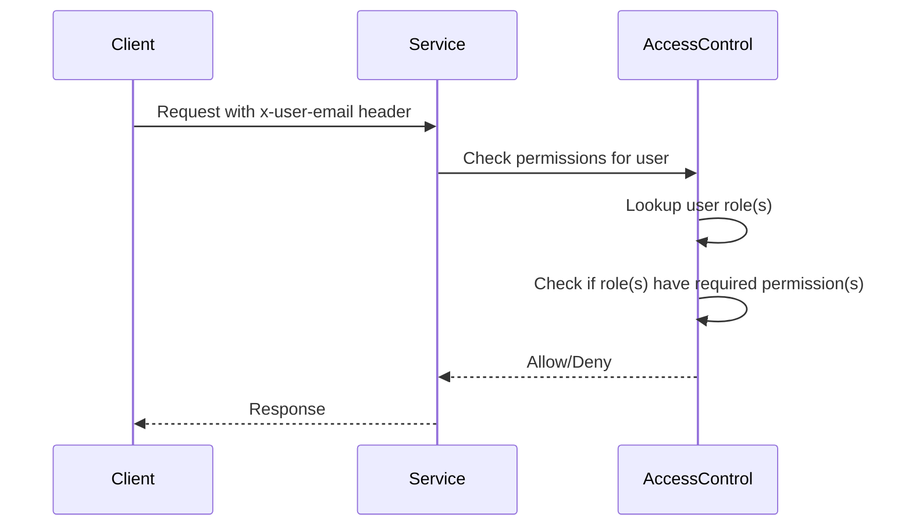

<details>
<summary>Relevant source files</summary>

The following files were used as context for generating this wiki page:

- [config/roles.json](https://github.com/aanickode/access-control-service/blob/main/config/roles.json)
- [docs/permissions.md](https://github.com/aanickode/access-control-service/blob/main/docs/permissions.md)

</details>

# Permission Management

## Introduction

The access-control-service implements a role-based access control (RBAC) model to manage permissions within the system. This model defines a set of predefined roles, each associated with a specific set of permissions. Users are assigned one or more roles, granting them the combined permissions of those roles. This approach simplifies permission management and ensures consistent access control across the application.

Sources: [docs/permissions.md](https://github.com/aanickode/access-control-service/blob/main/docs/permissions.md)

## Role Definition

Roles and their associated permissions are defined in the `config/roles.json` configuration file. This file maps each role to an array of permission strings.

```json
{
  "admin": ["view_users", "create_role", "view_permissions"],
  "engineer": ["view_users", "view_permissions"],
  "analyst": ["view_users"]
}
```

Sources: [config/roles.json](https://github.com/aanickode/access-control-service/blob/main/config/roles.json), [docs/permissions.md](https://github.com/aanickode/access-control-service/blob/main/docs/permissions.md)

## Default Roles

The system comes with three predefined roles:

### admin

- Permissions: `view_users`, `create_role`, `view_permissions`
- Description: Full system access, intended for platform and DevOps teams.

### engineer

- Permissions: `view_users`, `view_permissions`
- Description: Read-only access to users and permissions, used for observability and debugging.

### analyst

- Permissions: `view_users`
- Description: Basic read-only access, intended for data/reporting use cases.

Sources: [docs/permissions.md](https://github.com/aanickode/access-control-service/blob/main/docs/permissions.md)

## Permission Enforcement

Permissions are enforced at runtime on a per-route basis. Each route defines the required permission(s) to access it. The access-control-service checks the user's assigned role(s) against the required permission(s) for the requested route.



For a request to be valid, it must:

1. Include the `x-user-email` header
2. Match a known user in the in-memory `db.users` map
3. Have a role that includes the required permission(s) for the requested route

Sources: [docs/permissions.md](https://github.com/aanickode/access-control-service/blob/main/docs/permissions.md)

## Adding a New Role

To add a new role to the system, follow these steps:

1. Edit `config/roles.json` to define the new role and its associated permissions:

```json
{
  "support": ["view_users"]
}
```

2. Assign the new role to a user using the `cli/manage.js` script:

```bash
node cli/manage.js assign-role support@company.com support
```

3. Ensure that consuming services request the appropriate permissions for the new role when making requests to the access-control-service.

Sources: [docs/permissions.md](https://github.com/aanickode/access-control-service/blob/main/docs/permissions.md)

## Limitations and Future Enhancements

### Current Limitations

- All permission checks are flat; no wildcarding or nesting is supported.
- All user-role mappings are stored in-memory, which may not be suitable for large-scale deployments.
- Changes to `roles.json` require a service restart to take effect.

### Planned Enhancements

- Scoped permissions (e.g., `project:view:marketing`) to provide more granular access control.
- Integration with single sign-on (SSO) group claims to simplify user-role management.
- Audit logging for role changes and access attempts to improve security and compliance.

Sources: [docs/permissions.md](https://github.com/aanickode/access-control-service/blob/main/docs/permissions.md)

## Summary

The access-control-service implements a role-based access control (RBAC) model to manage permissions within the system. Roles are defined in `config/roles.json`, and users are assigned one or more roles. Permissions are enforced at runtime based on the user's assigned roles and the required permissions for the requested route. While the current implementation is relatively simple, future enhancements are planned to improve scalability, granularity, and integration with external identity providers.