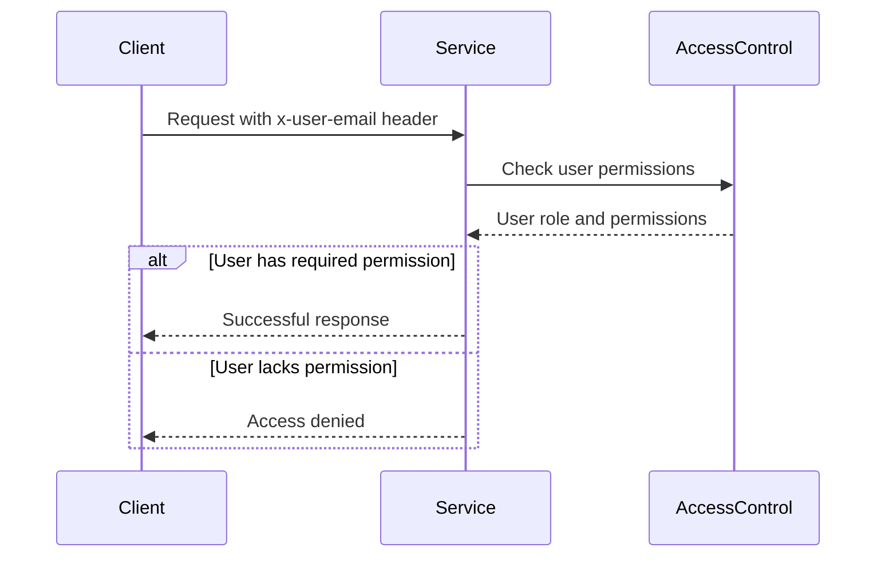

<details>
<summary>Relevant source files</summary>

The following files were used as context for generating this wiki page:

- [config/roles.json](https://github.com/aanickode/access-control-service/blob/main/config/roles.json)
- [src/models.js](https://github.com/aanickode/access-control-service/blob/main/src/models.js)
- [docs/permissions.md](https://github.com/aanickode/access-control-service/blob/main/docs/permissions.md)

</details>

# Permission Management

The Permission Management system is a crucial component of the access-control-service project, responsible for enforcing role-based access control (RBAC) across various routes and services within the application. It defines a set of predefined roles, each associated with specific permissions, and ensures that users are granted access only to the resources and functionalities they are authorized to access based on their assigned roles.

## Introduction

The Permission Management system is designed to provide a secure and flexible way to manage user access within the application. It follows the RBAC model, where permissions are grouped into roles, and users are assigned one or more roles based on their responsibilities and access requirements. This approach simplifies the management of permissions and ensures consistent access control across the application.

The system consists of several key components, including user and role models, a configuration file for defining roles and their associated permissions, and a set of utilities for managing and enforcing permissions at runtime.

## Role and Permission Configuration

The roles and their associated permissions are defined in the `config/roles.json` file. This file serves as the central configuration point for the Permission Management system, allowing administrators to easily modify or add new roles and permissions as needed.

```json
{
  "admin": ["view_users", "create_role", "view_permissions"],
  "engineer": ["view_users", "view_permissions"],
  "analyst": ["view_users"]
}
```

Sources: [config/roles.json](https://github.com/aanickode/access-control-service/blob/main/config/roles.json)

The `roles.json` file defines three default roles:

- `admin`: Grants full system access, including the ability to view users, create new roles, and view permissions.
- `engineer`: Allows read-only access to users and permissions, typically used for observability and debugging purposes.
- `analyst`: Provides basic read-only access to user data, intended for data analysis and reporting use cases.

Sources: [docs/permissions.md](https://github.com/aanickode/access-control-service/blob/main/docs/permissions.md#default-roles)

### Adding a New Role

To add a new role, follow these steps:

1. Edit the `config/roles.json` file and define the new role with its associated permissions.
2. Assign the new role to a user using the provided CLI utility (`node cli/manage.js assign-role user@email.com new-role`).
3. Ensure that consuming services request the appropriate permissions for the new role.

Sources: [docs/permissions.md](https://github.com/aanickode/access-control-service/blob/main/docs/permissions.md#adding-a-new-role)

## User and Role Models

The `src/models.js` file defines the data models for users and roles within the system.

```javascript
export const User = {
  email: 'string',
  role: 'string'
};

export const Role = {
  name: 'string',
  permissions: ['string']
};
```

Sources: [src/models.js](https://github.com/aanickode/access-control-service/blob/main/src/models.js)

The `User` model represents a user in the system, with properties for their email address and the role assigned to them. The `Role` model defines a role with a name and an array of permissions associated with that role.

## Permission Enforcement

The Permission Management system enforces permissions on a per-route basis. Each route defines the permission required to access it, and these permissions are checked at runtime against the user's assigned role.

For a request to be considered valid, it must:

1. Include the `x-user-email` header.
2. Match a known user in the in-memory `db.users` map.
3. Have a role that includes the required permission for the requested route.



Sources: [docs/permissions.md](https://github.com/aanickode/access-control-service/blob/main/docs/permissions.md#permission-enforcement)

The permission checks are flat, meaning that there is no support for wildcarding or nesting of permissions. Additionally, all user-role mappings are stored in-memory, and changes to the `roles.json` configuration file require a service restart to take effect.

Sources: [docs/permissions.md](https://github.com/aanickode/access-control-service/blob/main/docs/permissions.md#notes)

## Future Enhancements

The Permission Management system has several potential areas for future enhancements, including:

- Scoped permissions (e.g., `project:view:marketing`) to provide more granular access control.
- Integration with Single Sign-On (SSO) group claims to simplify user and role management.
- Audit logging for role changes and access attempts to improve visibility and compliance.

Sources: [docs/permissions.md](https://github.com/aanickode/access-control-service/blob/main/docs/permissions.md#future-enhancements)

## Summary

The Permission Management system is a critical component of the access-control-service project, responsible for enforcing role-based access control across various routes and services. It provides a flexible and secure way to manage user access by defining roles and associated permissions, and ensuring that users are granted access only to the resources and functionalities they are authorized to access based on their assigned roles. The system is designed to be easily configurable and extensible, with potential future enhancements to improve granularity, integration, and auditing capabilities.