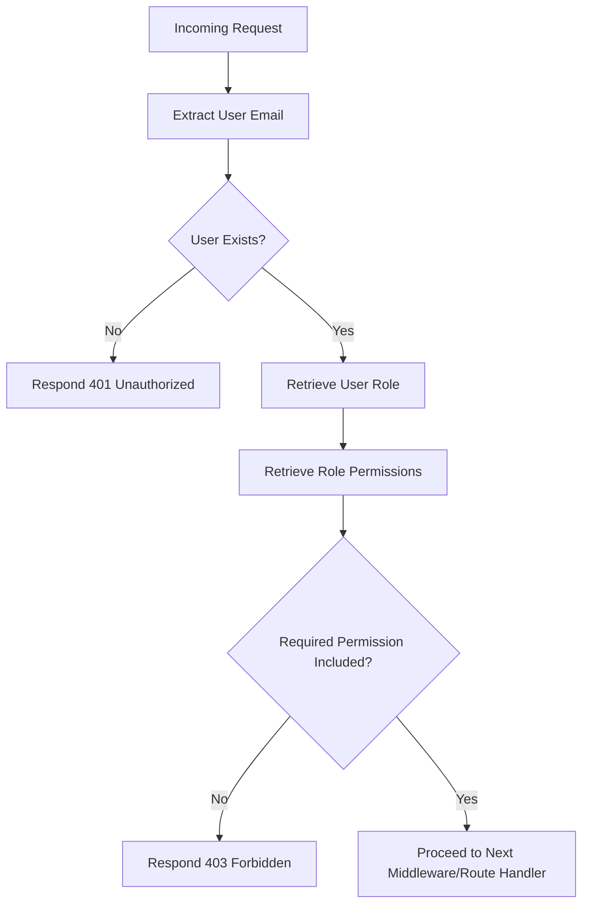

<details>
<summary>Relevant source files</summary>

The following files were used as context for generating this wiki page:

- [config/roles.json](https://github.com/aanickode/access-control-service/blob/main/config/roles.json)
- [src/authMiddleware.js](https://github.com/aanickode/access-control-service/blob/main/src/authMiddleware.js)
- [docs/permissions.md](https://github.com/aanickode/access-control-service/blob/main/docs/permissions.md)

</details>

# Permission Management

## Introduction

The Permission Management system is a crucial component of the access-control-service project. It implements a Role-Based Access Control (RBAC) model, where permissions are granted to users based on their assigned roles. This system ensures that only authorized users can access specific resources or perform certain actions within the application.

The Permission Management system consists of several key components, including roles, permissions, and an authentication middleware that enforces the access control rules. It also provides a configuration file (`config/roles.json`) to define the roles and their associated permissions, as well as a command-line interface (CLI) for managing user-role assignments.

## Role-Based Access Control (RBAC) Model

The RBAC model is a widely adopted approach for managing access control in software systems. It simplifies the administration of permissions by grouping them into roles, which can then be assigned to users based on their responsibilities and access requirements.

### Roles and Permissions

The `config/roles.json` file defines the available roles and their associated permissions. Each role is a key in the JSON object, and its value is an array of permission strings.

```json
{
  "admin": ["view_users", "create_role", "view_permissions"],
  "engineer": ["view_users", "view_permissions"],
  "analyst": ["view_users"]
}
```

Sources: [config/roles.json](https://github.com/aanickode/access-control-service/blob/main/config/roles.json)

The following roles are defined by default:

| Role     | Permissions                                |
|----------|---------------------------------------------|
| admin    | view_users, create_role, view_permissions  |
| engineer | view_users, view_permissions               |
| analyst  | view_users                                 |

Sources: [docs/permissions.md](https://github.com/aanickode/access-control-service/blob/main/docs/permissions.md)

## Authentication Middleware

The `authMiddleware.js` module contains the `checkPermission` function, which is a middleware function used to enforce access control rules. This middleware checks if the user has the required permission to access a specific route or resource.

```javascript
export function checkPermission(requiredPermission) {
  return function (req, res, next) {
    const userEmail = req.headers['x-user-email'];
    if (!userEmail || !db.users[userEmail]) {
      return res.status(401).json({ error: 'Unauthorized: no user context' });
    }

    const role = db.users[userEmail];
    const permissions = db.roles[role] || [];

    if (!permissions.includes(requiredPermission)) {
      return res.status(403).json({ error: 'Forbidden: insufficient permissions' });
    }

    next();
  };
}
```

Sources: [src/authMiddleware.js](https://github.com/aanickode/access-control-service/blob/main/src/authMiddleware.js)

The `checkPermission` function takes a `requiredPermission` as an argument and returns a middleware function. This middleware function performs the following steps:

1. Extracts the user's email from the `x-user-email` header in the request.
2. Checks if the user exists in the `db.users` map.
3. Retrieves the user's role from the `db.users` map.
4. Retrieves the permissions associated with the user's role from the `db.roles` object.
5. Checks if the required permission is included in the user's permissions.
6. If the user has the required permission, the middleware calls `next()` to proceed to the next middleware or route handler.
7. If the user is not authorized or does not have the required permission, the middleware responds with a 401 (Unauthorized) or 403 (Forbidden) error, respectively.

### Permission Enforcement Flow

The following diagram illustrates the flow of permission enforcement using the `checkPermission` middleware:



Sources: [src/authMiddleware.js](https://github.com/aanickode/access-control-service/blob/main/src/authMiddleware.js)

## Managing User-Role Assignments

The `docs/permissions.md` file provides instructions for adding a new role and assigning it to a user. This process involves the following steps:

1. Edit the `config/roles.json` file to define a new role and its associated permissions.
2. Use the `cli/manage.js` script to assign the new role to a user.

```bash
node cli/manage.js assign-role support@company.com support
```

3. Ensure that consuming services request the appropriate permissions when accessing protected resources.

Sources: [docs/permissions.md](https://github.com/aanickode/access-control-service/blob/main/docs/permissions.md)

## Limitations and Future Enhancements

The current implementation of the Permission Management system has some limitations, as outlined in the `docs/permissions.md` file:

- All permission checks are flat; no wildcarding or nesting is supported.
- All user-role mappings are stored in-memory, which may not be suitable for large-scale or distributed systems.
- Changes to the `roles.json` file require a service restart to take effect.

The `docs/permissions.md` file also mentions potential future enhancements, such as:

- Scoped permissions (e.g., `project:view:marketing`).
- Integration with Single Sign-On (SSO) group claims.
- Audit logging for role changes and access attempts.

Sources: [docs/permissions.md](https://github.com/aanickode/access-control-service/blob/main/docs/permissions.md)

## Conclusion

The Permission Management system in the access-control-service project implements a Role-Based Access Control (RBAC) model to manage user permissions and access control. It provides a flexible and scalable approach to granting and revoking permissions based on user roles. The system consists of key components such as roles, permissions, an authentication middleware, and a configuration file for defining roles and permissions. Additionally, it offers a command-line interface for managing user-role assignments. While the current implementation has some limitations, the system is designed to be extensible and can be enhanced with features like scoped permissions, SSO integration, and audit logging.