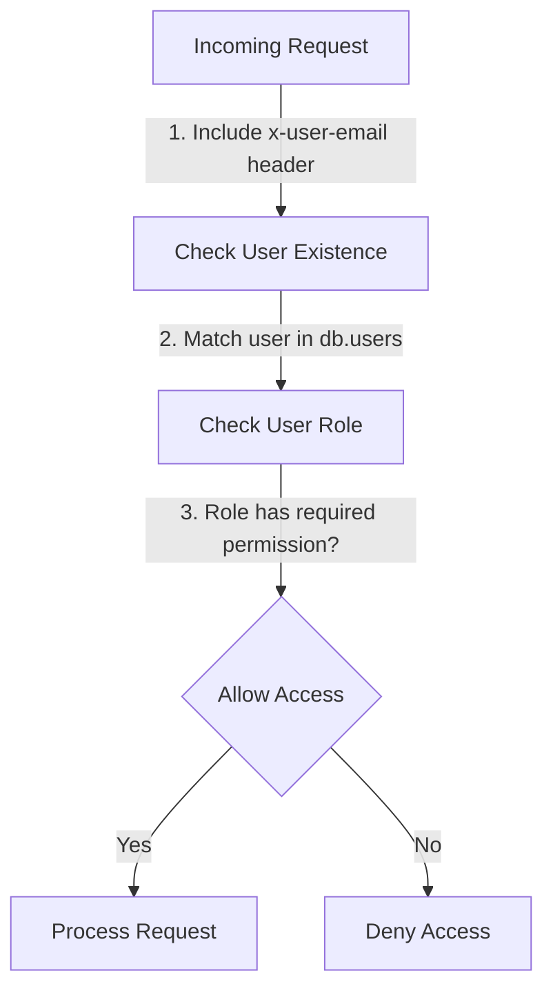

<details>
<summary>Relevant source files</summary>

The following files were used as context for generating this wiki page:

- [config/roles.json](https://github.com/aanickode/access-control-service/blob/main/config/roles.json)
- [src/models.js](https://github.com/aanickode/access-control-service/blob/main/src/models.js)
- [docs/permissions.md](https://github.com/aanickode/access-control-service/blob/main/docs/permissions.md)

</details>

# Permission Management

## Introduction

The Permission Management system is a crucial component of the access-control-service project, responsible for enforcing role-based access control (RBAC) across various routes and services. It defines a set of predefined roles, each associated with specific permissions, and ensures that users can only access resources they are authorized for based on their assigned roles.

The system is designed to be flexible, allowing for the creation of new roles and the assignment of permissions to those roles. It also provides a mechanism for assigning roles to users, enabling fine-grained control over access privileges within the application.

## Role Management

The `config/roles.json` file serves as the central configuration for defining roles and their associated permissions. It contains a JSON object where the keys represent role names, and the values are arrays of permission strings.

```json
{
  "admin": ["view_users", "create_role", "view_permissions"],
  "engineer": ["view_users", "view_permissions"],
  "analyst": ["view_users"]
}
```

Sources: [config/roles.json](https://github.com/aanickode/access-control-service/blob/main/config/roles.json)

### Predefined Roles

The system comes with three predefined roles:

#### admin

- Permissions: `view_users`, `create_role`, `view_permissions`
- Description: Full system access, intended for platform and DevOps teams.

#### engineer

- Permissions: `view_users`, `view_permissions`
- Description: Read-only access to users and permissions, used for observability and debugging.

#### analyst

- Permissions: `view_users`
- Description: Basic read-only access, intended for data/reporting use cases.

Sources: [docs/permissions.md](https://github.com/aanickode/access-control-service/blob/main/docs/permissions.md)

## User Management

The `src/models.js` file defines the data models for users and roles within the system.

```javascript
export const User = {
  email: 'string',
  role: 'string'
};

export const Role = {
  name: 'string',
  permissions: ['string']
};
```

Sources: [src/models.js](https://github.com/aanickode/access-control-service/blob/main/src/models.js)

Users are identified by their email addresses, and each user is assigned a single role. The role determines the set of permissions granted to the user.

## Permission Enforcement

The permission enforcement mechanism is implemented at the route level, where each route defines the required permission(s) for access.



Sources: [docs/permissions.md](https://github.com/aanickode/access-control-service/blob/main/docs/permissions.md)

For a request to be considered valid, it must:

1. Include the `x-user-email` header.
2. Match a known user in the in-memory `db.users` map.
3. Have a role that includes the required permission for the requested route.

## Adding a New Role

To add a new role to the system, follow these steps:

1. Edit the `config/roles.json` file and define the new role with its associated permissions:

   ```json
   {
     "support": ["view_users"]
   }
   ```

2. Assign the new role to a user using the provided CLI tool:

   ```bash
   node cli/manage.js assign-role support@company.com support
   ```

3. Ensure that consuming services request the appropriate permissions when accessing routes that require the new role.

Sources: [docs/permissions.md](https://github.com/aanickode/access-control-service/blob/main/docs/permissions.md)

## Limitations and Future Enhancements

The current implementation of the Permission Management system has the following limitations:

- All permission checks are flat, with no support for wildcarding or nesting.
- All user-role mappings are stored in-memory, which may not be suitable for large-scale deployments.
- Changes to the `roles.json` configuration file require a service restart to take effect.

To address these limitations and enhance the system's capabilities, the following improvements are suggested:

- Implement scoped permissions (e.g., `project:view:marketing`) to provide more granular access control.
- Integrate with a single sign-on (SSO) system to leverage group claims for role assignments.
- Introduce audit logging for role changes and access attempts to improve security and compliance.

Sources: [docs/permissions.md](https://github.com/aanickode/access-control-service/blob/main/docs/permissions.md)

## Conclusion

The Permission Management system is a critical component of the access-control-service project, enabling role-based access control and ensuring that users can only access resources they are authorized for. It provides a flexible and extensible framework for defining roles, assigning permissions, and enforcing access control rules. While the current implementation has some limitations, the proposed future enhancements aim to address these limitations and further enhance the system's capabilities.