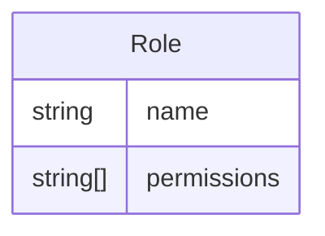
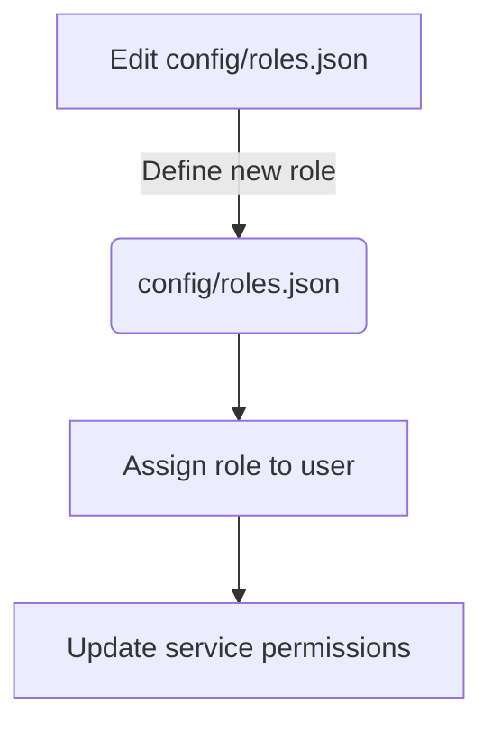
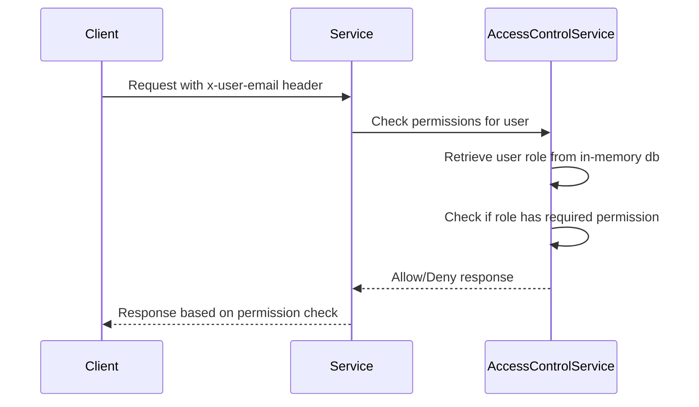

Relevant source files

The following files were used as context for generating this wiki page:

- [config/roles.json](https://github.com/aanickode/access-control-service/blob/main/config/roles.json)
- [src/models.js](https://github.com/aanickode/access-control-service/blob/main/src/models.js)
- [docs/permissions.md](https://github.com/aanickode/access-control-service/blob/main/docs/permissions.md)

# Permission Management

The Permission Management system is a crucial component of the access-control-service project, responsible for enforcing role-based access control (RBAC) across various routes and services within the application. It defines a set of predefined roles, each associated with a specific set of permissions, and ensures that users can only access resources and functionalities based on their assigned roles.

## Introduction

The Permission Management system is designed to provide a secure and flexible way to manage access control within the application. It follows the RBAC model, where permissions are granted to roles rather than individual users. Users are then assigned one or more roles, inheriting the permissions associated with those roles.

The system is implemented using an in-memory data structure that maps user emails to their respective roles. Permissions are defined as strings and are associated with specific routes or functionalities within the application. When a user attempts to access a protected resource, the system checks if the user's role includes the required permission. If the permission is granted, access is allowed; otherwise, access is denied.

## Role Management

### Role Definitions

The predefined roles and their associated permissions are defined in the `config/roles.json` file. This file serves as the central configuration for role-based access control within the application.

Sources: [config/roles.json](), [src/models.js:6-7]()

The following table summarizes the default roles and their respective permissions:

| Role     | Permissions                                |
|----------|---------------------------------------------|
| admin    | view_users, create_role, view_permissions  |
| engineer | view_users, view_permissions               |
| analyst  | view_users                                 |

Sources: [docs/permissions.md:13-22]()

### Adding a New Role

To add a new role, follow these steps:

1. Edit the `config/roles.json` file and define the new role with its associated permissions.
2. Assign the new role to a user using the provided CLI tool (`node cli/manage.js assign-role <email> <role>`).
3. Ensure that consuming services request the appropriate permissions for the new role when accessing protected resources.

Sources: [docs/permissions.md:26-34]()

## Permission Enforcement

The Permission Management system enforces permissions on a per-route basis. Each route defines the required permission(s) to access it, and these permissions are checked at runtime against the user's assigned role.

Sources: [docs/permissions.md:3-8]()

For a request to be considered valid, it must:

1. Include the `x-user-email` header.
2. Match a known user in the in-memory `db.users` map.
3. Have a role that includes the required permission for the requested route.

Sources: [docs/permissions.md:3-8]()

## Data Models

### User

The `User` model represents a user within the system and includes the following fields:

| Field | Type     | Description                        |
|-------|----------|-------------------------------------|
| email | string   | The user's email address (unique)  |
| role  | string   | The user's assigned role           |

Sources: [src/models.js:1-4]()

### Role

The `Role` model defines a role within the RBAC system and includes the following fields:

| Field       | Type       | Description                                   |
|-------------|------------|-----------------------------------------------|
| name        | string     | The name of the role (e.g., admin, engineer) |
| permissions | string[]   | An array of permissions associated with the role |

Sources: [src/models.js:6-7]()

## Future Enhancements

The `docs/permissions.md` file outlines several potential future enhancements for the Permission Management system, including:

- Scoped permissions (e.g., `project:view:marketing`) for more granular access control.
- Integration with Single Sign-On (SSO) group claims for role assignment.
- Audit logging for role changes and access attempts.

Sources: [docs/permissions.md:36-40]()

## Notes and Limitations

- All permission checks are flat; wildcarding or nesting of permissions is not supported.
- All user-role mappings are stored in-memory, which may not be suitable for large-scale deployments.
- Changes to the `config/roles.json` file require a service restart to take effect.

Sources: [docs/permissions.md:28-30]()