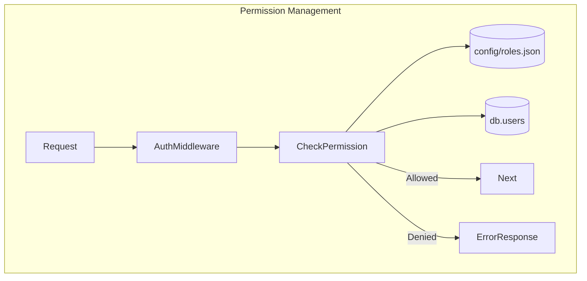
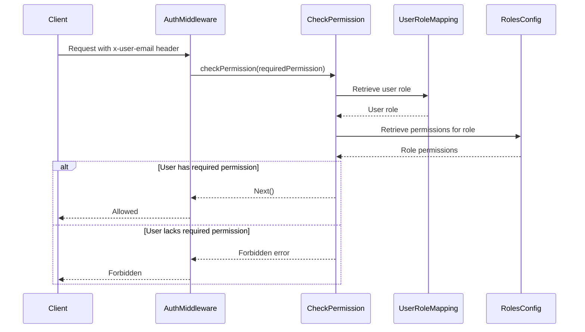

<details>
<summary>Relevant source files</summary>

The following files were used as context for generating this wiki page:

- [config/roles.json](https://github.com/aanickode/access-control-service/blob/main/config/roles.json)
- [src/authMiddleware.js](https://github.com/aanickode/access-control-service/blob/main/src/authMiddleware.js)
- [docs/permissions.md](https://github.com/aanickode/access-control-service/blob/main/docs/permissions.md)

</details>

# Permission Management

## Introduction

The Permission Management system is a crucial component of the access-control-service project, responsible for enforcing role-based access control (RBAC) across various routes and resources. It ensures that only authorized users with the appropriate permissions can access specific functionalities or data within the application.

The system operates by mapping users to predefined roles, each with a set of associated permissions. Permissions are checked at runtime for each incoming request, verifying that the user's role grants them the necessary access rights for the requested operation.

Sources: [docs/permissions.md](https://github.com/aanickode/access-control-service/blob/main/docs/permissions.md)

## Architecture Overview

The Permission Management system follows a straightforward architecture, as illustrated by the following diagram:



1. An incoming request is intercepted by the `AuthMiddleware`.
2. The `AuthMiddleware` invokes the `CheckPermission` function, passing the required permission for the requested route.
3. `CheckPermission` retrieves the user's role from the `UserRoleMapping` (in-memory `db.users` map).
4. It then checks if the user's role grants the required permission by consulting the `RolesConfig` (defined in `config/roles.json`).
5. If the user has the necessary permission, the request is allowed to proceed; otherwise, an error response is sent.

Sources: [src/authMiddleware.js](https://github.com/aanickode/access-control-service/blob/main/src/authMiddleware.js), [docs/permissions.md](https://github.com/aanickode/access-control-service/blob/main/docs/permissions.md)

## Permission Enforcement

The `checkPermission` middleware function is responsible for enforcing permissions on a per-route basis. It follows these steps:



1. The client sends a request with the `x-user-email` header.
2. The `AuthMiddleware` invokes `checkPermission` with the required permission for the route.
3. `checkPermission` retrieves the user's role from the `UserRoleMapping`.
4. It then fetches the permissions associated with that role from the `RolesConfig`.
5. If the required permission is included in the role's permissions, the request is allowed to proceed; otherwise, a "Forbidden" error is returned.

Sources: [src/authMiddleware.js](https://github.com/aanickode/access-control-service/blob/main/src/authMiddleware.js), [docs/permissions.md](https://github.com/aanickode/access-control-service/blob/main/docs/permissions.md)

## Roles and Permissions

The system defines a set of default roles, each with a predefined set of permissions, as specified in the `config/roles.json` file:

| Role     | Permissions                                 |
|----------|----------------------------------------------|
| admin    | view_users, create_role, view_permissions   |
| engineer | view_users, view_permissions                |
| analyst  | view_users                                  |

Sources: [config/roles.json](https://github.com/aanickode/access-control-service/blob/main/config/roles.json), [docs/permissions.md](https://github.com/aanickode/access-control-service/blob/main/docs/permissions.md)

### Role Descriptions

#### admin
- Grants full system access.
- Intended for platform and DevOps teams.

#### engineer
- Provides read-only access to users and permissions.
- Used for observability and debugging purposes.

#### analyst
- Allows basic read-only access to user data.
- Intended for data/reporting use cases.

Sources: [docs/permissions.md](https://github.com/aanickode/access-control-service/blob/main/docs/permissions.md)

## Adding a New Role

To add a new role to the system, follow these steps:

1. Edit the `config/roles.json` file to define the new role and its associated permissions:

```json
{
  "support": ["view_users"]
}
```

2. Assign the new role to a user using the provided CLI tool:

```bash
node cli/manage.js assign-role support@company.com support
```

3. Ensure that consuming services request the appropriate permissions when accessing routes or resources that require the new role.

Sources: [docs/permissions.md](https://github.com/aanickode/access-control-service/blob/main/docs/permissions.md)

## Implementation Details

### User-Role Mapping

The mapping between users and their assigned roles is maintained in an in-memory `db.users` map, where the keys are user email addresses, and the values are the corresponding role names.

Sources: [src/authMiddleware.js](https://github.com/aanickode/access-control-service/blob/main/src/authMiddleware.js)

### Permission Checks

Permission checks are performed in a flat manner, without support for wildcarding or nesting. The `checkPermission` function simply checks if the required permission is included in the list of permissions associated with the user's role.

Sources: [docs/permissions.md](https://github.com/aanickode/access-control-service/blob/main/docs/permissions.md)

### Configuration and Deployment

- Changes to the `config/roles.json` file require a service restart to take effect.
- All user-role mappings are stored in memory and not persisted across service restarts.

Sources: [docs/permissions.md](https://github.com/aanickode/access-control-service/blob/main/docs/permissions.md)

## Future Enhancements

The following enhancements have been identified for future iterations of the Permission Management system:

- **Scoped Permissions**: Introduce support for scoped permissions, allowing for more granular access control (e.g., `project:view:marketing`).
- **SSO Integration**: Integrate with a single sign-on (SSO) provider to retrieve user roles and permissions from group claims.
- **Audit Logging**: Implement audit logging for role changes and access attempts, enabling better visibility and auditing capabilities.

Sources: [docs/permissions.md](https://github.com/aanickode/access-control-service/blob/main/docs/permissions.md)