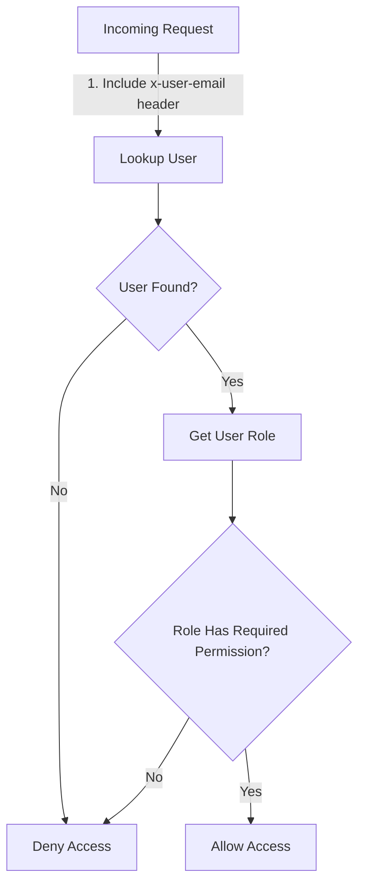

<details>
<summary>Relevant source files</summary>

The following files were used as context for generating this wiki page:

- [config/roles.json](https://github.com/aanickode/access-control-service/blob/main/config/roles.json)
- [docs/permissions.md](https://github.com/aanickode/access-control-service/blob/main/docs/permissions.md)

</details>

# Permission Management

Permission management is a crucial aspect of the access-control-service project, responsible for enforcing role-based access control (RBAC) across various routes and services. It defines a set of roles with associated permissions, ensuring that only authorized users can access specific resources or perform certain actions within the system.

## Introduction

The access-control-service project implements a permission management system based on the Role-Based Access Control (RBAC) model. This system defines a set of predefined roles, each with a specific set of permissions. Users are assigned one or more roles, and their access to resources or actions is determined by the permissions associated with their assigned roles.

The permission management system is designed to provide a flexible and scalable way to manage access control within the project. It allows for easy management of roles and permissions, as well as the assignment of roles to users. The system is designed to be extensible, allowing for the addition of new roles and permissions as needed.

## Role Definition

The roles and their associated permissions are defined in the `config/roles.json` file. This file contains a JSON object where the keys represent the role names, and the values are arrays of permission strings.

```json
{
  "admin": ["view_users", "create_role", "view_permissions"],
  "engineer": ["view_users", "view_permissions"],
  "analyst": ["view_users"]
}
```

Sources: [config/roles.json](https://github.com/aanickode/access-control-service/blob/main/config/roles.json)

### Default Roles

The project defines three default roles:

1. **admin**: This role has full system access and is intended for platform and DevOps teams. It includes permissions to view users, create roles, and view permissions.

2. **engineer**: This role has read-only access to users and permissions, and is intended for observability and debugging purposes.

3. **analyst**: This role has basic read-only access to users, intended for data and reporting use cases.

Sources: [docs/permissions.md](https://github.com/aanickode/access-control-service/blob/main/docs/permissions.md)

## Permission Enforcement

Permissions are enforced on a per-route basis. Each route defines the permission required to access it, and these permissions are checked at runtime against the user's assigned role.



For a request to be considered valid, it must:

1. Include the `x-user-email` header.
2. Match a known user in the in-memory `db.users` map.
3. Have a role that includes the required permission for the requested route.

Sources: [docs/permissions.md](https://github.com/aanickode/access-control-service/blob/main/docs/permissions.md)

## Adding a New Role

To add a new role to the system, follow these steps:

1. Edit the `config/roles.json` file to define the new role and its associated permissions:

```json
{
  "support": ["view_users"]
}
```

2. Assign the new role to a user using the provided CLI tool:

```bash
node cli/manage.js assign-role support@company.com support
```

3. Ensure that consuming services request the appropriate permissions for the new role when accessing protected routes.

Sources: [docs/permissions.md](https://github.com/aanickode/access-control-service/blob/main/docs/permissions.md)

## Permission System Architecture

The permission system follows a simple architecture, with all user-role mappings stored in-memory. Changes to the `roles.json` configuration file require a service restart to take effect.

```mermaid
classDiagram
    class PermissionManager {
        -roles: Map~Role, Permissions[]~
        -users: Map~User, Role~
        +checkPermission(user, permission) bool
        +assignRole(user, role)
        +loadRoles()
    }
    PermissionManager --> "roles.json" : Reads roles
    PermissionManager --> "db.users" : Reads users
    PermissionManager --> RouteHandler : Provides permission checks
    class RouteHandler {
        +handleRequest(request)
    }
    RouteHandler ..> PermissionManager : Uses
```

The `PermissionManager` class is responsible for loading roles from the `roles.json` file, managing user-role assignments, and providing permission checking functionality to the `RouteHandler`. The `RouteHandler` is responsible for handling incoming requests and enforcing the required permissions for each route.

Sources: [docs/permissions.md](https://github.com/aanickode/access-control-service/blob/main/docs/permissions.md)

## Key Components

| Component | Description |
| --- | --- |
| `PermissionManager` | Manages roles, permissions, and user-role assignments. |
| `RouteHandler` | Handles incoming requests and enforces required permissions. |
| `roles.json` | Configuration file defining roles and their associated permissions. |
| `db.users` | In-memory map of users and their assigned roles. |

Sources: [docs/permissions.md](https://github.com/aanickode/access-control-service/blob/main/docs/permissions.md)

## Limitations and Future Enhancements

The current implementation of the permission management system has the following limitations:

- All permission checks are flat, with no support for wildcarding or nested permissions.
- All user-role mappings are stored in-memory, which may not be suitable for large-scale deployments.
- Changes to the `roles.json` configuration file require a service restart to take effect.

To address these limitations and enhance the permission management system, the following improvements are planned:

- Implement scoped permissions (e.g., `project:view:marketing`) to provide more granular access control.
- Integrate with a Single Sign-On (SSO) system to leverage group claims for role assignments.
- Implement audit logging for role changes and access attempts to improve security and compliance.

Sources: [docs/permissions.md](https://github.com/aanickode/access-control-service/blob/main/docs/permissions.md)

## Conclusion

The access-control-service project implements a role-based access control (RBAC) system for managing permissions and enforcing access control across various routes and services. The system defines a set of predefined roles with associated permissions, allowing for easy management of user access. While the current implementation is relatively simple, it provides a solid foundation for future enhancements and integration with more advanced access control mechanisms.