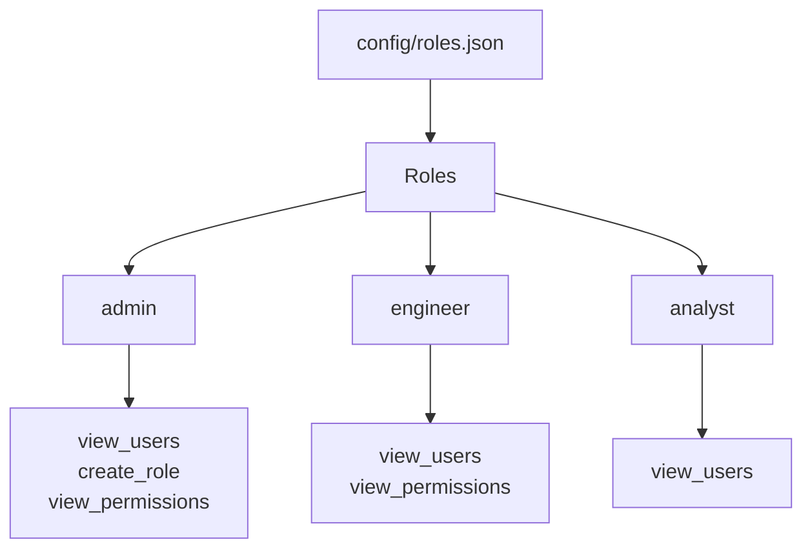
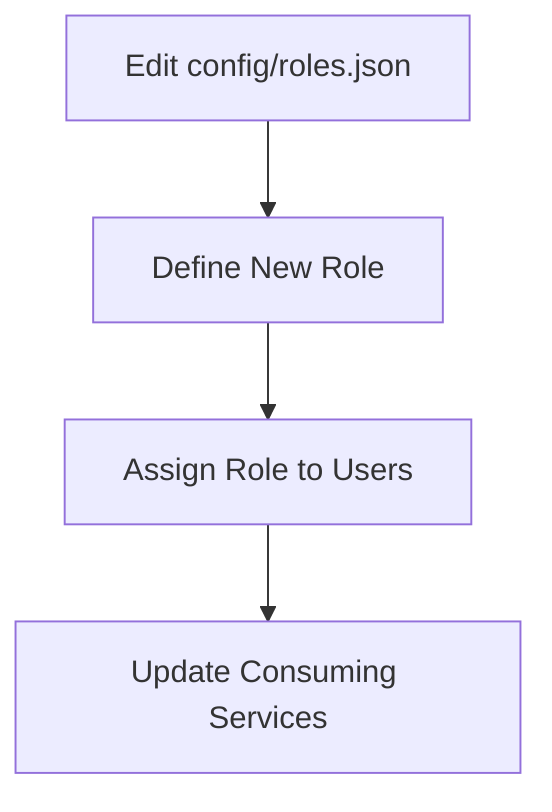
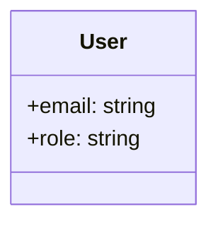
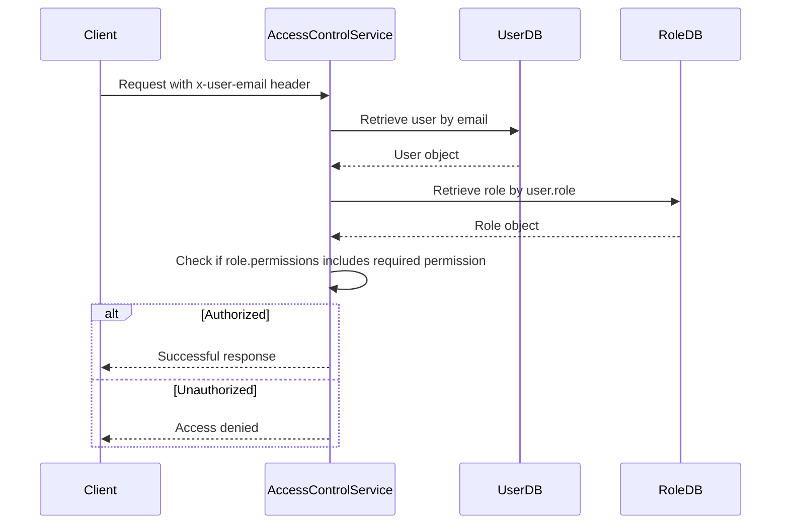

Relevant source files

The following files were used as context for generating this wiki page:

- [config/roles.json](https://github.com/aanickode/access-control-service/blob/main/config/roles.json)
- [src/models.js](https://github.com/aanickode/access-control-service/blob/main/src/models.js)
- [docs/permissions.md](https://github.com/aanickode/access-control-service/blob/main/docs/permissions.md)

# Permission Management

The Permission Management system is a role-based access control (RBAC) mechanism that governs user access to various routes and resources within the project. It defines a set of predefined roles, each associated with specific permissions, and maps users to these roles to determine their access privileges.

## Introduction

The Permission Management system is a crucial component of the access-control-service, responsible for enforcing access control policies based on user roles and permissions. It ensures that only authorized users can perform specific actions or access sensitive data within the application.

The system follows a role-based access control (RBAC) model, where permissions are grouped into roles, and users are assigned one or more roles. This approach simplifies the management of permissions and allows for flexible and scalable access control configurations.

## Role Management

The project defines a set of predefined roles, each with its own set of associated permissions. These roles are defined in the `config/roles.json` file.

The predefined roles and their associated permissions are as follows:

| Role     | Permissions                                   |
|----------|------------------------------------------------|
| admin    | view_users, create_role, view_permissions     |
| engineer | view_users, view_permissions                  |
| analyst  | view_users                                     |

Sources: [config/roles.json](https://github.com/aanickode/access-control-service/blob/main/config/roles.json), [docs/permissions.md:12-21](https://github.com/aanickode/access-control-service/blob/main/docs/permissions.md#L12-L21)

### Adding a New Role

To add a new role, follow these steps:

1. Edit the `config/roles.json` file and define the new role with its associated permissions.
2. Assign the new role to users using the provided CLI tool (`node cli/manage.js assign-role <email> <role>`).
3. Ensure that consuming services request the appropriate permissions for the new role.

Sources: [docs/permissions.md:25-34](https://github.com/aanickode/access-control-service/blob/main/docs/permissions.md#L25-L34)

## User Management

Users are represented by the `User` data model, which consists of an email and a role.

Sources: [src/models.js:1-4](https://github.com/aanickode/access-control-service/blob/main/src/models.js#L1-L4)

## Permission Enforcement

Permissions are enforced on a per-route basis. Each route defines the required permission(s) to access it, and these permissions are checked at runtime against the user's assigned role.

For a request to be considered valid, it must:

1. Include the `x-user-email` header.
2. Match a known user in the in-memory `db.users` map.
3. Have a role that includes the required permission for the requested route.

Sources: [docs/permissions.md:4-10](https://github.com/aanickode/access-control-service/blob/main/docs/permissions.md#L4-L10)

## Future Enhancements

The Permission Management system has several potential enhancements planned for future releases:

- Scoped permissions (e.g., `project:view:marketing`) for more granular access control.
- Integration with single sign-on (SSO) group claims for easier user-role mapping.
- Audit logging for role changes and access attempts to improve security and auditing capabilities.

Sources: [docs/permissions.md:37-40](https://github.com/aanickode/access-control-service/blob/main/docs/permissions.md#L37-L40)

## Summary

The Permission Management system is a critical component of the access-control-service, responsible for enforcing access control policies based on user roles and permissions. It follows a role-based access control (RBAC) model, where permissions are grouped into roles, and users are assigned one or more roles to determine their access privileges. The system provides a flexible and scalable approach to managing user access, ensuring that only authorized users can perform specific actions or access sensitive data within the application.