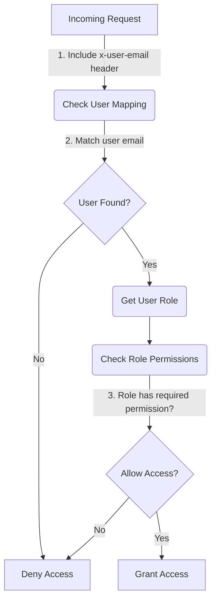
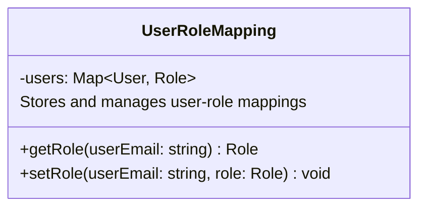

<details>
<summary>Relevant source files</summary>

The following files were used as context for generating this wiki page:

- [config/roles.json](https://github.com/aanickode/access-control-service/blob/main/config/roles.json)
- [docs/permissions.md](https://github.com/aanickode/access-control-service/blob/main/docs/permissions.md)

</details>

# Permission Management

Permission management is a crucial aspect of the access-control-service project, responsible for enforcing role-based access control (RBAC) across the system. It defines a set of roles with associated permissions, and ensures that users can only access resources and functionalities based on their assigned roles.

## Introduction

The access-control-service implements a simple, flat permission model to control access to various routes or functionalities within the system. Each route requires a specific permission, and users are granted access based on their assigned role and the permissions associated with that role.

The permission management system consists of the following key components:

1. **Roles**: A predefined set of roles with specific permissions. Roles are defined in the `config/roles.json` file.
2. **Permissions**: A list of permissions that grant access to different parts of the system. Permissions are associated with roles in the `roles.json` file.
3. **User-Role Mapping**: An in-memory mapping of users to their assigned roles, maintained by the service.
4. **Permission Enforcement**: A middleware or mechanism that checks the user's role and associated permissions against the required permission for each requested route or functionality.

## Role and Permission Configuration

The `config/roles.json` file defines the default roles and their associated permissions within the system. It follows a simple JSON structure:

```json
{
  "role_name": ["permission1", "permission2", ...],
  "another_role": ["permission3", "permission4", ...]
}
```

Sources: [config/roles.json](https://github.com/aanickode/access-control-service/blob/main/config/roles.json)

The default roles defined in the project are:

| Role     | Permissions                                  | Description                                      |
|----------|-----------------------------------------------|--------------------------------------------------|
| admin    | view_users, create_role, view_permissions    | Full system access for platform and DevOps teams |
| engineer | view_users, view_permissions                 | Read-only access for observability and debugging |
| analyst  | view_users                                   | Basic read-only access for data/reporting        |

Sources: [docs/permissions.md](https://github.com/aanickode/access-control-service/blob/main/docs/permissions.md)

## Permission Enforcement Flow

The permission enforcement process follows these steps:



1. The incoming request must include the `x-user-email` header.
2. The service checks if the user email matches a known user in the in-memory `db.users` mapping.
3. If the user is found, the service retrieves the user's assigned role and checks if that role includes the required permission for the requested route or functionality.
4. If the role has the required permission, access is granted; otherwise, access is denied.

Sources: [docs/permissions.md](https://github.com/aanickode/access-control-service/blob/main/docs/permissions.md)

## Adding a New Role

To add a new role to the system, follow these steps:

1. Edit the `config/roles.json` file and define the new role with its associated permissions:

```json
{
  "support": ["view_users"]
}
```

2. Assign the new role to a user using the provided CLI tool:

```bash
node cli/manage.js assign-role support@company.com support
```

3. Ensure that consuming services request the appropriate permissions when accessing routes or functionalities protected by the new role.

Sources: [docs/permissions.md](https://github.com/aanickode/access-control-service/blob/main/docs/permissions.md)

## User-Role Mapping

The access-control-service maintains an in-memory mapping of users to their assigned roles. This mapping is likely stored in a data structure like a JavaScript object or a Map, where the keys are user emails, and the values are the corresponding role names.



Sources: [docs/permissions.md](https://github.com/aanickode/access-control-service/blob/main/docs/permissions.md)

## Future Enhancements

The `docs/permissions.md` file mentions several potential future enhancements for the permission management system:

- **Scoped Permissions**: Introducing a hierarchical or scoped permission model, such as `project:view:marketing`, to provide more granular access control.
- **SSO Integration**: Integrating with a Single Sign-On (SSO) provider to map user roles based on group claims or attributes from the SSO system.
- **Audit Logging**: Implementing audit logging for role changes and access attempts to improve security and auditing capabilities.

Sources: [docs/permissions.md](https://github.com/aanickode/access-control-service/blob/main/docs/permissions.md)

## Conclusion

The access-control-service implements a simple yet effective role-based access control (RBAC) system for managing permissions within the project. It defines a set of roles with associated permissions, maintains an in-memory mapping of users to roles, and enforces permission checks on each requested route or functionality. While the current implementation is flat and straightforward, the project acknowledges the need for future enhancements, such as scoped permissions, SSO integration, and audit logging, to improve the system's scalability, security, and auditing capabilities.