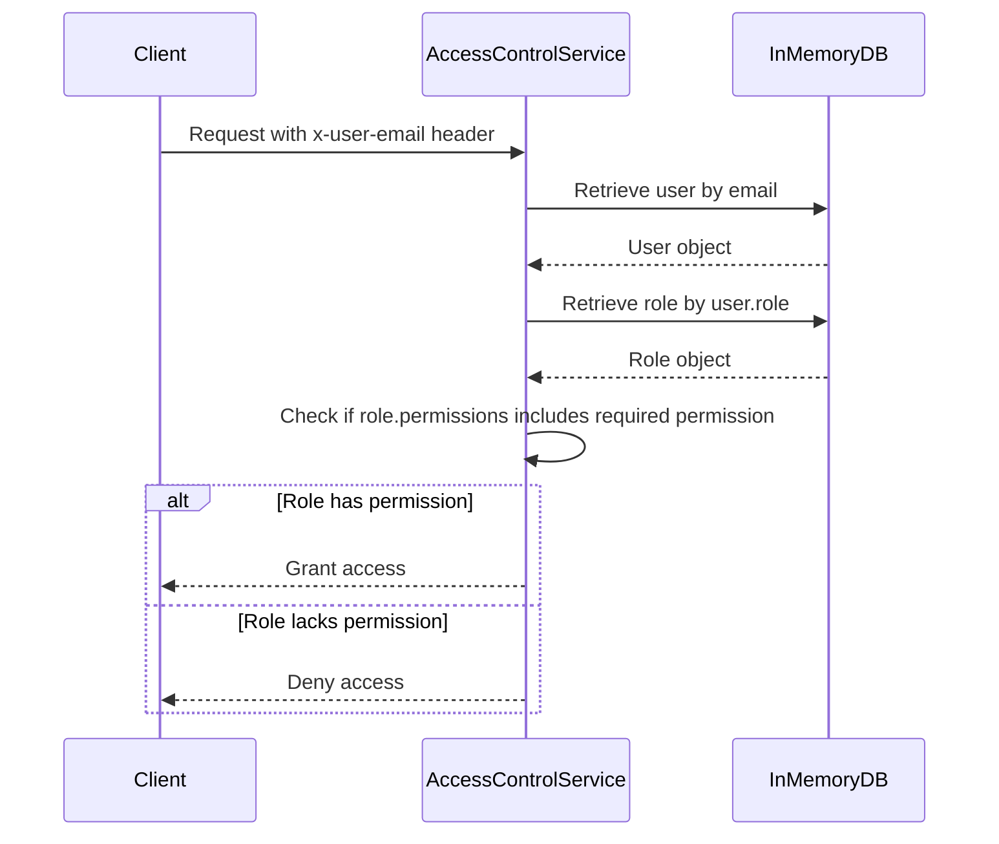

<details>
<summary>Relevant source files</summary>

The following files were used as context for generating this wiki page:

- [config/roles.json](https://github.com/aanickode/access-control-service/blob/main/config/roles.json)
- [src/models.js](https://github.com/aanickode/access-control-service/blob/main/src/models.js)
- [docs/permissions.md](https://github.com/aanickode/access-control-service/blob/main/docs/permissions.md)

</details>

# Permission Management

The Permission Management system is a role-based access control (RBAC) model that governs user access to various routes and functionalities within the project. It defines a set of predefined roles, each associated with a specific set of permissions, and maps users to these roles to determine their access privileges.

## Introduction

The Permission Management system is a crucial component of the project, responsible for ensuring that users have appropriate access levels based on their assigned roles. It serves as a centralized access control mechanism, enabling the application to enforce security policies and maintain data integrity.

The system operates by mapping users to predefined roles, each with a set of associated permissions. When a user attempts to access a specific route or functionality, the system checks if the user's role has the required permission. If the user has the necessary permission, access is granted; otherwise, access is denied.

## Role Management

The project defines a set of predefined roles, each with a specific set of permissions. These roles are defined in the `config/roles.json` file.

```json
{
  "admin": ["view_users", "create_role", "view_permissions"],
  "engineer": ["view_users", "view_permissions"],
  "analyst": ["view_users"]
}
```

Sources: [config/roles.json](https://github.com/aanickode/access-control-service/blob/main/config/roles.json)

### Role Definitions

#### Admin Role

The `admin` role has the following permissions:

- `view_users`: Allows viewing user information.
- `create_role`: Allows creating new roles.
- `view_permissions`: Allows viewing the list of available permissions.

This role is intended for platform and DevOps teams, granting them full system access.

#### Engineer Role

The `engineer` role has the following permissions:

- `view_users`: Allows viewing user information.
- `view_permissions`: Allows viewing the list of available permissions.

This role is intended for observability and debugging purposes, providing read-only access to users and permissions.

#### Analyst Role

The `analyst` role has the following permission:

- `view_users`: Allows viewing user information.

This role is intended for data and reporting use cases, providing basic read-only access.

Sources: [docs/permissions.md](https://github.com/aanickode/access-control-service/blob/main/docs/permissions.md)

## User Management

The project defines a `User` model with the following properties:

```javascript
export const User = {
  email: 'string',
  role: 'string'
};
```

Sources: [src/models.js](https://github.com/aanickode/access-control-service/blob/main/src/models.js)

Each user is associated with an email address and a role. The role determines the user's access permissions within the system.

## Permission Enforcement

The Permission Management system enforces permissions on a per-route basis. Each route defines the required permission to access it, and these permissions are checked at runtime against the user's assigned role.



Sources: [docs/permissions.md](https://github.com/aanickode/access-control-service/blob/main/docs/permissions.md)

For a request to be considered valid, it must:

1. Include the header `x-user-email`.
2. Match a known user in the in-memory `db.users` map.
3. Have a role that includes the required permission for the requested route.

Sources: [docs/permissions.md](https://github.com/aanickode/access-control-service/blob/main/docs/permissions.md)

## Adding a New Role

To add a new role to the system, follow these steps:

1. Edit the `config/roles.json` file to define a new role and its associated permissions.

```json
{
  "support": ["view_users"]
}
```

2. Assign the new role to a user using the provided CLI tool.

```bash
node cli/manage.js assign-role support@company.com support
```

3. Ensure that consuming services request the appropriate permissions for the new role when accessing protected routes.

Sources: [docs/permissions.md](https://github.com/aanickode/access-control-service/blob/main/docs/permissions.md)

## Limitations and Future Enhancements

The current implementation of the Permission Management system has the following limitations:

- All permission checks are flat; there is no support for wildcarding or nested permissions.
- All user-role mappings are stored in-memory, which may not be suitable for large-scale deployments.
- Changes to the `roles.json` file require a service restart to take effect.

To address these limitations and improve the system, the following future enhancements are proposed:

- Implement scoped permissions (e.g., `project:view:marketing`) to provide more granular access control.
- Integrate with a single sign-on (SSO) system to leverage group claims for role assignments.
- Introduce audit logging for role changes and access attempts to improve security and compliance.

Sources: [docs/permissions.md](https://github.com/aanickode/access-control-service/blob/main/docs/permissions.md)

## Conclusion

The Permission Management system is a critical component of the project, responsible for enforcing access control policies and ensuring data integrity. By mapping users to predefined roles and associating permissions with those roles, the system provides a flexible and scalable approach to managing user access. While the current implementation has some limitations, the proposed future enhancements aim to address these limitations and further improve the system's functionality and security.