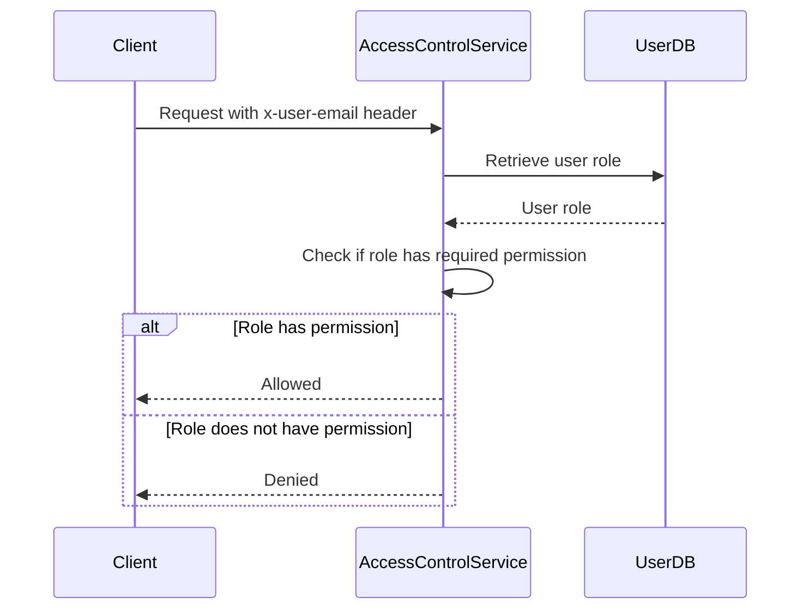

<details>
<summary>Relevant source files</summary>

The following files were used as context for generating this wiki page:

- [config/roles.json](https://github.com/aanickode/access-control-service/blob/main/config/roles.json)
- [docs/permissions.md](https://github.com/aanickode/access-control-service/blob/main/docs/permissions.md)

</details>

# Permission Management

## Introduction

The Permission Management system is a crucial component of the access-control-service project, responsible for enforcing role-based access control (RBAC) across various routes and services within the application. It defines a set of predefined roles, each associated with specific permissions, and ensures that users can only access resources and functionalities based on their assigned roles.

The system is designed to provide a flexible and scalable approach to managing permissions, allowing for easy addition of new roles and permissions as the application evolves. It also aims to enhance security by restricting access to sensitive operations and data based on the principle of least privilege.

## Role Definition

The roles and their associated permissions are defined in the `config/roles.json` file. This file serves as the central configuration for the RBAC system, specifying the available roles and the permissions granted to each role.

```json
{
  "admin": ["view_users", "create_role", "view_permissions"],
  "engineer": ["view_users", "view_permissions"],
  "analyst": ["view_users"]
}
```

Sources: [config/roles.json](https://github.com/aanickode/access-control-service/blob/main/config/roles.json)

The roles defined in this file are:

- **admin**: This role has full system access, including the ability to view users, create new roles, and view permissions. It is intended for platform and DevOps teams.
- **engineer**: This role has read-only access to users and permissions, allowing for observability and debugging purposes.
- **analyst**: This role has basic read-only access to view users, intended for data and reporting use cases.

Sources: [docs/permissions.md](https://github.com/aanickode/access-control-service/blob/main/docs/permissions.md#default-roles)

## Permission Enforcement

The access-control-service enforces permissions on a per-route basis. Each route defines the permission required to access it, and these permissions are checked at runtime against the user's assigned role.



Sources: [docs/permissions.md](https://github.com/aanickode/access-control-service/blob/main/docs/permissions.md#permission-enforcement)

For a request to be considered valid, it must:

1. Include the `x-user-email` header.
2. Match a known user in the in-memory `db.users` map.
3. Have a role that includes the required permission for the requested route.

Sources: [docs/permissions.md](https://github.com/aanickode/access-control-service/blob/main/docs/permissions.md#permission-enforcement)

## Adding a New Role

To add a new role to the system, follow these steps:

1. Edit the `config/roles.json` file to define the new role and its associated permissions:

```json
{
  "support": ["view_users"]
}
```

2. Assign the new role to a user using the provided CLI tool:

```bash
node cli/manage.js assign-role support@company.com support
```

3. Ensure that consuming services request the appropriate permissions when making requests to the access-control-service.

Sources: [docs/permissions.md](https://github.com/aanickode/access-control-service/blob/main/docs/permissions.md#adding-a-new-role)

## Permission Model

The permission model used by the access-control-service is flat, meaning that all permission checks are performed without wildcarding or nesting. Additionally, all user-role mappings are stored in-memory, and changes to the `roles.json` configuration file require a service restart to take effect.

Sources: [docs/permissions.md](https://github.com/aanickode/access-control-service/blob/main/docs/permissions.md#notes)

## Future Enhancements

The documentation outlines several potential future enhancements for the Permission Management system:

- **Scoped permissions**: Introduce the ability to define permissions with scopes, such as `project:view:marketing`, allowing for more granular access control.
- **SSO group claims integration**: Integrate with Single Sign-On (SSO) group claims to automatically assign roles based on group membership.
- **Audit logging**: Implement audit logging for role changes and access attempts, providing a trail of events for security and compliance purposes.

Sources: [docs/permissions.md](https://github.com/aanickode/access-control-service/blob/main/docs/permissions.md#future-enhancements)

## Conclusion

The Permission Management system in the access-control-service project provides a robust and flexible approach to enforcing role-based access control. By defining roles and their associated permissions, the system ensures that users can only access resources and functionalities based on their assigned roles, enhancing security and adhering to the principle of least privilege. The system is designed to be scalable, allowing for the addition of new roles and permissions as the application evolves. Additionally, the documentation outlines potential future enhancements to further improve the system's capabilities and align it with industry best practices.