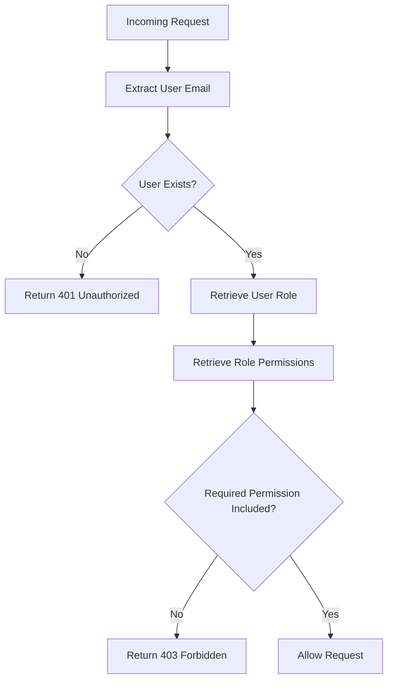

<details>
<summary>Relevant source files</summary>

The following files were used as context for generating this wiki page:

- [config/roles.json](https://github.com/aanickode/access-control-service/blob/main/config/roles.json)
- [src/authMiddleware.js](https://github.com/aanickode/access-control-service/blob/main/src/authMiddleware.js)
- [docs/permissions.md](https://github.com/aanickode/access-control-service/blob/main/docs/permissions.md)

</details>

# Permission Management

## Introduction

The Permission Management system is a crucial component of the access-control-service project, responsible for enforcing role-based access control (RBAC) across various routes and services within the application. It ensures that users are granted access to resources and functionalities based on their assigned roles and corresponding permissions.

The system operates by mapping users to predefined roles, each with a set of associated permissions. When a user attempts to access a protected route or resource, the system checks if the user's role includes the required permission. If the permission is present, access is granted; otherwise, it is denied.

## Role Configuration

The roles and their associated permissions are defined in the `config/roles.json` file. This file serves as the central configuration for the RBAC system.

```json
{
  "admin": ["view_users", "create_role", "view_permissions"],
  "engineer": ["view_users", "view_permissions"],
  "analyst": ["view_users"]
}
```

Sources: [config/roles.json](https://github.com/aanickode/access-control-service/blob/main/config/roles.json)

The configuration file defines three default roles:

- `admin`: This role has full system access, including the ability to view users, create new roles, and view permissions.
- `engineer`: This role has read-only access to users and permissions, typically used for observability and debugging purposes.
- `analyst`: This role has basic read-only access to user data, intended for data analysis and reporting use cases.

## Permission Enforcement

The permission enforcement logic is implemented in the `src/authMiddleware.js` file, which exports a `checkPermission` function.

```javascript
export function checkPermission(requiredPermission) {
  return function (req, res, next) {
    const userEmail = req.headers['x-user-email'];
    if (!userEmail || !db.users[userEmail]) {
      return res.status(401).json({ error: 'Unauthorized: no user context' });
    }

    const role = db.users[userEmail];
    const permissions = db.roles[role] || [];

    if (!permissions.includes(requiredPermission)) {
      return res.status(403).json({ error: 'Forbidden: insufficient permissions' });
    }

    next();
  };
}
```

Sources: [src/authMiddleware.js](https://github.com/aanickode/access-control-service/blob/main/src/authMiddleware.js)

The `checkPermission` function is a middleware that checks if the user has the required permission to access a specific route. It follows these steps:

1. Extracts the user's email from the `x-user-email` header in the request.
2. Checks if the user exists in the `db.users` map.
3. Retrieves the user's role from the `db.users` map.
4. Retrieves the permissions associated with the user's role from the `db.roles` configuration.
5. Verifies if the required permission is included in the user's permissions.
6. If the permission is present, the request is allowed to proceed; otherwise, a 403 Forbidden response is returned.

## Permission Enforcement Flow

The following diagram illustrates the flow of permission enforcement:



Sources: [src/authMiddleware.js](https://github.com/aanickode/access-control-service/blob/main/src/authMiddleware.js)

## Adding a New Role

To add a new role to the system, follow these steps:

1. Edit the `config/roles.json` file and define the new role with its associated permissions.

```json
{
  "support": ["view_users"]
}
```

Sources: [docs/permissions.md](https://github.com/aanickode/access-control-service/blob/main/docs/permissions.md)

2. Assign the new role to a user using the provided CLI tool:

```bash
node cli/manage.js assign-role support@company.com support
```

Sources: [docs/permissions.md](https://github.com/aanickode/access-control-service/blob/main/docs/permissions.md)

3. Ensure that consuming services request the appropriate permissions when accessing protected routes or resources.

## Key Considerations

- **Flat Permission Structure**: The current implementation uses a flat permission structure, where permissions are simple strings without any wildcarding or nesting.
- **In-Memory User-Role Mapping**: The mapping of users to roles is stored in an in-memory `db.users` map. Changes to this mapping require a service restart.
- **Configuration Changes**: Modifications to the `config/roles.json` file also require a service restart to take effect.

## Future Enhancements

The `docs/permissions.md` file outlines several potential enhancements for the Permission Management system:

- **Scoped Permissions**: Introduce a more granular permission system with scoped permissions, such as `project:view:marketing`.
- **SSO Group Claims Integration**: Integrate with a single sign-on (SSO) provider to map user roles based on group claims.
- **Audit Logging**: Implement audit logging for role changes and access attempts to improve security and auditing capabilities.

Sources: [docs/permissions.md](https://github.com/aanickode/access-control-service/blob/main/docs/permissions.md)

## Conclusion

The Permission Management system is a critical component of the access-control-service project, ensuring that users have appropriate access to resources and functionalities based on their assigned roles and permissions. By leveraging the RBAC model, the system provides a flexible and scalable approach to access control, allowing for easy management of roles and permissions as the application grows and evolves.