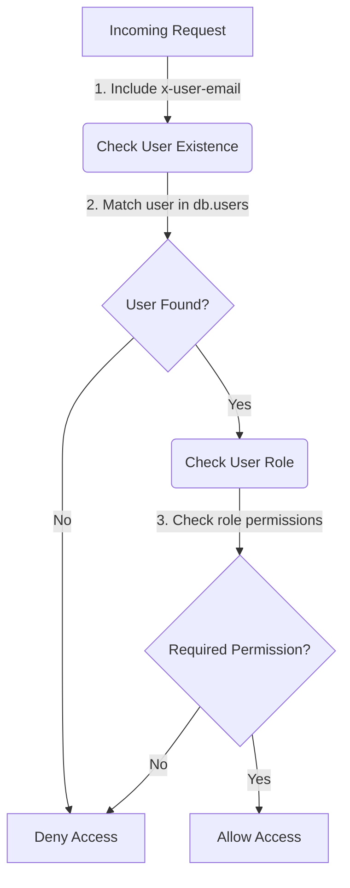
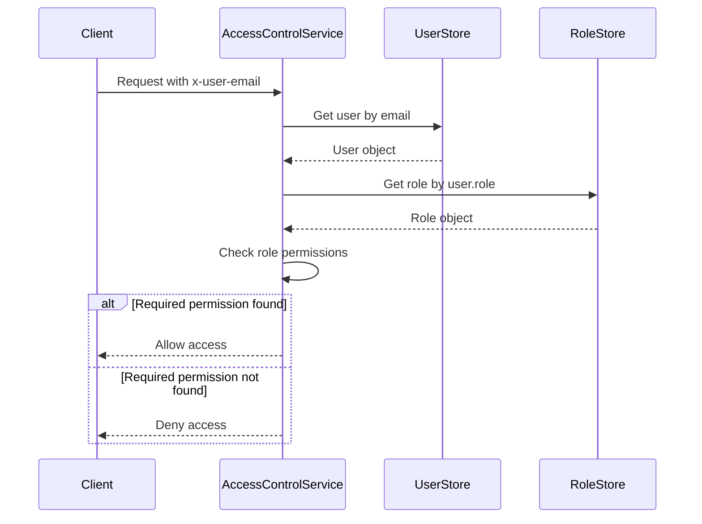

<details>
<summary>Relevant source files</summary>

The following files were used as context for generating this wiki page:

- [config/roles.json](https://github.com/aanickode/access-control-service/blob/main/config/roles.json)
- [src/models.js](https://github.com/aanickode/access-control-service/blob/main/src/models.js)
- [docs/permissions.md](https://github.com/aanickode/access-control-service/blob/main/docs/permissions.md)

</details>

# Permission Management

## Introduction

The Permission Management system is a crucial component of the access-control-service project, responsible for enforcing role-based access control (RBAC) across the application. It defines a set of roles with associated permissions, maps users to these roles, and ensures that only authorized users can access specific routes or functionalities based on their assigned permissions.

The system follows a flat permission model, where permissions are granted or denied based on the user's role, without any hierarchical or nested structure. The user-role mappings are maintained in-memory, and any changes to the role configurations require a service restart.

Sources: [docs/permissions.md](https://github.com/aanickode/access-control-service/blob/main/docs/permissions.md)

## Role Configuration

The roles and their associated permissions are defined in the `config/roles.json` file. This file contains a JSON object where the keys represent role names, and the values are arrays of permission strings.

```json
{
  "admin": ["view_users", "create_role", "view_permissions"],
  "engineer": ["view_users", "view_permissions"],
  "analyst": ["view_users"]
}
```

Sources: [config/roles.json](https://github.com/aanickode/access-control-service/blob/main/config/roles.json), [docs/permissions.md](https://github.com/aanickode/access-control-service/blob/main/docs/permissions.md)

## User and Role Models

The `src/models.js` file defines the data models for `User` and `Role` objects.

```javascript
export const User = {
  email: 'string',
  role: 'string'
};

export const Role = {
  name: 'string',
  permissions: ['string']
};
```

The `User` model represents a user with an email address and an associated role. The `Role` model defines a role with a name and an array of permission strings.

Sources: [src/models.js](https://github.com/aanickode/access-control-service/blob/main/src/models.js)

## Permission Enforcement

The permission enforcement process is described in the `docs/permissions.md` file. It outlines the following steps for a valid request:

1. Include the header `x-user-email`
2. Match a known user in the in-memory `db.users` map
3. Have a role that includes the required permission for the requested route



Sources: [docs/permissions.md](https://github.com/aanickode/access-control-service/blob/main/docs/permissions.md)

## Default Roles

The system comes with three pre-defined roles, each with a specific set of permissions:

| Role     | Permissions                                 | Description                                    |
|----------|-------------------------------------------|-------------------------------------------------|
| admin    | view_users, create_role, view_permissions | Full system access for platform and DevOps teams |
| engineer | view_users, view_permissions              | Read-only access for observability and debugging |
| analyst  | view_users                                | Basic read-only access for data/reporting use cases |

Sources: [config/roles.json](https://github.com/aanickode/access-control-service/blob/main/config/roles.json), [docs/permissions.md](https://github.com/aanickode/access-control-service/blob/main/docs/permissions.md)

## Adding a New Role

To add a new role, follow these steps:

1. Edit the `config/roles.json` file to define a new role with its associated permissions:

```json
{
  "support": ["view_users"]
}
```

2. Assign the new role to a user using the `cli/manage.js` script:

```bash
node cli/manage.js assign-role support@company.com support
```

3. Ensure that consuming services request the appropriate permissions for the new role when accessing protected routes.

Sources: [docs/permissions.md](https://github.com/aanickode/access-control-service/blob/main/docs/permissions.md)

## Sequence Diagram: Permission Check



Sources: [docs/permissions.md](https://github.com/aanickode/access-control-service/blob/main/docs/permissions.md)

## Notes and Future Enhancements

- All permission checks are flat, without support for wildcarding or nesting.
- User-role mappings are stored in-memory, and changes to `roles.json` require a service restart.
- Potential future enhancements include:
  - Scoped permissions (e.g., `project:view:marketing`)
  - Integration with Single Sign-On (SSO) group claims
  - Audit logging for role changes and access attempts

Sources: [docs/permissions.md](https://github.com/aanickode/access-control-service/blob/main/docs/permissions.md)

## Summary

The Permission Management system in the access-control-service project provides a role-based access control mechanism to ensure that only authorized users can access specific routes or functionalities based on their assigned roles and permissions. It defines a set of pre-configured roles with associated permissions, allows for the addition of new roles, and enforces permission checks during runtime. While the current implementation is flat and in-memory, future enhancements may include scoped permissions, SSO integration, and audit logging capabilities.