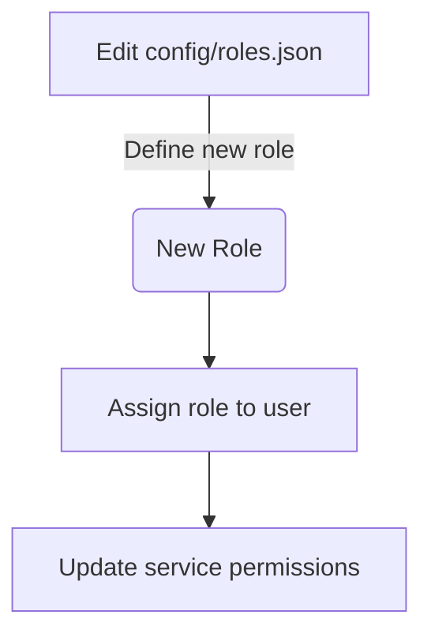
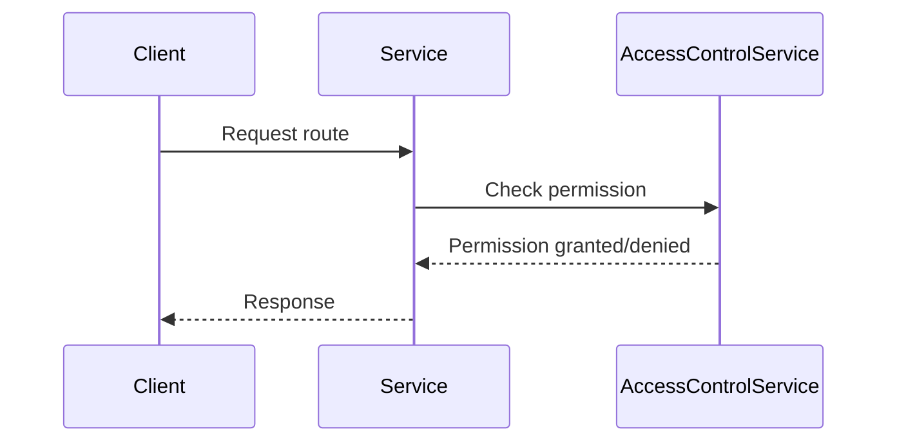
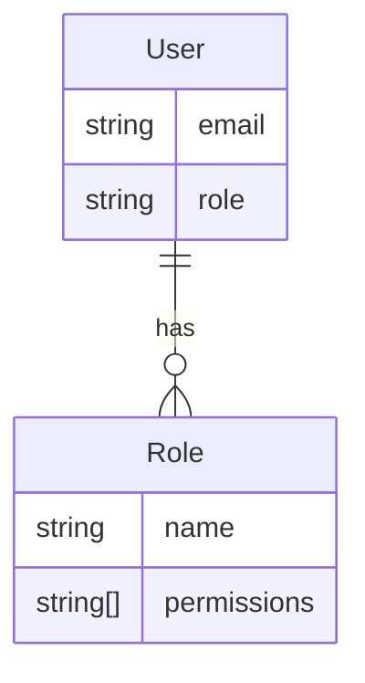

Relevant source files

The following files were used as context for generating this wiki page:

- [config/roles.json](https://github.com/aanickode/access-control-service/blob/main/config/roles.json)
- [src/models.js](https://github.com/aanickode/access-control-service/blob/main/src/models.js)
- [docs/permissions.md](https://github.com/aanickode/access-control-service/blob/main/docs/permissions.md)

# Permission Management

The Permission Management system is a role-based access control (RBAC) model that governs user access to various routes and functionalities within the application. It defines a set of predefined roles, each associated with a specific set of permissions, and assigns these roles to users based on their responsibilities and access requirements.

## Introduction

The Permission Management system is a crucial component of the access-control-service project, responsible for ensuring that users have appropriate access levels based on their assigned roles. It enforces permissions at runtime, verifying that a user's role includes the required permission before granting access to a specific route or functionality.

The system consists of two primary components: roles and permissions. Roles are predefined sets of permissions, while permissions are individual access privileges that control access to specific routes or functionalities within the application.

## Roles

Roles are defined in the `config/roles.json` file, which maps role names to an array of associated permissions. The following roles are currently defined:

### Default Roles

| Role     | Permissions                                  | Description                                                  |
| -------- | --------------------------------------------- | ------------------------------------------------------------ |
| admin    | `view_users`, `create_role`, `view_permissions` | Full system access, used by platform and DevOps teams.      |
| engineer | `view_users`, `view_permissions`               | Read-only access to users and permissions, used for observability and debugging. |
| analyst  | `view_users`                                   | Basic read-only access, intended for data/reporting use cases. |

Sources: [config/roles.json](), [docs/permissions.md]()

### Role Management

Adding a new role involves the following steps:

1. Edit the `config/roles.json` file to define the new role and its associated permissions.
2. Assign the new role to a user using the `cli/manage.js` script.
3. Ensure that consuming services request the appropriate permissions for the new role.

Sources: [docs/permissions.md]()

## Permissions

Permissions are enforced on a per-route basis, and each route defines the required permission for access. At runtime, the system checks if the user's assigned role includes the necessary permission before granting access to the requested route.

Sources: [docs/permissions.md]()

For a request to be considered valid, it must:

1. Include the `x-user-email` header.
2. Match a known user in the in-memory `db.users` map.
3. Have a role that includes the required permission for the requested route.

Sources: [docs/permissions.md]()

## User and Role Models

The `src/models.js` file defines the data models for users and roles:

- The `User` model contains the user's email and their assigned role.
- The `Role` model defines the role name and an array of associated permissions.
- A user has a single role, while a role can be associated with multiple users.

Sources: [src/models.js]()

## Permission Enforcement Implementation

The actual implementation of permission enforcement is not included in the provided source files. However, based on the information in `docs/permissions.md`, it is likely that the service checks the user's role against the required permission for each route before allowing access.

## Future Enhancements

The `docs/permissions.md` file outlines several potential future enhancements for the Permission Management system:

- Scoped permissions (e.g., `project:view:marketing`) to provide more granular access control.
- Integration with Single Sign-On (SSO) group claims for role assignment.
- Audit logging for role changes and access attempts.

Sources: [docs/permissions.md]()

## Conclusion

The Permission Management system is a critical component of the access-control-service project, ensuring that users have appropriate access levels based on their assigned roles. It defines a set of predefined roles, each associated with specific permissions, and enforces these permissions at runtime when users attempt to access various routes or functionalities within the application. The system is designed to be extensible, allowing for the addition of new roles and permissions as needed, and has potential for future enhancements to improve its functionality and security.