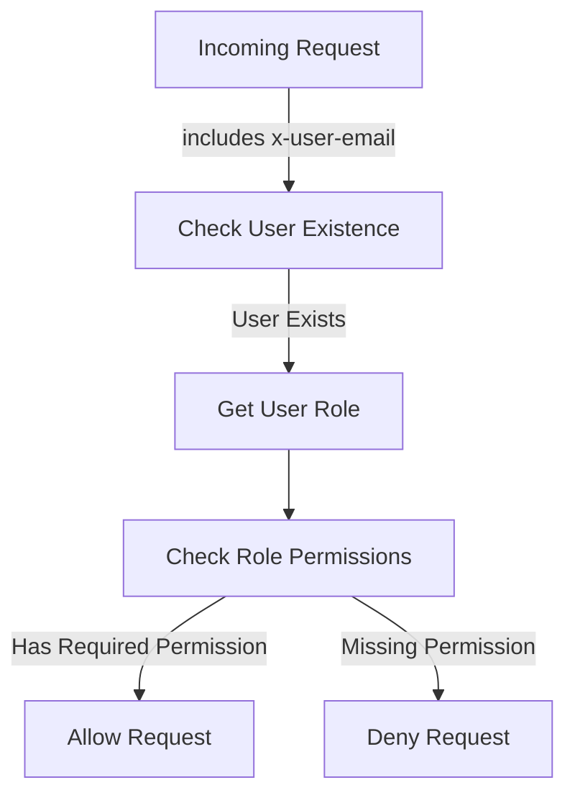
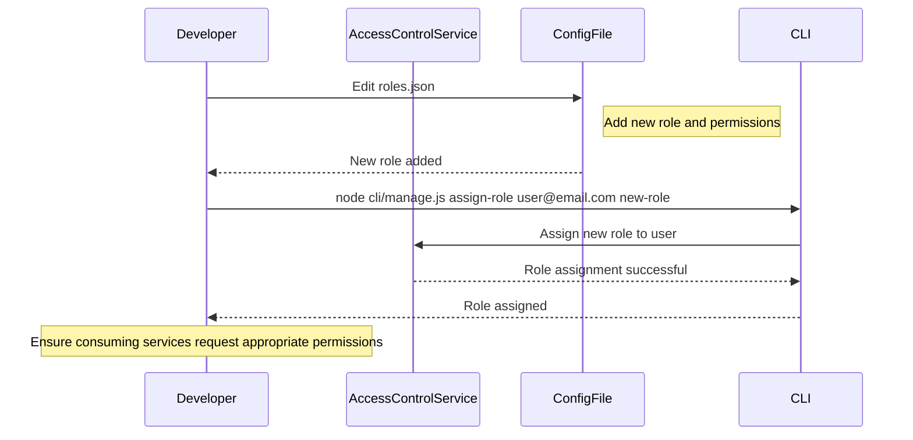

<details>
<summary>Relevant source files</summary>

The following files were used as context for generating this wiki page:

- [config/roles.json](https://github.com/aanickode/access-control-service/blob/main/config/roles.json)
- [src/models.js](https://github.com/aanickode/access-control-service/blob/main/src/models.js)
- [docs/permissions.md](https://github.com/aanickode/access-control-service/blob/main/docs/permissions.md)

</details>

# Permission Management

## Introduction

The Permission Management system is a crucial component of the access-control-service project, responsible for enforcing role-based access control (RBAC) across various routes and services. It defines a set of predefined roles, each associated with specific permissions, and ensures that users can only access resources and functionalities based on their assigned roles.

The system is designed to provide a flexible and scalable approach to managing permissions, allowing for easy addition of new roles and permissions as the project evolves. It also supports future enhancements, such as scoped permissions, integration with single sign-on (SSO) group claims, and audit logging for role changes and access attempts.

## Role and Permission Model

The project follows a role-based access control (RBAC) model, where permissions are granted to roles, and users are assigned one or more roles. This approach simplifies permission management and ensures consistent access control across the system.

### Data Models

The `User` and `Role` data models are defined in the `src/models.js` file:

```javascript
export const User = {
  email: 'string',
  role: 'string'
};

export const Role = {
  name: 'string',
  permissions: ['string']
};
```

- `User` model: Represents a user with an email and a role.
- `Role` model: Defines a role with a name and an array of associated permissions.

Sources: [src/models.js](https://github.com/aanickode/access-control-service/blob/main/src/models.js)

### Default Roles and Permissions

The project comes with a set of predefined roles and their associated permissions, defined in the `config/roles.json` file:

```json
{
  "admin": ["view_users", "create_role", "view_permissions"],
  "engineer": ["view_users", "view_permissions"],
  "analyst": ["view_users"]
}
```

Sources: [config/roles.json](https://github.com/aanickode/access-control-service/blob/main/config/roles.json), [docs/permissions.md](https://github.com/aanickode/access-control-service/blob/main/docs/permissions.md)

The predefined roles and their associated permissions are:

| Role     | Permissions                                 |
|----------|----------------------------------------------|
| admin    | view_users, create_role, view_permissions   |
| engineer | view_users, view_permissions                |
| analyst  | view_users                                  |

Sources: [docs/permissions.md](https://github.com/aanickode/access-control-service/blob/main/docs/permissions.md)

## Permission Enforcement

The permission enforcement process is described in the `docs/permissions.md` file. It follows these steps:

1. Each route defines the permission required to access it.
2. At runtime, the user's request must include the `x-user-email` header.
3. The system checks if the user exists in the in-memory `db.users` map.
4. If the user exists, the system checks if the user's assigned role includes the required permission for the requested route.
5. If the user has the required permission, the request is allowed; otherwise, it is denied.



Sources: [docs/permissions.md](https://github.com/aanickode/access-control-service/blob/main/docs/permissions.md)

## Adding a New Role

To add a new role, follow these steps:

1. Edit the `config/roles.json` file to define the new role and its associated permissions.
2. Assign the new role to a user using the `cli/manage.js` script.
3. Ensure that consuming services request the appropriate permissions for the new role.



Sources: [docs/permissions.md](https://github.com/aanickode/access-control-service/blob/main/docs/permissions.md)

## Future Enhancements

The `docs/permissions.md` file outlines several potential future enhancements for the Permission Management system:

- **Scoped Permissions**: Introduce a more granular permission model with scoped permissions, e.g., `project:view:marketing`.
- **SSO Group Claims Integration**: Integrate with single sign-on (SSO) group claims to manage permissions based on group memberships.
- **Audit Logging**: Implement audit logging for role changes and access attempts to improve security and auditing capabilities.

Sources: [docs/permissions.md](https://github.com/aanickode/access-control-service/blob/main/docs/permissions.md)

## Conclusion

The Permission Management system is a critical component of the access-control-service project, providing a robust and flexible role-based access control (RBAC) mechanism. It defines a set of predefined roles with associated permissions, enforces permission checks at runtime, and supports adding new roles and permissions as the project evolves. By following the RBAC model, the system ensures that users can only access resources and functionalities based on their assigned roles, enhancing security and access control across the project.