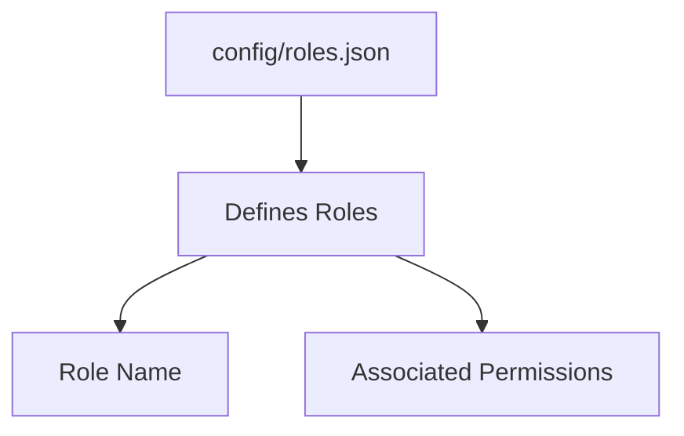
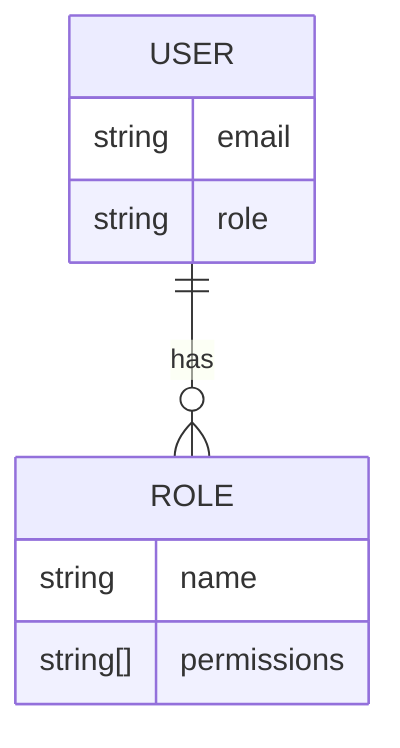
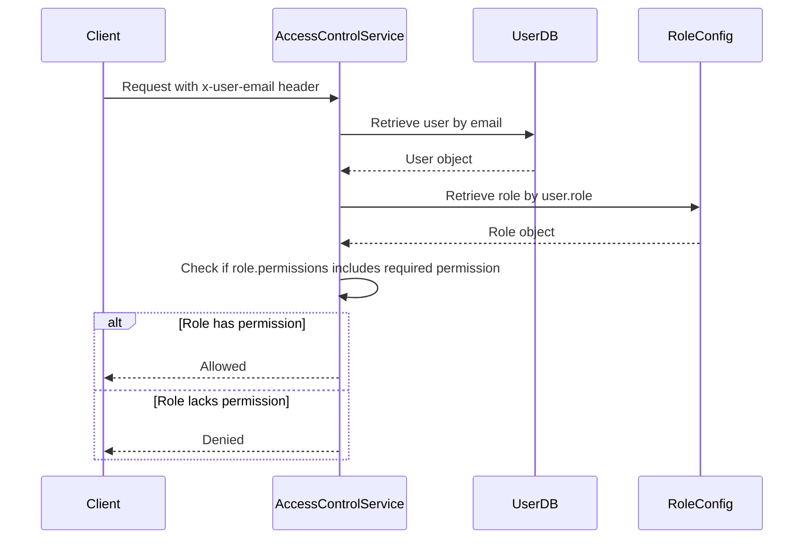
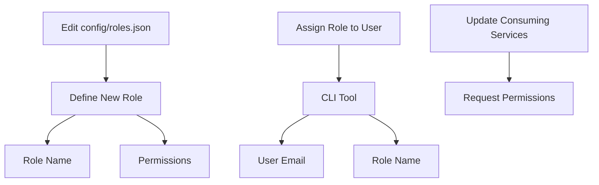

Relevant source files

The following files were used as context for generating this wiki page:

- [config/roles.json](https://github.com/aanickode/access-control-service/blob/main/config/roles.json)
- [src/models.js](https://github.com/aanickode/access-control-service/blob/main/src/models.js)
- [docs/permissions.md](https://github.com/aanickode/access-control-service/blob/main/docs/permissions.md)

# Permission Management

The Permission Management system is a crucial component of the access-control-service project, responsible for enforcing role-based access control (RBAC) across various routes and services. It defines a set of predefined roles, each associated with specific permissions, and ensures that users can only access resources or perform actions for which their assigned role grants them the necessary permissions.

## Introduction

The Permission Management system is designed to provide a secure and flexible way to manage access control within the project. It follows the RBAC model, where permissions are grouped into roles, and users are assigned one or more roles based on their responsibilities and access requirements. This approach simplifies the management of permissions and ensures that users have the appropriate level of access to perform their tasks.

The system consists of several key components, including user and role models, a configuration file for defining roles and their associated permissions, and a set of rules and logic for enforcing permissions at runtime.

## Role and Permission Configuration

The project defines a set of default roles and their associated permissions in the `config/roles.json` file. This file serves as the central configuration for the RBAC system, allowing administrators to easily manage and update roles and permissions.

Sources: [config/roles.json](), [docs/permissions.md:10-19]()

The default roles defined in the project are:

| Role     | Permissions                                 | Description                                      |
|----------|----------------------------------------------|--------------------------------------------------|
| admin    | view_users, create_role, view_permissions   | Full system access for platform and DevOps teams |
| engineer | view_users, view_permissions                | Read-only access for observability and debugging |
| analyst  | view_users                                  | Basic read-only access for data/reporting        |

Sources: [docs/permissions.md:10-19]()

## User and Role Models

The `src/models.js` file defines the data models for users and roles within the system. The `User` model includes fields for the user's email and their assigned role, while the `Role` model represents a role with a name and an array of associated permissions.

Sources: [src/models.js]()

## Permission Enforcement

The Permission Management system enforces permissions at runtime, ensuring that users can only access routes or perform actions for which their assigned role grants them the necessary permissions. The enforcement logic is described in the `docs/permissions.md` file.

Sources: [docs/permissions.md:3-10]()

For a request to be granted access, it must:

1. Include the `x-user-email` header
2. Match a known user in the in-memory `db.users` map
3. Have a role that includes the required permission for the requested route

Sources: [docs/permissions.md:5-9]()

## Adding a New Role

To add a new role to the system, follow these steps:

1. Edit the `config/roles.json` file to define the new role and its associated permissions.
2. Assign the new role to a user using the provided CLI tool.
3. Ensure that consuming services request the appropriate permissions for the new role.

Sources: [docs/permissions.md:22-30]()

## Future Enhancements

The `docs/permissions.md` file outlines several potential future enhancements for the Permission Management system, including:

- Scoped permissions (e.g., `project:view:marketing`)
- Integration with Single Sign-On (SSO) group claims
- Audit logging for role changes and access attempts

Sources: [docs/permissions.md:33-36]()

## Conclusion

The Permission Management system is a critical component of the access-control-service project, ensuring that users can only access resources and perform actions for which they have the necessary permissions. By following the RBAC model and providing a flexible configuration system, the project can easily manage and update roles and permissions as needed. While the current implementation is functional, the proposed future enhancements could further improve the system's capabilities and security.