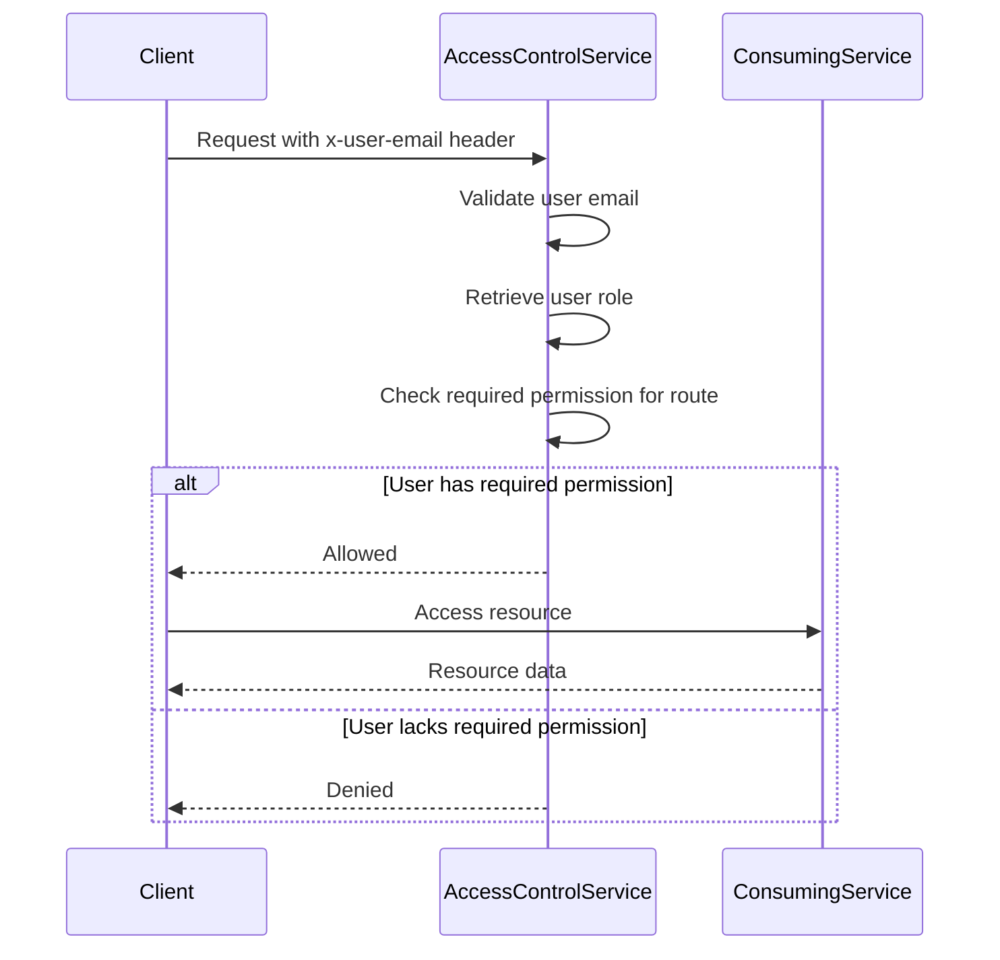

<details>
<summary>Relevant source files</summary>

The following files were used as context for generating this wiki page:

- [config/roles.json](https://github.com/aanickode/access-control-service/blob/main/config/roles.json)
- [src/models.js](https://github.com/aanickode/access-control-service/blob/main/src/models.js)
- [docs/permissions.md](https://github.com/aanickode/access-control-service/blob/main/docs/permissions.md)

</details>

# Permission Management

The Permission Management system is a role-based access control (RBAC) model that governs user access to various resources and functionalities within the project. It defines a set of roles, each associated with specific permissions, and maps users to these roles to control their access levels.

## Introduction

The Permission Management system is a crucial component of the project, responsible for ensuring that users have appropriate access to resources based on their assigned roles. It follows the principle of least privilege, granting users only the permissions necessary to perform their tasks. This system plays a vital role in maintaining data security, privacy, and overall system integrity.

## Roles and Permissions

The project defines a set of predefined roles, each with a specific set of permissions. These roles and their associated permissions are defined in the `config/roles.json` file.

```json
{
  "admin": ["view_users", "create_role", "view_permissions"],
  "engineer": ["view_users", "view_permissions"],
  "analyst": ["view_users"]
}
```
Sources: [config/roles.json](https://github.com/aanickode/access-control-service/blob/main/config/roles.json)

The roles and their corresponding permissions are as follows:

### admin

- `view_users`: Allows viewing user information.
- `create_role`: Allows creating new roles.
- `view_permissions`: Allows viewing the list of available permissions.

This role is intended for platform and DevOps teams, granting them full system access.

### engineer

- `view_users`: Allows viewing user information.
- `view_permissions`: Allows viewing the list of available permissions.

This role is used for observability and debugging purposes, providing read-only access to users and permissions.

### analyst

- `view_users`: Allows viewing user information.

This role is intended for data and reporting use cases, providing basic read-only access.

Sources: [docs/permissions.md](https://github.com/aanickode/access-control-service/blob/main/docs/permissions.md)

## User Model

The `User` model is defined in the `src/models.js` file and consists of two properties:

```javascript
export const User = {
  email: 'string',
  role: 'string'
};
```
Sources: [src/models.js](https://github.com/aanickode/access-control-service/blob/main/src/models.js)

- `email`: Represents the user's email address, which serves as a unique identifier.
- `role`: Represents the user's assigned role, which determines their access permissions.

## Permission Enforcement

The Permission Management system enforces permissions on a per-route basis. Each route defines the required permission(s) to access it, and these permissions are checked at runtime against the user's assigned role.


Sources: [docs/permissions.md](https://github.com/aanickode/access-control-service/blob/main/docs/permissions.md)

For a request to be considered valid, it must:

1. Include the `x-user-email` header.
2. Match a known user in the in-memory `db.users` map.
3. Have a role that includes the required permission for the requested route.

Sources: [docs/permissions.md](https://github.com/aanickode/access-control-service/blob/main/docs/permissions.md)

## Adding a New Role

To add a new role to the system, follow these steps:

1. Edit the `config/roles.json` file to define the new role and its associated permissions.

```json
{
  "support": ["view_users"]
}
```
Sources: [docs/permissions.md](https://github.com/aanickode/access-control-service/blob/main/docs/permissions.md)

2. Assign the new role to a user using the provided CLI tool.

```bash
node cli/manage.js assign-role support@company.com support
```
Sources: [docs/permissions.md](https://github.com/aanickode/access-control-service/blob/main/docs/permissions.md)

3. Ensure that consuming services request the appropriate permissions for the new role when accessing protected resources.

## Implementation Details

### Permissions

- All permission checks are flat; there is no support for wildcarding or nesting of permissions.
- All user-role mappings are stored in-memory.
- Changes to the `roles.json` file require a service restart to take effect.

Sources: [docs/permissions.md](https://github.com/aanickode/access-control-service/blob/main/docs/permissions.md)

### Future Enhancements

The following enhancements are planned for the Permission Management system:

- Scoped permissions (e.g., `project:view:marketing`) to provide more granular access control.
- Integration with Single Sign-On (SSO) group claims for role assignment.
- Audit logging for role changes and access attempts.

Sources: [docs/permissions.md](https://github.com/aanickode/access-control-service/blob/main/docs/permissions.md)

## Conclusion

The Permission Management system is a critical component of the project, ensuring that users have appropriate access to resources based on their assigned roles. It follows the RBAC model, defining a set of predefined roles with associated permissions, and enforces these permissions at runtime. By adhering to the principle of least privilege, the system helps maintain data security, privacy, and overall system integrity.