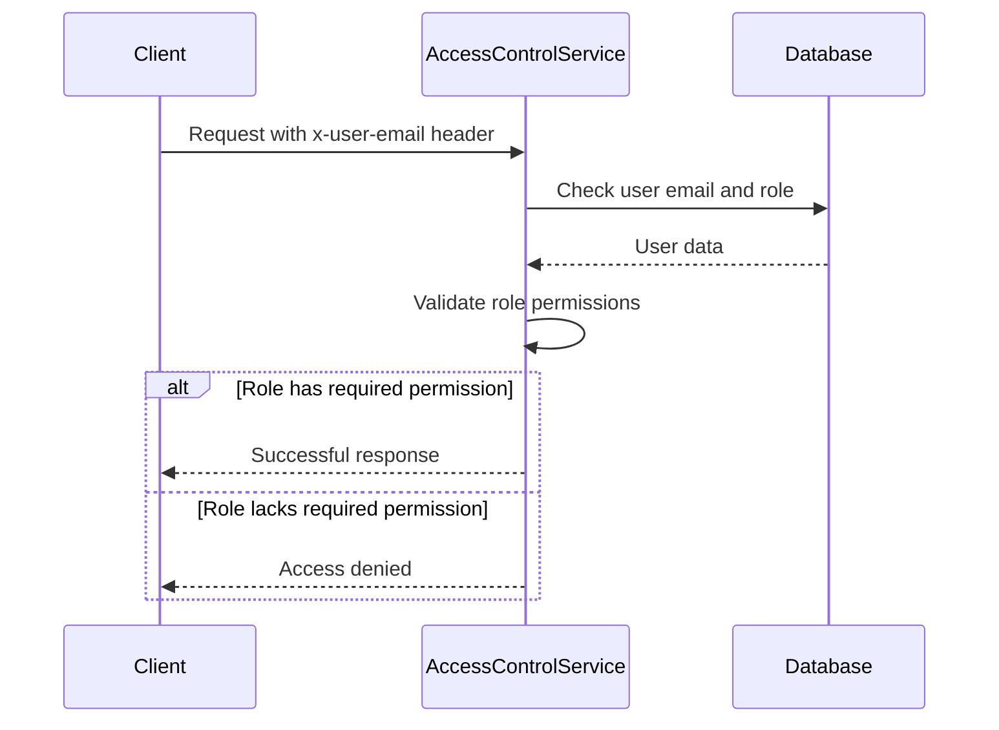

<details>
<summary>Relevant source files</summary>

The following files were used as context for generating this wiki page:

- [config/roles.json](https://github.com/aanickode/access-control-service/blob/main/config/roles.json)
- [src/models.js](https://github.com/aanickode/access-control-service/blob/main/src/models.js)
- [docs/permissions.md](https://github.com/aanickode/access-control-service/blob/main/docs/permissions.md)

</details>

# Permission Management

The Permission Management system is a role-based access control (RBAC) model implemented within the access-control-service project. It defines a set of roles with associated permissions, which are used to control access to various routes and functionalities across the system.

## Introduction

The Permission Management system is a crucial component of the access-control-service project, responsible for enforcing access control based on user roles and their assigned permissions. It ensures that only authorized users can perform specific actions or access certain resources within the system.

The system follows a role-based access control (RBAC) model, where users are assigned roles, and each role is associated with a set of permissions. These permissions define the actions or resources that a user with a particular role can access or perform.

Sources: [docs/permissions.md]()

## Role Definition

The roles and their associated permissions are defined in the `config/roles.json` file. This file contains a JSON object that maps role names to an array of permission strings.

```json
{
  "admin": ["view_users", "create_role", "view_permissions"],
  "engineer": ["view_users", "view_permissions"],
  "analyst": ["view_users"]
}
```

Sources: [config/roles.json](), [docs/permissions.md:13-19]()

### Default Roles

The system comes with three predefined roles:

1. **admin**: This role has full system access, including the ability to view users, create roles, and view permissions. It is intended for platform and DevOps teams.
2. **engineer**: This role has read-only access to users and permissions, which is useful for observability and debugging purposes.
3. **analyst**: This role has basic read-only access to users, intended for data and reporting use cases.

Sources: [docs/permissions.md:21-32]()

## User and Role Models

The `src/models.js` file defines the data models for `User` and `Role` objects.

```javascript
export const User = {
  email: 'string',
  role: 'string'
};

export const Role = {
  name: 'string',
  permissions: ['string']
};
```

The `User` model represents a user in the system, with properties for `email` and `role`. The `Role` model defines a role with a `name` and an array of `permissions`.

Sources: [src/models.js]()

## Permission Enforcement

Permissions are enforced on a per-route basis within the access-control-service. Each route defines the permission required to access it, and these permissions are checked at runtime against the user's assigned role.

For a request to be considered valid, it must:

1. Include the header `x-user-email`
2. Match a known user in the in-memory `db.users` map
3. Have a role that includes the required permission for the requested route



Sources: [docs/permissions.md:5-10]()

## Adding a New Role

To add a new role to the system, follow these steps:

1. Edit the `config/roles.json` file to define the new role and its associated permissions:

```json
{
  "support": ["view_users"]
}
```

2. Assign the new role to a user using the provided CLI tool:

```bash
node cli/manage.js assign-role support@company.com support
```

3. Ensure that consuming services request the appropriate permissions when making requests to the access-control-service.

Sources: [docs/permissions.md:34-43]()

## Notes and Limitations

- All permission checks are flat, meaning there is no support for wildcarding or nesting of permissions.
- All user-role mappings are stored in-memory, which may not be suitable for large-scale deployments.
- Changes to the `roles.json` file require a service restart to take effect.

Sources: [docs/permissions.md:45-48]()

## Future Enhancements

The `docs/permissions.md` file outlines several potential future enhancements for the Permission Management system:

- Scoped permissions (e.g., `project:view:marketing`) to provide more granular access control.
- Integration with single sign-on (SSO) group claims for easier user-role mapping.
- Audit logging for role changes and access attempts to improve security and auditing capabilities.

Sources: [docs/permissions.md:50-54]()

In summary, the Permission Management system is a crucial component of the access-control-service project, providing role-based access control and enforcing permissions across various routes and functionalities. While it currently has some limitations, the system is designed to be extensible and can be enhanced with additional features in the future.