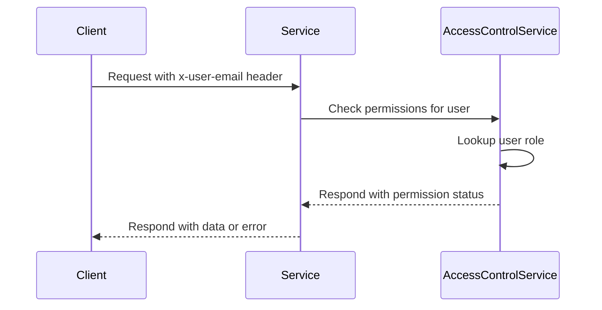

<details>
<summary>Relevant source files</summary>

The following files were used as context for generating this wiki page:

- [config/roles.json](https://github.com/aanickode/access-control-service/blob/main/config/roles.json)
- [docs/permissions.md](https://github.com/aanickode/access-control-service/blob/main/docs/permissions.md)

</details>

# Permission Management

## Introduction

The access-control-service implements a role-based access control (RBAC) model to manage permissions within the system. Permissions are enforced on a per-route basis, ensuring that only authorized users with the appropriate roles can access specific resources or perform certain actions.

The RBAC model defines a set of default roles, each associated with a predefined set of permissions. These roles can be assigned to users, granting them the corresponding access rights. Additionally, the system allows for the creation of new roles with custom permission sets to accommodate evolving requirements.

Sources: [docs/permissions.md](https://github.com/aanickode/access-control-service/blob/main/docs/permissions.md)

## Role Management

### Default Roles

The system comes preconfigured with the following default roles and their associated permissions:

```mermaid
erDiagram
    ROLE ||--o{ PERMISSION : has

    ROLE {
        string name
    }

    PERMISSION {
        string name
    }

    ROLE {
        "admin"
        "engineer"
        "analyst"
    }

    PERMISSION {
        "view_users"
        "create_role"
        "view_permissions"
    }

    admin ||--o{ view_users : has
    admin ||--o{ create_role : has
    admin ||--o{ view_permissions : has
    engineer ||--o{ view_users : has
    engineer ||--o{ view_permissions : has
    analyst ||--o{ view_users : has
```

- **admin**: This role has full system access, including the ability to view users, create new roles, and view permissions. It is intended for use by platform and DevOps teams.
- **engineer**: This role has read-only access to users and permissions, allowing for observability and debugging purposes.
- **analyst**: This role has basic read-only access to user information, intended for data analysis and reporting use cases.

Sources: [config/roles.json](https://github.com/aanickode/access-control-service/blob/main/config/roles.json), [docs/permissions.md](https://github.com/aanickode/access-control-service/blob/main/docs/permissions.md)

### Adding a New Role

To add a new role with a custom set of permissions, follow these steps:

1. Edit the `config/roles.json` file to define the new role and its associated permissions:

```json
{
  "support": ["view_users"]
}
```

2. Assign the new role to a user using the provided CLI tool:

```bash
node cli/manage.js assign-role support@company.com support
```

3. Ensure that consuming services request the appropriate permissions when accessing routes protected by the new role.

Sources: [docs/permissions.md](https://github.com/aanickode/access-control-service/blob/main/docs/permissions.md)

## Permission Enforcement

The access-control-service enforces permissions on a per-route basis. For a request to be considered valid, it must meet the following criteria:

1. Include the `x-user-email` header with a valid user email.
2. Match a known user in the in-memory `db.users` map.
3. Have a role that includes the required permission for the requested route.



The permission checks are flat, meaning there is no support for wildcarding or nesting of permissions. All user-role mappings are stored in-memory, and changes to the `roles.json` configuration file require a service restart to take effect.

Sources: [docs/permissions.md](https://github.com/aanickode/access-control-service/blob/main/docs/permissions.md)

## Future Enhancements

The access-control-service documentation outlines several potential future enhancements to the permission management system:

- **Scoped Permissions**: Introduce a more granular permission model that supports scoping permissions to specific resources or projects (e.g., `project:view:marketing`).
- **SSO Integration**: Integrate with a single sign-on (SSO) provider to leverage group claims for role assignments.
- **Audit Logging**: Implement audit logging capabilities to track role changes and access attempts for auditing and compliance purposes.

Sources: [docs/permissions.md](https://github.com/aanickode/access-control-service/blob/main/docs/permissions.md)

## Conclusion

The access-control-service implements a role-based access control (RBAC) model to manage permissions within the system. It defines a set of default roles with predefined permissions and allows for the creation of custom roles to accommodate evolving requirements. Permissions are enforced on a per-route basis, ensuring that only authorized users with the appropriate roles can access specific resources or perform certain actions. While the current implementation is flat and in-memory, the documentation outlines potential future enhancements, such as scoped permissions, SSO integration, and audit logging, to improve the system's functionality and security.