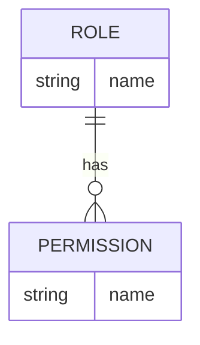
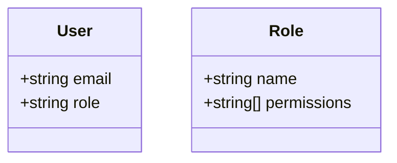
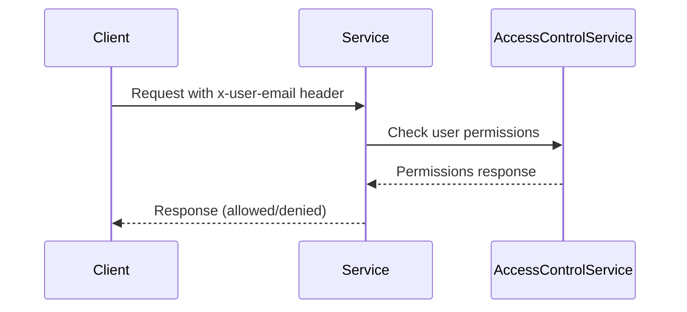
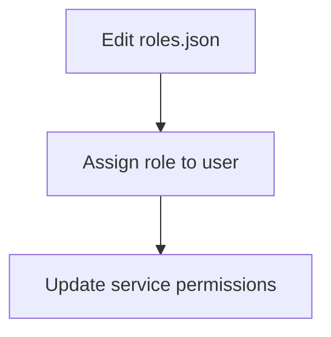

<details>
<summary>Relevant source files</summary>

The following files were used as context for generating this wiki page:

- [config/roles.json](https://github.com/aanickode/access-control-service/blob/main/config/roles.json)
- [src/models.js](https://github.com/aanickode/access-control-service/blob/main/src/models.js)
- [docs/permissions.md](https://github.com/aanickode/access-control-service/blob/main/docs/permissions.md)

</details>

# Permission Management

The Permission Management system is a crucial component of the access-control-service project, responsible for enforcing role-based access control (RBAC) across various routes and services. It ensures that users are granted access to resources and functionalities based on their assigned roles and associated permissions.

## Introduction

The Permission Management system is built around the concept of roles and permissions. Each user is assigned a specific role, and each role is associated with a set of permissions that define the actions and resources the user can access. This approach simplifies access control management by grouping permissions into logical roles, making it easier to assign and manage access rights for different types of users.

The system is designed to be flexible and extensible, allowing for the addition of new roles and permissions as needed. It also supports future enhancements, such as scoped permissions and integration with single sign-on (SSO) group claims.

Sources: [docs/permissions.md](https://github.com/aanickode/access-control-service/blob/main/docs/permissions.md)

## Role Configuration

The roles and their associated permissions are defined in the `config/roles.json` file. This file serves as the central configuration for the Permission Management system, allowing administrators to easily manage and update roles and permissions.



The `roles.json` file contains a JSON object where the keys represent role names, and the values are arrays of permission strings associated with each role.

Sources: [config/roles.json](https://github.com/aanickode/access-control-service/blob/main/config/roles.json)

## Default Roles

The system comes pre-configured with three default roles:

| Role     | Permissions                                  | Description                                    |
|----------|-----------------------------------------------|------------------------------------------------|
| admin    | view_users, create_role, view_permissions    | Full system access for platform and DevOps teams |
| engineer | view_users, view_permissions                 | Read-only access for observability and debugging |
| analyst  | view_users                                   | Basic read-only access for data/reporting use cases |

Sources: [docs/permissions.md](https://github.com/aanickode/access-control-service/blob/main/docs/permissions.md)

## User and Role Models

The `src/models.js` file defines the data models for users and roles within the system.



- The `User` model represents a user in the system, with properties for `email` and `role`.
- The `Role` model defines a role, with properties for `name` and an array of `permissions`.

Sources: [src/models.js](https://github.com/aanickode/access-control-service/blob/main/src/models.js)

## Permission Enforcement

The Permission Management system enforces permissions on a per-route basis. Each route defines the permission required to access it, and these permissions are checked at runtime against the user's assigned role.



For a request to be considered valid, it must:

1. Include the `x-user-email` header.
2. Match a known user in the in-memory `db.users` map.
3. Have a role that includes the required permission for the requested route.

Sources: [docs/permissions.md](https://github.com/aanickode/access-control-service/blob/main/docs/permissions.md)

## Adding a New Role

To add a new role to the system, follow these steps:

1. Edit the `config/roles.json` file to define the new role and its associated permissions.
2. Assign the new role to a user using the `cli/manage.js` script.
3. Ensure that consuming services request the appropriate permissions for the new role.



For example, to add a "support" role with the "view_users" permission:

1. Edit `config/roles.json`:

```json
{
  "support": ["view_users"]
}
```

2. Assign the role to a user:

```bash
node cli/manage.js assign-role support@company.com support
```

3. Update consuming services to request the "view_users" permission for the "support" role.

Sources: [docs/permissions.md](https://github.com/aanickode/access-control-service/blob/main/docs/permissions.md)

## Notes and Future Enhancements

- All permission checks are flat; no wildcarding or nesting is supported.
- All user-role mappings are stored in-memory, and changes to `roles.json` require a service restart.
- Planned future enhancements include:
  - Scoped permissions (e.g., `project:view:marketing`).
  - Integration with SSO group claims.
  - Audit logging for role changes and access attempts.

Sources: [docs/permissions.md](https://github.com/aanickode/access-control-service/blob/main/docs/permissions.md)

## Summary

The Permission Management system is a crucial component of the access-control-service project, providing a flexible and extensible role-based access control (RBAC) mechanism. It allows administrators to define roles and associated permissions, assign roles to users, and enforce permissions on a per-route basis. The system is designed to be easily configurable and supports future enhancements to accommodate evolving access control requirements.