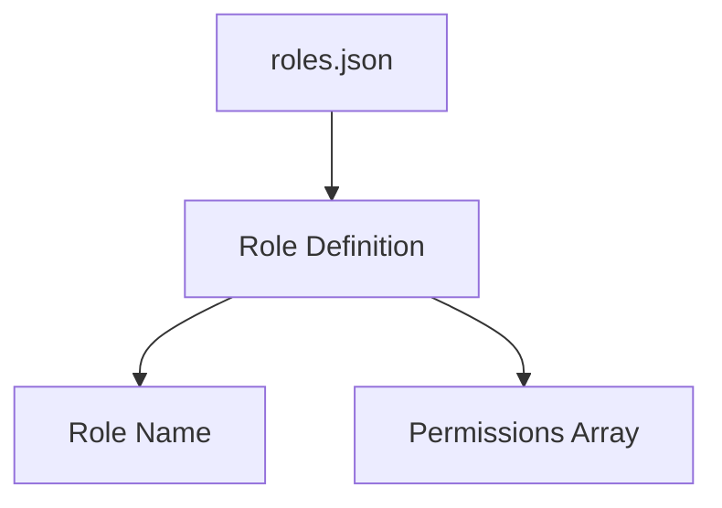
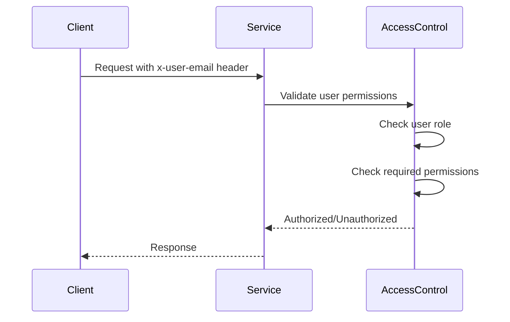
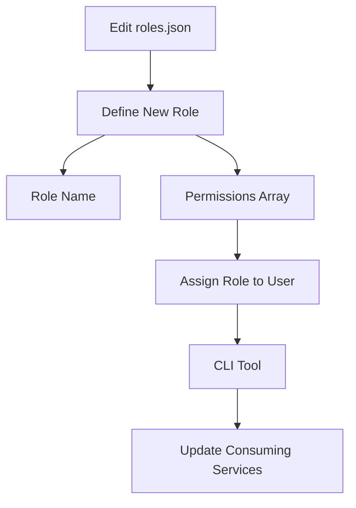

Relevant source files

The following files were used as context for generating this wiki page:

- [config/roles.json](https://github.com/aanickode/access-control-service/blob/main/config/roles.json)
- [docs/permissions.md](https://github.com/aanickode/access-control-service/blob/main/docs/permissions.md)

# Permission Management

Permission Management is a crucial aspect of the access-control-service project, responsible for defining and enforcing access control rules based on user roles and permissions. It ensures that only authorized users can access specific routes or functionalities within the system, enhancing security and maintaining data integrity.

## Introduction

The access-control-service project implements a Role-Based Access Control (RBAC) model, where permissions are assigned to roles, and users are associated with one or more roles. This approach simplifies the management of permissions by grouping them into logical roles, making it easier to assign and revoke access privileges as needed.

The Permission Management system consists of two main components: the `roles.json` configuration file, which defines the available roles and their associated permissions, and the runtime permission enforcement logic, which verifies user permissions based on their assigned roles.

## Role Configuration

The `roles.json` file located in the `config` directory defines the available roles and their corresponding permissions. Each role is represented as a key-value pair, where the key is the role name, and the value is an array of permission strings.

Sources: [config/roles.json](https://github.com/aanickode/access-control-service/blob/main/config/roles.json)

The default roles defined in the project are:

| Role     | Permissions                                |
|----------|---------------------------------------------|
| admin    | view_users, create_role, view_permissions |
| engineer | view_users, view_permissions              |
| analyst  | view_users                                |

Sources: [docs/permissions.md](https://github.com/aanickode/access-control-service/blob/main/docs/permissions.md)

## Permission Enforcement

The permission enforcement logic is implemented within the access-control-service and is responsible for verifying user permissions before allowing access to specific routes or functionalities.

Sources: [docs/permissions.md](https://github.com/aanickode/access-control-service/blob/main/docs/permissions.md)

The permission enforcement process follows these steps:

1. The client sends a request with the `x-user-email` header.
2. The service validates the user's permissions by checking the user's role and the required permissions for the requested route.
3. The access control module checks if the user's role includes the required permissions.
4. If the user is authorized, the service processes the request; otherwise, an unauthorized response is returned.

Sources: [docs/permissions.md](https://github.com/aanickode/access-control-service/blob/main/docs/permissions.md)

## Adding a New Role

To add a new role to the system, follow these steps:

1. Edit the `roles.json` file in the `config` directory and define the new role with its associated permissions.
2. Assign the new role to a user using the provided CLI tool (`cli/manage.js`).
3. Ensure that consuming services request the appropriate permissions for the new role.

Sources: [docs/permissions.md](https://github.com/aanickode/access-control-service/blob/main/docs/permissions.md)

## Limitations and Future Enhancements

The current implementation of the Permission Management system has the following limitations:

- All permission checks are flat, without support for wildcarding or nesting.
- User-role mappings are stored in-memory, which may not be suitable for large-scale deployments.
- Changes to the `roles.json` file require a service restart to take effect.

To address these limitations and enhance the Permission Management system, the following improvements are planned:

- Implement scoped permissions (e.g., `project:view:marketing`) to provide more granular access control.
- Integrate with a Single Sign-On (SSO) system to leverage group claims for role assignments.
- Introduce audit logging for role changes and access attempts to improve visibility and compliance.

Sources: [docs/permissions.md](https://github.com/aanickode/access-control-service/blob/main/docs/permissions.md)

## Conclusion

The Permission Management system in the access-control-service project plays a crucial role in ensuring secure access to resources and functionalities within the system. By implementing a Role-Based Access Control (RBAC) model, it simplifies the management of permissions and provides a flexible and scalable approach to access control. While the current implementation has some limitations, the planned enhancements aim to address these limitations and further enhance the system's capabilities.