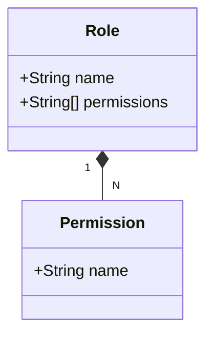
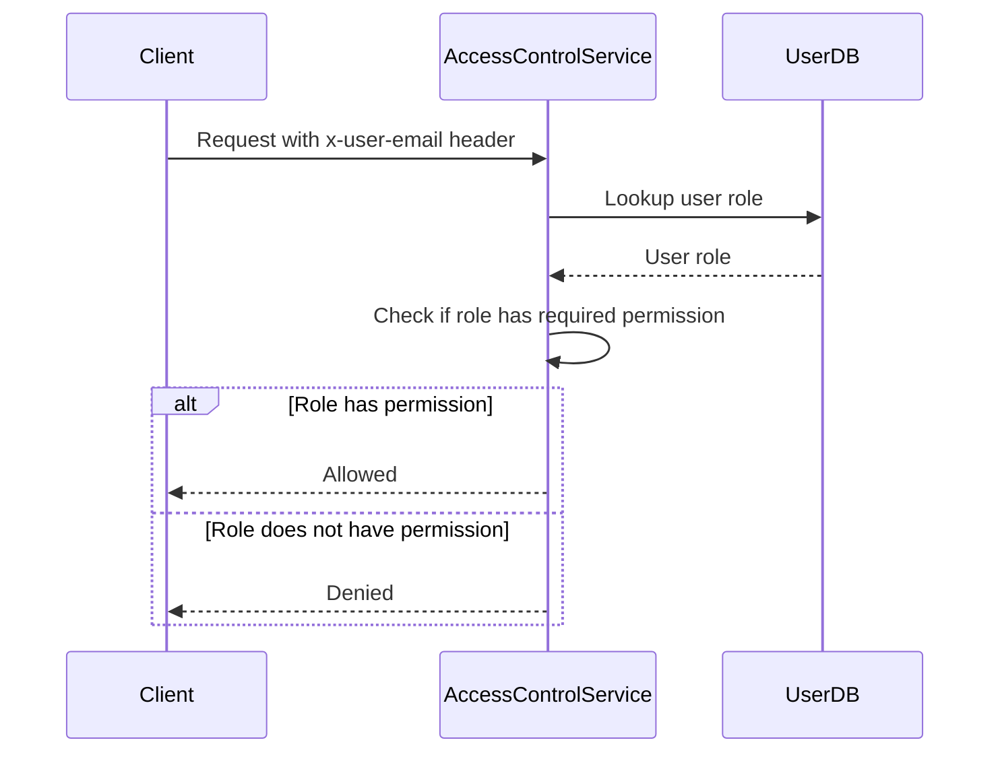

<details>
<summary>Relevant source files</summary>

The following files were used as context for generating this wiki page:

- [config/roles.json](https://github.com/aanickode/access-control-service/blob/main/config/roles.json)
- [docs/permissions.md](https://github.com/aanickode/access-control-service/blob/main/docs/permissions.md)

</details>

# Permission Management

Permission Management is a crucial aspect of the access-control-service project, responsible for enforcing role-based access control (RBAC) across the system. It defines a set of roles, each associated with specific permissions, and ensures that users can only access resources or perform actions for which they have the required permissions based on their assigned role.

## Introduction

The access-control-service project implements a permission management system based on the Role-Based Access Control (RBAC) model. This system defines a set of predefined roles, each with a specific set of permissions. Users are assigned one or more roles, and their access to various resources or actions within the system is determined by the permissions associated with their assigned roles.

The permission management system is designed to provide a flexible and scalable approach to access control, allowing for easy management of user permissions and roles. It ensures that users can only access resources or perform actions for which they have the appropriate permissions, enhancing the overall security and integrity of the system.

## Roles and Permissions

The access-control-service project defines a set of predefined roles, each with a specific set of permissions. These roles and their associated permissions are defined in the `config/roles.json` file.



Sources: [config/roles.json](https://github.com/aanickode/access-control-service/blob/main/config/roles.json)

The `roles.json` file contains a JSON object that maps role names to an array of permission strings. For example:

```json
{
  "admin": ["view_users", "create_role", "view_permissions"],
  "engineer": ["view_users", "view_permissions"],
  "analyst": ["view_users"]
}
```

Sources: [config/roles.json](https://github.com/aanickode/access-control-service/blob/main/config/roles.json)

### Default Roles

The access-control-service project defines the following default roles:

| Role     | Permissions                                  | Description                                     |
|----------|-----------------------------------------------|--------------------------------------------------|
| admin    | view_users, create_role, view_permissions    | Full system access for platform and DevOps teams |
| engineer | view_users, view_permissions                 | Read-only access for observability and debugging |
| analyst  | view_users                                   | Basic read-only access for data/reporting use cases |

Sources: [docs/permissions.md](https://github.com/aanickode/access-control-service/blob/main/docs/permissions.md)

## Permission Enforcement

The access-control-service enforces permissions on a per-route basis. Each route defines the permission required to access it, and these permissions are checked at runtime against the user's assigned role.



Sources: [docs/permissions.md](https://github.com/aanickode/access-control-service/blob/main/docs/permissions.md)

For a request to be considered valid, it must:

1. Include the `x-user-email` header
2. Match a known user in the in-memory `db.users` map
3. Have a role that includes the required permission for the requested route

Sources: [docs/permissions.md](https://github.com/aanickode/access-control-service/blob/main/docs/permissions.md)

## Adding a New Role

To add a new role to the access-control-service, follow these steps:

1. Edit the `config/roles.json` file to define a new role and its associated permissions:

```json
{
  "support": ["view_users"]
}
```

2. Assign the new role to a user using the provided CLI tool:

```bash
node cli/manage.js assign-role support@company.com support
```

3. Ensure that consuming services request the appropriate permissions when making requests to the access-control-service.

Sources: [docs/permissions.md](https://github.com/aanickode/access-control-service/blob/main/docs/permissions.md)

## Implementation Details

### Permission Checks

All permission checks in the access-control-service are flat, meaning there is no support for wildcarding or nesting of permissions. Each permission is treated as a distinct string value.

Sources: [docs/permissions.md](https://github.com/aanickode/access-control-service/blob/main/docs/permissions.md)

### User-Role Mappings

The access-control-service stores all user-role mappings in memory, meaning that any changes to the `roles.json` file or user-role assignments require a service restart to take effect.

Sources: [docs/permissions.md](https://github.com/aanickode/access-control-service/blob/main/docs/permissions.md)

## Future Enhancements

The access-control-service project has identified the following potential enhancements for the permission management system:

- Scoped permissions (e.g., `project:view:marketing`) to provide more granular access control
- Integration with Single Sign-On (SSO) group claims for role assignments
- Audit logging for role changes and access attempts

Sources: [docs/permissions.md](https://github.com/aanickode/access-control-service/blob/main/docs/permissions.md)

## Summary

The access-control-service project implements a role-based access control (RBAC) system for managing permissions. It defines a set of predefined roles, each with a specific set of permissions, and enforces these permissions on a per-route basis. Users are assigned roles, and their access to resources or actions is determined by the permissions associated with their assigned roles. The permission management system provides a flexible and scalable approach to access control, ensuring that users can only access resources or perform actions for which they have the appropriate permissions.