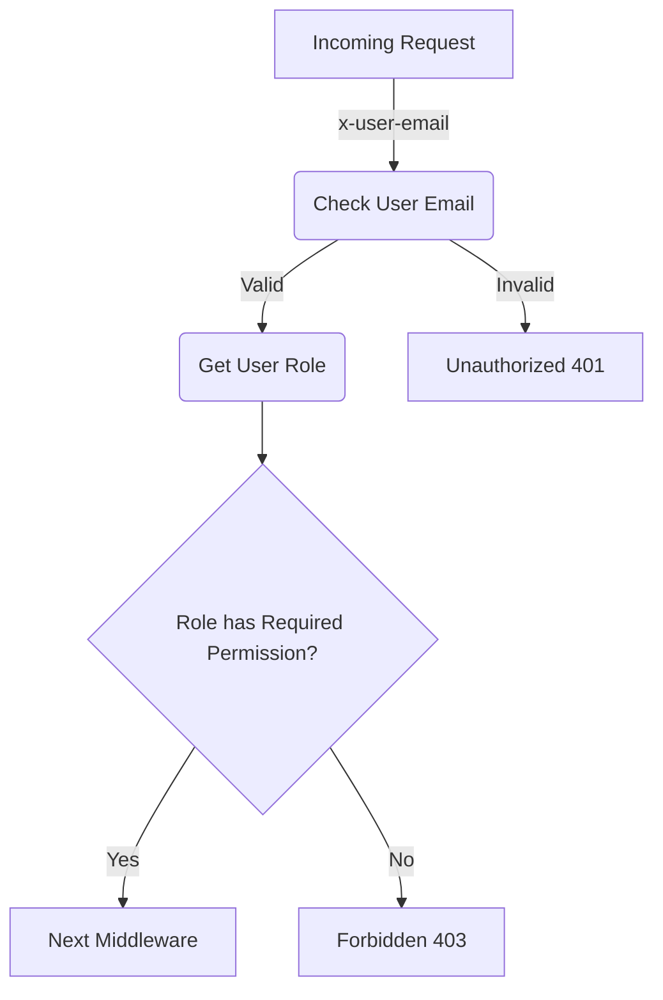

<details>
<summary>Relevant source files</summary>

The following files were used as context for generating this wiki page:

- [config/roles.json](https://github.com/aanickode/access-control-service/blob/main/config/roles.json)
- [src/authMiddleware.js](https://github.com/aanickode/access-control-service/blob/main/src/authMiddleware.js)
- [docs/permissions.md](https://github.com/aanickode/access-control-service/blob/main/docs/permissions.md)

</details>

# Permission Management

## Introduction

The Permission Management system is a crucial component of the access-control-service project, responsible for enforcing role-based access control (RBAC) across various routes and services. It ensures that only authorized users with the appropriate permissions can access specific resources or perform certain actions within the system.

The system is built around a simple yet flexible model that maps users to predefined roles, and each role is associated with a set of permissions. By leveraging this approach, the project can effectively manage and control access to different parts of the application based on the user's assigned role and the required permissions for each resource or action.

Sources: [docs/permissions.md](https://github.com/aanickode/access-control-service/blob/main/docs/permissions.md)

## Role and Permission Model

The project follows a role-based access control (RBAC) model, where permissions are granted to roles, and users are assigned one or more roles. This approach simplifies the management of permissions by grouping them into logical roles, making it easier to assign and revoke access privileges.

### Roles

The roles and their associated permissions are defined in the `config/roles.json` file. Each role is a key in the JSON object, and its value is an array of permission strings.

```json
{
  "admin": ["view_users", "create_role", "view_permissions"],
  "engineer": ["view_users", "view_permissions"],
  "analyst": ["view_users"]
}
```

Sources: [config/roles.json](https://github.com/aanickode/access-control-service/blob/main/config/roles.json), [docs/permissions.md](https://github.com/aanickode/access-control-service/blob/main/docs/permissions.md:14-19)

### Default Roles

The project comes with three predefined roles:

| Role     | Permissions                                 | Description                                   |
|----------|----------------------------------------------|-----------------------------------------------|
| admin    | view_users, create_role, view_permissions   | Full system access for platform and DevOps teams |
| engineer | view_users, view_permissions                | Read-only access for observability and debugging |
| analyst  | view_users                                  | Basic read-only access for data/reporting use cases |

Sources: [docs/permissions.md](https://github.com/aanickode/access-control-service/blob/main/docs/permissions.md:21-31)

## Permission Enforcement

The `authMiddleware.js` module contains the `checkPermission` function, which is responsible for enforcing permissions on a per-route basis. This middleware function checks if the user has the required permission to access a specific route.



The `checkPermission` middleware follows these steps:

1. Checks if the `x-user-email` header is present in the request and if the user exists in the `db.users` in-memory map.
2. Retrieves the user's role from the `db.users` map.
3. Checks if the user's role includes the required permission for the requested route.
4. If the user has the required permission, the request is passed to the next middleware.
5. If the user does not have the required permission, a `403 Forbidden` response is sent.
6. If the `x-user-email` header is missing or the user is not found, a `401 Unauthorized` response is sent.

Sources: [src/authMiddleware.js](https://github.com/aanickode/access-control-service/blob/main/src/authMiddleware.js), [docs/permissions.md](https://github.com/aanickode/access-control-service/blob/main/docs/permissions.md:5-10)

## Adding a New Role

To add a new role to the system, follow these steps:

1. Edit the `config/roles.json` file and define the new role with its associated permissions:

```json
{
  "support": ["view_users"]
}
```

2. Assign the new role to a user using the `cli/manage.js` script:

```bash
node cli/manage.js assign-role support@company.com support
```

3. Ensure that consuming services request the appropriate permissions when accessing routes protected by the `checkPermission` middleware.

Sources: [docs/permissions.md](https://github.com/aanickode/access-control-service/blob/main/docs/permissions.md:34-43)

## Limitations and Future Enhancements

The current implementation of the Permission Management system has some limitations and potential areas for improvement:

- **Flat Permissions**: The permissions are currently flat, meaning there is no support for wildcarding or nesting permissions. This may become cumbersome as the system grows and more granular permissions are needed.
- **In-Memory User-Role Mapping**: The user-role mappings are stored in an in-memory `db.users` map, which means that any changes to the mappings will be lost upon service restart.
- **Static Configuration**: Changes to the `roles.json` configuration file require a service restart to take effect.

Potential future enhancements include:

- **Scoped Permissions**: Introducing scoped permissions (e.g., `project:view:marketing`) to provide more fine-grained access control.
- **SSO Integration**: Integrating with a single sign-on (SSO) system to leverage group claims for role assignments.
- **Audit Logging**: Implementing audit logging for role changes and access attempts to improve visibility and compliance.

Sources: [docs/permissions.md](https://github.com/aanickode/access-control-service/blob/main/docs/permissions.md:46-52)

## Conclusion

The Permission Management system in the access-control-service project provides a robust and flexible way to control access to various resources and actions based on a user's assigned role and the required permissions. By leveraging the role-based access control (RBAC) model, the system simplifies the management of permissions and ensures that only authorized users can perform specific actions within the application.

While the current implementation is functional and meets the project's immediate needs, there are opportunities for future enhancements, such as introducing scoped permissions, integrating with SSO systems, and implementing audit logging for improved visibility and compliance.