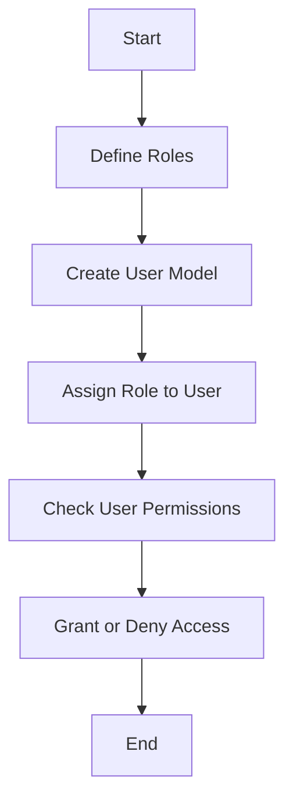

<details>
<summary>Relevant source files</summary>

The following files were used as context for generating this wiki page:

- [config/roles.json](https://github.com/aanickode/access-control-service/blob/main/config/roles.json)
- [src/models.js](https://github.com/aanickode/access-control-service/blob/main/src/models.js)

</details>

# Role Management

## Introduction

The Role Management feature within this project provides a mechanism for defining and managing user roles and their associated permissions. It allows for the creation of roles with specific sets of permissions, which can then be assigned to users to control their access to various parts of the system. This feature is crucial for implementing access control and ensuring that users only have the necessary privileges to perform their intended tasks.

Sources: [config/roles.json](), [src/models.js]()

## Role Definition

Roles are defined in the `config/roles.json` file, where each role is represented as a key-value pair. The key represents the role name, and the value is an array of permission strings.

```json
{
  "admin": ["view_users", "create_role", "view_permissions"],
  "engineer": ["view_users", "view_permissions"],
  "analyst": ["view_users"]
}
```

In the example above, three roles are defined: `admin`, `engineer`, and `analyst`. The `admin` role has permissions to view users, create roles, and view permissions. The `engineer` role can view users and permissions, while the `analyst` role can only view users.

Sources: [config/roles.json]()

## Data Models

The data models for `User` and `Role` are defined in the `src/models.js` file.

```javascript
export const User = {
  email: 'string',
  role: 'string'
};

export const Role = {
  name: 'string',
  permissions: ['string']
};
```

The `User` model has two properties:

- `email`: A string representing the user's email address.
- `role`: A string representing the user's assigned role.

The `Role` model has two properties:

- `name`: A string representing the name of the role.
- `permissions`: An array of strings representing the permissions associated with the role.

Sources: [src/models.js]()

## Role Assignment

To assign a role to a user, the `role` property of the `User` model should be set to the desired role name defined in the `config/roles.json` file.

```javascript
const user = {
  email: 'john@example.com',
  role: 'admin'
};
```

In this example, the user with the email `john@example.com` is assigned the `admin` role, granting them the permissions defined for that role in the `config/roles.json` file.

Sources: [src/models.js](), [config/roles.json]()

## Permission Checking

To check if a user has a specific permission, you can retrieve the user's role from the `User` model and then check if the corresponding permissions array in the `config/roles.json` file contains the desired permission.

```javascript
import roles from '../config/roles.json';

function hasPermission(user, permission) {
  const userRole = roles[user.role];
  return userRole && userRole.includes(permission);
}
```

The `hasPermission` function takes a `user` object and a `permission` string as arguments. It retrieves the user's role from the `roles` object (loaded from `config/roles.json`) and checks if the corresponding permissions array includes the specified `permission`.

Sources: [config/roles.json](), [src/models.js]()

## Role Management Flow

The overall flow for role management can be represented using the following Mermaid diagram:



1. Roles are defined in the `config/roles.json` file with their associated permissions.
2. The `User` and `Role` data models are created in the `src/models.js` file.
3. When creating a new user, a role is assigned to the user's `role` property.
4. To check if a user has a specific permission, the user's role is retrieved, and the corresponding permissions array is checked for the desired permission.
5. Based on the permission check, access is granted or denied to the user for the requested operation.

Sources: [config/roles.json](), [src/models.js]()

## Conclusion

The Role Management feature in this project provides a flexible and extensible way to manage user roles and permissions. By defining roles and their associated permissions in a centralized configuration file (`config/roles.json`), and using the `User` and `Role` data models, developers can easily assign roles to users and check their permissions for various operations within the system. This feature is essential for implementing access control and ensuring that users have the appropriate level of access based on their roles and responsibilities.