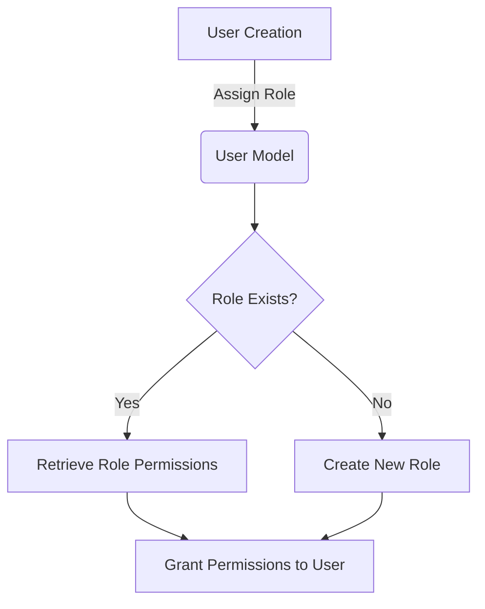
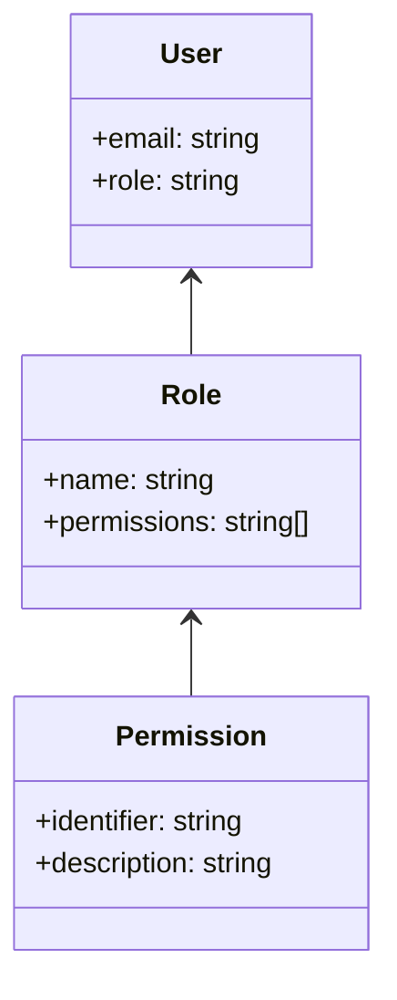
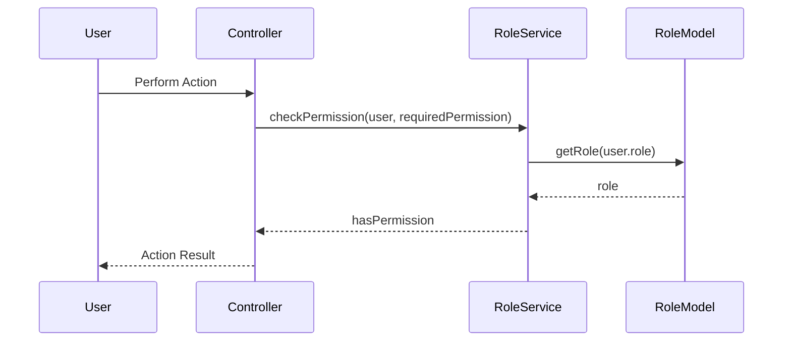

<details>
<summary>Relevant source files</summary>

The following files were used as context for generating this wiki page:

- [config/roles.json](https://github.com/aanickode/access-control-service/blob/main/config/roles.json)
- [src/models.js](https://github.com/aanickode/access-control-service/blob/main/src/models.js)
</details>

# Role Management

## Introduction

The Role Management system is a crucial component of the project, responsible for defining and managing user roles and their associated permissions. It serves as a centralized access control mechanism, ensuring that users are granted appropriate access levels based on their assigned roles. This system promotes security and maintainability by separating concerns and allowing for granular control over user privileges.

## Data Models

### User Model

The `User` model represents an individual user within the system. It consists of the following fields:

```javascript
export const User = {
  email: 'string',
  role: 'string'
};
```

- `email` (string): Unique identifier for the user, typically an email address.
- `role` (string): The name of the role assigned to the user, which determines their permissions.

Sources: [src/models.js:1-4]()

### Role Model

The `Role` model defines the available roles and their associated permissions:

```javascript
export const Role = {
  name: 'string',
  permissions: ['string']
};
```

- `name` (string): The unique name of the role.
- `permissions` (array of strings): A list of permission identifiers granted to users with this role.

Sources: [src/models.js:6-9]()

## Role Definitions

The project defines three predefined roles and their corresponding permissions in the `config/roles.json` file:

```json
{
  "admin": ["view_users", "create_role", "view_permissions"],
  "engineer": ["view_users", "view_permissions"],
  "analyst": ["view_users"]
}
```

- `admin`: Users with the "admin" role have permissions to view user information, create new roles, and view available permissions.
- `engineer`: Users with the "engineer" role can view user information and available permissions.
- `analyst`: Users with the "analyst" role are only allowed to view user information.

Sources: [config/roles.json]()

## Role Management Flow

The Role Management system likely follows a common flow for assigning roles to users and managing permissions:



1. During user creation, a role is assigned to the user.
2. The system checks if the assigned role exists in the `Role` model.
3. If the role exists, the associated permissions are retrieved from the `Role` model.
4. If the role does not exist, a new role is created with the specified permissions.
5. The user is granted the permissions associated with their assigned role.

Sources: [src/models.js](), [config/roles.json]()

## Role-based Access Control (RBAC)

The Role Management system implements a Role-based Access Control (RBAC) approach, where permissions are granted based on the user's assigned role. This approach simplifies access control management by grouping permissions into roles and assigning roles to users, rather than managing individual user-permission mappings.



In this RBAC model:

- Users are assigned a specific role.
- Roles are defined with a set of permissions.
- Permissions are granular access privileges or actions that users can perform within the system.

By assigning roles to users, the system can efficiently manage and control access levels without the need for individual user-permission mappings.

Sources: [src/models.js](), [config/roles.json]()

## Permission Checks

When a user attempts to perform an action within the system, the Role Management system likely checks if the user's assigned role has the required permission(s) for that action. This permission check could be implemented as a middleware or a separate service, depending on the project's architecture.



1. The user initiates an action within the system.
2. The controller handling the action calls the `RoleService` to check if the user has the required permission.
3. The `RoleService` retrieves the user's role from the `RoleModel`.
4. The `RoleService` checks if the user's role has the required permission.
5. The result of the permission check is returned to the controller.
6. The controller either allows or denies the action based on the permission check result.

Note: This is a simplified example, and the actual implementation may vary depending on the project's architecture and requirements.

Sources: [src/models.js](), [config/roles.json]()

## Summary

The Role Management system is a crucial component of the project, providing a centralized and scalable approach to managing user access levels. By defining roles and associating them with specific permissions, the system ensures that users are granted appropriate privileges based on their assigned roles. This approach promotes security, maintainability, and granular control over user access within the application.