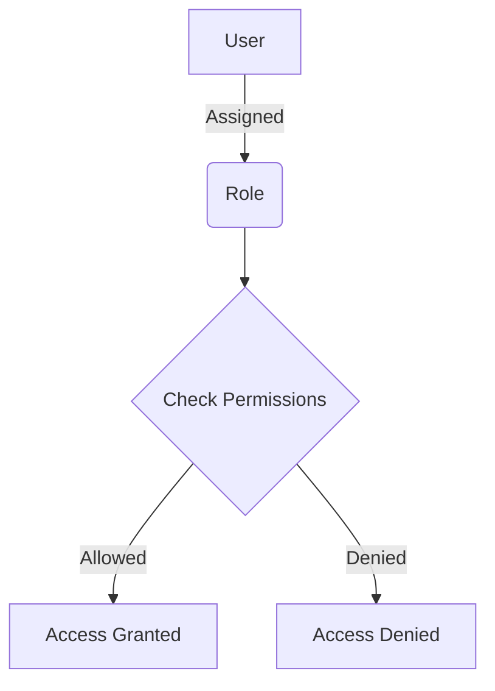
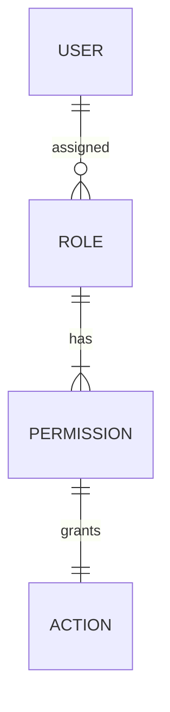
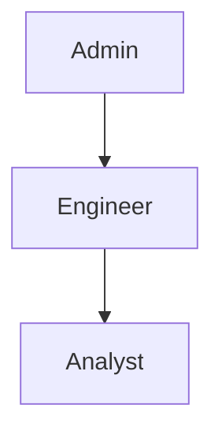

<details>
<summary>Relevant source files</summary>

The following files were used as context for generating this wiki page:

- [config/roles.json](https://github.com/aanickode/access-control-service/blob/main/config/roles.json)
- [src/models.js](https://github.com/aanickode/access-control-service/blob/main/src/models.js)

</details>

# Role Management

## Introduction

The Role Management system is a crucial component of the access control service, responsible for defining and managing user roles and their associated permissions within the application. It provides a structured way to grant or restrict access to various features and functionalities based on a user's assigned role.

By leveraging this system, administrators can efficiently control and maintain the appropriate level of access for different user groups, ensuring data security and adherence to organizational policies.

## Role Definition

The roles and their corresponding permissions are defined in the `config/roles.json` file. This configuration file serves as the central source of truth for role-based access control (RBAC) within the application.

```json
{
  "admin": ["view_users", "create_role", "view_permissions"],
  "engineer": ["view_users", "view_permissions"],
  "analyst": ["view_users"]
}
```

In this example, three roles are defined: `admin`, `engineer`, and `analyst`. Each role is associated with a list of permissions, represented as strings.

Sources: [config/roles.json](https://github.com/aanickode/access-control-service/blob/main/config/roles.json)

## Data Models

The `src/models.js` file defines the data models used within the application, including the `User` and `Role` models.

### User Model

```javascript
export const User = {
  email: 'string',
  role: 'string'
};
```

The `User` model consists of two properties:

- `email`: A string representing the user's email address.
- `role`: A string representing the user's assigned role.

Sources: [src/models.js:1-4](https://github.com/aanickode/access-control-service/blob/main/src/models.js#L1-L4)

### Role Model

```javascript
export const Role = {
  name: 'string',
  permissions: ['string']
};
```

The `Role` model consists of two properties:

- `name`: A string representing the name of the role.
- `permissions`: An array of strings representing the permissions associated with the role.

Sources: [src/models.js:6-9](https://github.com/aanickode/access-control-service/blob/main/src/models.js#L6-L9)

## Role Management Flow

The following diagram illustrates the high-level flow of role management within the application:



1. A user is assigned a specific role within the application.
2. The assigned role is associated with a set of permissions defined in the `config/roles.json` file.
3. When the user attempts to perform an action, the system checks if the user's role has the required permission.
4. If the permission is granted, the user is allowed to perform the action.
5. If the permission is not granted, the user is denied access to the requested action.

Sources: [config/roles.json](https://github.com/aanickode/access-control-service/blob/main/config/roles.json), [src/models.js](https://github.com/aanickode/access-control-service/blob/main/src/models.js)

## Role-Based Access Control (RBAC)

The Role Management system implements a role-based access control (RBAC) model, which is a widely adopted approach for managing access permissions within applications. RBAC simplifies the administration of permissions by assigning users to predefined roles, each with a specific set of permissions.



- Users are assigned to one or more roles.
- Roles are associated with a set of permissions.
- Permissions grant or deny access to specific actions or resources within the application.

By following the RBAC model, the Role Management system provides a flexible and scalable way to manage access control, making it easier to add, modify, or remove permissions for different user groups without modifying individual user accounts.

Sources: [config/roles.json](https://github.com/aanickode/access-control-service/blob/main/config/roles.json), [src/models.js](https://github.com/aanickode/access-control-service/blob/main/src/models.js)

## Role Hierarchy

The Role Management system supports a hierarchical structure of roles, where higher-level roles inherit permissions from lower-level roles. This hierarchy is evident in the `config/roles.json` file, where the `admin` role has the most permissions, followed by the `engineer` role, and then the `analyst` role.



In this example, the `admin` role inherits all permissions from the `engineer` and `analyst` roles, while the `engineer` role inherits permissions from the `analyst` role.

Sources: [config/roles.json](https://github.com/aanickode/access-control-service/blob/main/config/roles.json)

## Role Management Operations

The Role Management system likely supports various operations related to roles and permissions, such as:

| Operation | Description |
| --- | --- |
| Create Role | Create a new role with a set of permissions. |
| Update Role | Modify the permissions associated with an existing role. |
| Delete Role | Remove an existing role from the system. |
| Assign Role | Assign a role to a user or group of users. |
| Revoke Role | Remove a role assignment from a user or group of users. |
| View Roles | List all available roles and their associated permissions. |
| View User Roles | List the roles assigned to a specific user. |

Note: The exact implementation details of these operations are not available in the provided source files.

## Conclusion

The Role Management system is a critical component of the access control service, enabling efficient management of user permissions through the assignment of predefined roles. By following the role-based access control (RBAC) model and leveraging a hierarchical role structure, the system provides a flexible and scalable approach to controlling access to various features and functionalities within the application.