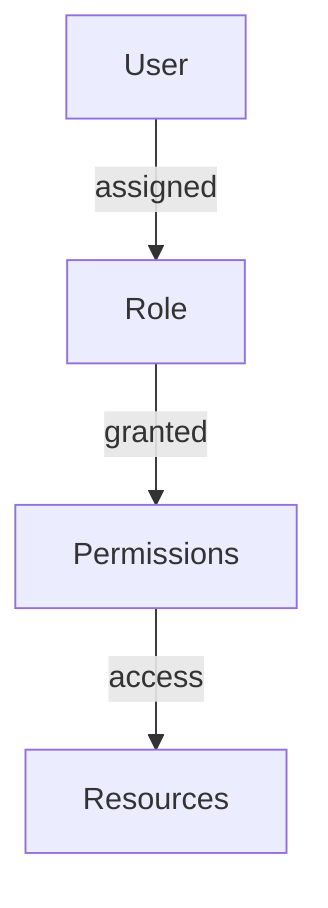
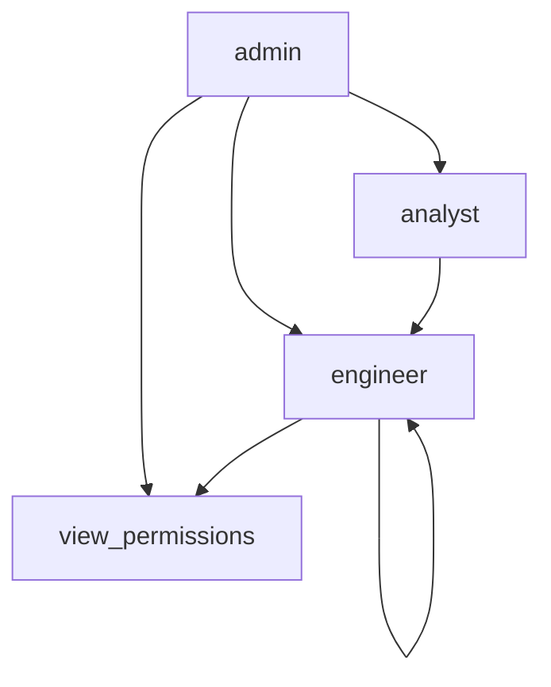
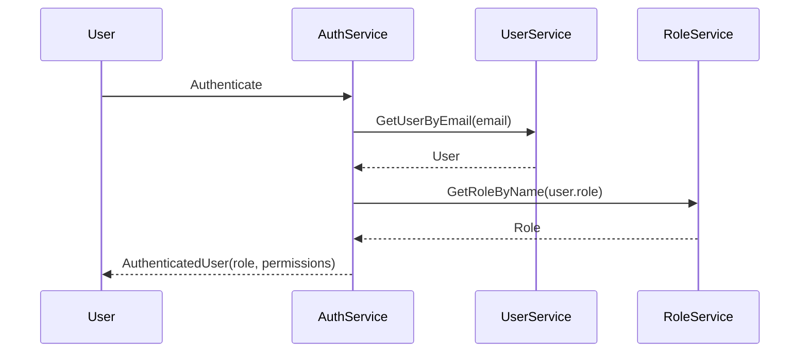

<details>
<summary>Relevant source files</summary>

The following files were used as context for generating this wiki page:

- [config/roles.json](https://github.com/aanickode/access-control-service/blob/main/config/roles.json)
- [src/models.js](https://github.com/aanickode/access-control-service/blob/main/src/models.js)
</details>

# Role Management

## Introduction

The Role Management system is a crucial component of the access control service, responsible for defining and managing user roles and their associated permissions. It provides a structured way to grant or restrict access to various features or resources within the application based on a user's assigned role.

Sources: [config/roles.json](), [src/models.js]()

## Role Definition

Roles are defined in the `config/roles.json` file, where each role is represented as a key-value pair. The key represents the role name, and the value is an array of permission strings associated with that role.

```json
{
  "admin": ["view_users", "create_role", "view_permissions"],
  "engineer": ["view_users", "view_permissions"],
  "analyst": ["view_users"]
}
```

Sources: [config/roles.json]()

## Data Models

The application uses two main data models related to role management: `User` and `Role`.

### User Model

The `User` model represents a user in the system and has the following fields:

| Field | Type     | Description                  |
|-------|----------|-----------------------------|
| email | `string` | The user's email address     |
| role  | `string` | The name of the user's role  |

Sources: [src/models.js:1-4]()

### Role Model

The `Role` model defines a role and its associated permissions:

| Field       | Type       | Description                                |
|-------------|------------|-------------------------------------------|
| name        | `string`   | The name of the role                      |
| permissions | `string[]` | An array of permission strings for the role |

Sources: [src/models.js:6-9]()

## Role-based Access Control (RBAC)

The Role Management system implements a Role-based Access Control (RBAC) mechanism, where permissions are granted to roles, and users are assigned specific roles. This approach simplifies the management of permissions by grouping them into logical roles.



Sources: [config/roles.json](), [src/models.js]()

## Permission Hierarchy

The permissions defined in the `config/roles.json` file follow a hierarchical structure, where higher-level roles inherit the permissions of lower-level roles. For example, the `admin` role has all the permissions granted to the `engineer` and `analyst` roles, plus additional permissions like `create_role`.



Sources: [config/roles.json]()

## Role Assignment

Users are assigned roles during the authentication or user management process. The `role` field in the `User` model stores the name of the user's assigned role, which determines the permissions they have within the application.



Sources: [src/models.js](), [config/roles.json]()

## Conclusion

The Role Management system provides a flexible and scalable approach to access control by defining roles and their associated permissions. It allows for easy management of user access by assigning roles to users, ensuring that they only have the necessary permissions to perform their tasks within the application.