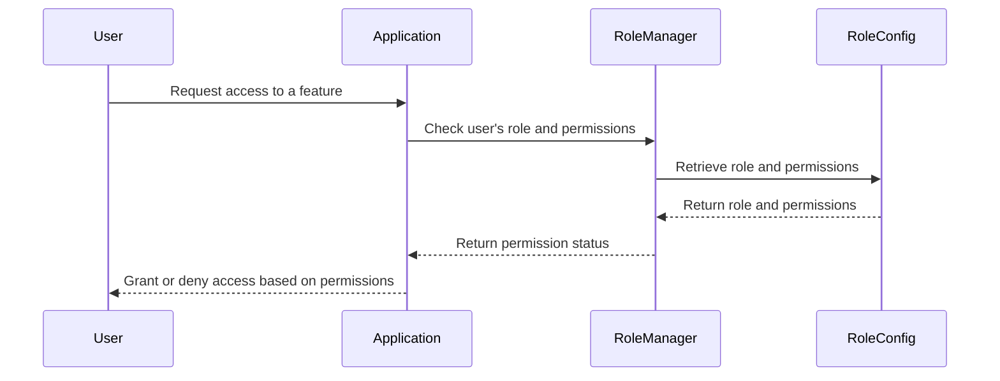

<details>
<summary>Relevant source files</summary>

The following files were used as context for generating this wiki page:

- [config/roles.json](https://github.com/aanickode/access-control-service/blob/main/config/roles.json)
- [src/models.js](https://github.com/aanickode/access-control-service/blob/main/src/models.js)
</details>

# Role Management

## Introduction

The Role Management system within this project provides a way to define and manage user roles and their associated permissions. It allows for the assignment of specific roles to users, which in turn grants them access to certain features or functionalities based on the permissions associated with their role. This system is crucial for implementing access control and ensuring that users can only perform authorized actions within the application.

## Data Models

### User Model

The `User` model represents a user within the system. It has the following fields:

```javascript
export const User = {
  email: 'string',
  role: 'string'
};
```

- `email`: A string representing the user's email address, likely used as a unique identifier.
- `role`: A string representing the role assigned to the user.

Sources: [src/models.js:1-4]()

### Role Model

The `Role` model defines a role and its associated permissions:

```javascript
export const Role = {
  name: 'string',
  permissions: ['string']
};
```

- `name`: A string representing the name of the role.
- `permissions`: An array of strings, where each string represents a specific permission granted to the role.

Sources: [src/models.js:6-9]()

## Role Definitions

The project defines three roles with their respective permissions in the `config/roles.json` file:

```json
{
  "admin": ["view_users", "create_role", "view_permissions"],
  "engineer": ["view_users", "view_permissions"],
  "analyst": ["view_users"]
}
```

- `admin`: This role has the permissions to view users, create new roles, and view permissions.
- `engineer`: This role can view users and view permissions.
- `analyst`: This role can only view users.

Sources: [config/roles.json]()

## Role Assignment

Based on the provided source files, it appears that users are assigned roles through the `role` field in the `User` model. However, the implementation details for assigning roles to users are not present in the provided files.

## Permission Handling

The source files do not provide information on how permissions are checked or enforced within the application. It is likely that the application has additional logic or middleware that checks a user's role and associated permissions before allowing or denying access to certain features or functionalities.

## Sequence Diagram: Role Management Flow



This sequence diagram illustrates a potential flow for role management within the application:

1. A user requests access to a specific feature or functionality.
2. The application invokes the `RoleManager` component to check the user's role and associated permissions.
3. The `RoleManager` retrieves the user's role and permissions from the `RoleConfig` (likely the `config/roles.json` file).
4. The `RoleConfig` returns the role and permissions to the `RoleManager`.
5. The `RoleManager` determines if the user has the required permissions and returns the permission status to the application.
6. Based on the permission status, the application grants or denies access to the requested feature for the user.

Note that this is a simplified representation based on the provided source files, and the actual implementation may differ or include additional steps or components.

Sources: [config/roles.json](), [src/models.js]()

## Potential Enhancements

Based on the limited information provided in the source files, here are some potential enhancements or additional features that could be considered for the Role Management system:

- **Role Inheritance**: Implement a hierarchical role structure where higher-level roles inherit permissions from lower-level roles, allowing for more granular permission management.
- **Dynamic Permission Assignment**: Provide a mechanism to dynamically assign or revoke permissions for roles, rather than relying solely on static configurations.
- **Permission Scoping**: Introduce the concept of scoping permissions to specific resources or entities within the application, rather than having global permissions.
- **Audit Logging**: Implement logging or auditing mechanisms to track changes to roles, permissions, and user role assignments for security and compliance purposes.
- **Role-based Access Control (RBAC) Middleware**: Develop a dedicated middleware or library that handles role-based access control checks and enforces permissions throughout the application.

These enhancements could improve the flexibility, scalability, and security of the Role Management system, but their implementation would require additional development efforts and potentially changes to the existing codebase.

## Summary

The Role Management system in this project provides a way to define and assign roles to users, with each role having a set of associated permissions. The system uses a simple data model with `User` and `Role` entities, and the roles and their permissions are defined in a configuration file (`config/roles.json`). While the provided source files do not include the implementation details for assigning roles or enforcing permissions, they serve as a foundation for implementing role-based access control within the application.